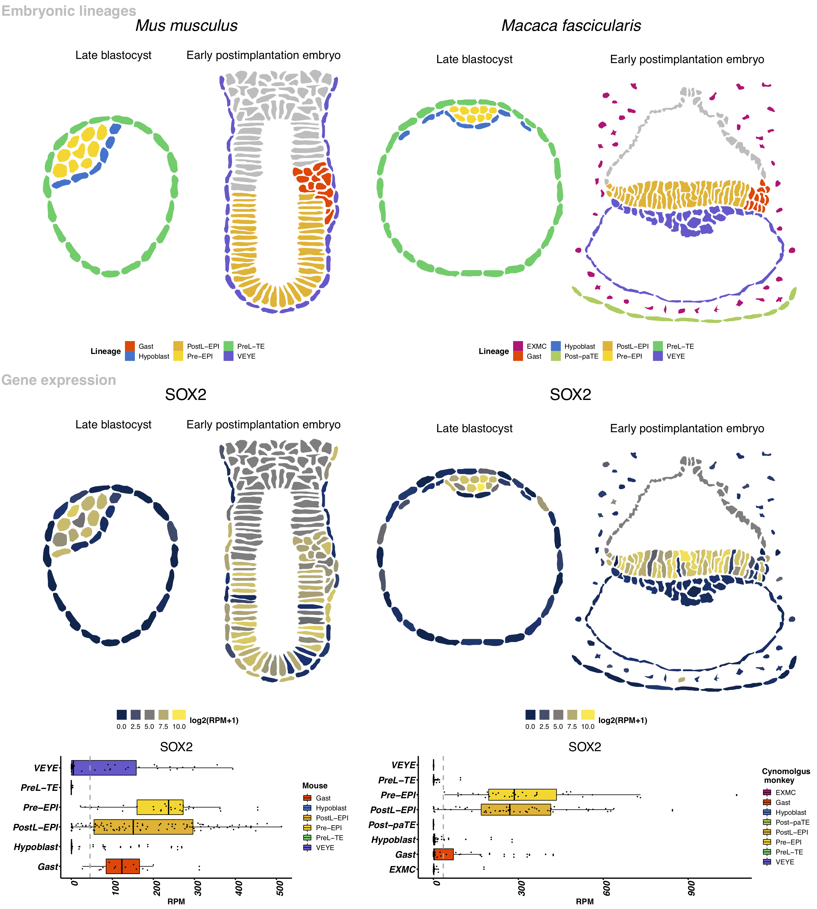

# Practical 1. Seurat toolkit for analysis of scRNA-seq {#intro}


## Reading the count matrix

For the first practical session in Seurat we will use SC3-seq data for crab-eating macaque embryo development [@pmid27556940]. The data is served as a count matrix where _rows_ are genes and _columns_ are cells. We will use the Seurat toolkit to perform dimensionality reduction, clustering and identify genes markers in 399 cells. 

Table 2.1 contains information on the different cells as described by the authors.


```{r include=FALSE}
options(warn=-1)
```


```{r, message=FALSE, warning=FALSE,echo=FALSE, eval=TRUE}
library(knitr)
dt <- data.frame(celltype = c('Post-paTE','PreL-TE','PreE-TE','ICM','Pre-EPI','PostE-EPI','Gast','PostL-EPI','VEYE','EXMC') , details=c('post-implantation parietal trophectoderm','pre-implantation late TE','pre-implantation early TE','inner cell mass','pre-implantation epiblast','post-implantation early epiblast','gastrulating cells','post-implantation late epiblast','visceral endoderm/yolk sac endoderm','extraembryonic mesenchyme') )
kable (dt, caption = "Different cell types profiled by single cell RNA sequencing for cynomolgus monkey (Macaca fascicularis) embryos." )
```


## Preprocesing of SC3-seq data (done)

SC3-seq data was downloaded from GEO in FastQ format for 474 cells in Table 1 of Nakamura et al. [@pmid27556940]. cyESC, ePGC, lPGC were filtered out from the Nakamura dataset for the web implementation, resulting in 399 cells. As in [@pmid27556940], all the reads were preprocessed with cutadapt 1.16 to remove adaptor and poly-A sequences  and low quality bases with ‘ cutadapt --colorspace -e 0.1 -q 20 -n 2 -O 1 -m 30  -a CTCGAGGGCGCGCCGGATCCATATACGCCTTGGCCGTACAGCAG -a "A{100}" -g CTCGAGGGCGCGCCGGATCCATATACGCCTTGGCCGTACAGCAG ’. Reads were then mapped to Macaca_fascicularis_5.0 genome downloaded from ftp://ftp.ncbi.nih.gov/genomes/Macaca_fascicularis/Assembled_chromosomes/seq/ (chr1-20, chrX and chrMT) and ERCC spike-in RNA sequences downloaded from https://tools.thermofisher.com/content/sfs/manuals/cms_095047.txt. For that, Bowtie 1.2.2 was used with parameters ‘bowtie -q -C -S -k 1 -p 1’. Reads aligned with Mapping Quality equal or higher than 10 were kept for further processing. featureCounts v1.6.0 with parameters ‘-T 2 -t exon -g gene’ was used for raw count gene quantification with the gene annotation file macFas5_Annot_wo_pseudo_v1e_add10k.gtf processed as in (kindly provided by Tomonori Nakamura and Mitinori Saitou). 


## Starting with Seurat

```{r, echo=FALSE}
library(knitr)
opts_chunk$set(fig.align = "center")
```

```{r, echo=TRUE, message=FALSE, warning=FALSE}
set.seed(1234567)
```

[Seurat](http://satijalab.org/seurat/) was originally developed as a clustering tool for scRNA-seq data, however in the last few years the focus of the package has become less specific and at the moment `Seurat` is a popular R package that can perform QC, analysis, and exploration of scRNA-seq data, i.e. many of the tasks covered in this course. Although Seurat authors provide several [tutorials](http://satijalab.org/seurat/get_started.html), here we will run an example using non-human primate data. We mostly use default values in various function calls, for more details please consult the documentation. We will first modify a bit the input count matrix:

```{r}
sc3 <- read.table("data/D3Ecounts.txt",  sep = "\t", head=T)

dim(sc3 )
head(sc3[1:10,1:10] )
rownames(sc3)  <- sc3$Geneid
Nc <- ncol(sc3)
sc3 <- sc3[,2:Nc]


head(sc3[1:10,1:10] )
dim(sc3 )
```


## `Seurat` object class

`Seurat` does not integrate one of the most used classes in Bioconductor, `SingleCellExperiment`, but instead introduces its own object class - `seurat`. All calculations in this chapter are performed on an object of this class. To begin the analysis we first need to initialize the object with the raw (non-normalized) data. We will keep all genes expressed in $>= 3$ cells and all cells with at least 200 detected genes:

```{r, message=FALSE, warning=FALSE}
library(Seurat)
library(dplyr)
cm <- CreateSeuratObject(raw.data = sc3, project = "nakamura",   min.cells = 3, 
                         min.genes = 200)

```

## Expression QC

`Seurat` allows you to easily explore QC metrics and filter cells based on any user-defined criteria. We can visualize gene and molecule counts and plot their relationship:
```{r}
VlnPlot(
  object = cm, 
  features.plot = c("nGene", "nUMI"), 
  nCol = 2
)
```

UMIs (unique molecular identifiers) are part of the oligo constructs for beads in droplet single-cell RNA-seq technologies. They are used to identify reads that originated from the same molecule, so that double counting of such molecules can be avoided.


```{r, fig.width=5, fig.height=5}
GenePlot(
  object = cm, 
  gene1 = "nUMI", 
  gene2 = "nGene"
)
```

We could exclude cells with a clear outlier number of read counts doing:
```{r}
cm <- FilterCells(
  object = cm, 
  subset.names = c("nUMI"), 
  high.thresholds = c(2e7)
)
head(cm@data[,1:5])
head(cm@raw.data[,1:5])
cm@ident[1:5]
head(cm@meta.data)
```

## Normalization

After removing unwanted cells from the dataset, the next step is to normalize the data. By default, we employ a global-scaling normalization method `LogNormalize` that normalizes the gene expression measurements for each cell by the total expression, multiplies this by a scale factor (10,000 by default), and log-transforms the result:
```{r message=FALSE, warning=FALSE, paged.print=FALSE}
cm <- NormalizeData(cm,   normalization.method = "LogNormalize", 
                    scale.factor = 10000)
```

## Highly variable genes

Seurat calculates highly variable genes and focuses on these for some downstream analysis. `FindVariableGenes` calculates the average expression and dispersion for each gene, places these genes into bins, and then calculates a z-score for dispersion within each bin. This helps control for the relationship between variability and average expression:
```{r message=FALSE, warning=FALSE, paged.print=FALSE, fig.width=5, fig.height=5}
cm <- FindVariableGenes(
  object = cm
)

length(x = cm@var.genes)
```
We are not entirely sure what is going on in the lower left hand corner of the plot above. A similar feature can be found in the Satija lab tutorial, so we do not believe that it is due to an error in how we used the method.


## Linear dimensionality reduction

Next we perform `PCA` on the scaled data. By default, the genes in `object@var.genes` are used as input, but can be alternatively defined using `pc.genes`. Running dimensionality reduction on highly variable genes can improve performance. However, with some types of data (UMI) - particularly after regressing out technical variables, `PCA` returns similar (albeit slower) results when run on much larger subsets of genes, including the whole transcriptome.
```{r message=FALSE, warning=FALSE, paged.print=FALSE}
cm <- ScaleData(    object = cm)

cm <- RunPCA(
  object = cm, 
  #pc.genes = cm@var.genes, 
  do.print = TRUE, 
  pcs.print = 1:5, 
  genes.print = 5,
  pcs.compute = 20
)

```

`Seurat` provides several useful ways of visualizing both cells and genes that define the `PCA`:
```{r}
PrintPCA(object = cm, pcs.print = 1:5, genes.print = 5, use.full = FALSE)
VizPCA(object = cm, pcs.use = 1:2)
PCAPlot(object = cm, dim.1 = 1, dim.2 = 2)
```

In particular, `PCHeatmap` allows for easy exploration of the primary sources of heterogeneity in a dataset, and can be useful when trying to decide which PCs to include for further downstream analyses. Both cells and genes are ordered according to their `PCA` scores. Setting `cells.use` to a number plots the _extreme_ cells on both ends of the spectrum, which dramatically speeds plotting for large datasets:

```{r, fig.width=5, fig.height=7.5}
PCHeatmap(
  object = cm, 
  pc.use = 1:6, 
  cells.use = 500, 
  do.balanced = TRUE, 
  label.columns = FALSE,
  use.full = FALSE
)
```

## Significant PCs

To overcome the extensive technical noise in any single gene for scRNA-seq data, `Seurat` clusters cells based on their `PCA` scores, with each PC essentially representing a _metagene_ that combines information across a correlated gene set. Determining how many PCs to include downstream is therefore an important step. `Seurat` randomly permutes a subset of the data (1% by default) and reruns `PCA`, constructing a _null distribution_ of gene scores by repeating this procedure. We identify _significant_ PCs as those who have a strong enrichment of low p-value genes:
```{r, results='hide', echo=TRUE}
cm <- JackStraw(
  object = cm, 
  num.replicate = 100
)
```


The `JackStrawPlot` function provides a visualization tool for comparing the distribution of p-values for each PC with a uniform distribution (dashed line). _Significant_ PCs will show a strong enrichment of genes with low p-values (solid curve above the dashed line). In this case it appears that PCs 1-9 are significant.
```{r}
JackStrawPlot(object = cm, PCs = 1:9)
```

A more ad hoc method for determining which PCs to use is to look at a plot of the standard deviations of the principle components and draw your cutoff where there is a clear elbow in the graph. This can be done with `PCElbowPlot`. In this example, it looks like the elbow would fall around PC 8.
```{r, fig.width=5, fig.height=5}
PCElbowPlot(object = cm)
```

## Clustering cells

`Seurat` implements an graph-based clustering approach. Distances between the cells are calculated based on previously identified PCs. `Seurat` approach was heavily inspired by recent manuscripts which applied graph-based clustering approaches to scRNA-seq data - SNN-Cliq [@Xu2015-vf] and CyTOF data - PhenoGraph [@Levine2015-fk]. Briefly, these methods embed cells in a graph structure - for example a K-nearest neighbor (_KNN_) graph, with edges drawn between cells with similar gene expression patterns, and then attempt to partition this graph into highly interconnected _quasi-cliques_ or _communities_. We first construct a _KNN_ graph based on the euclidean distance in PCA space, and refine the edge weights between any two cells based on the shared overlap in their local neighborhoods (Jaccard distance). To cluster the cells, we apply modularity optimization techniques - SLM [@Blondel2008-px], to iteratively group cells together, with the goal of optimizing the standard modularity function.

The `FindClusters` function implements the procedure, and contains a resolution parameter that sets the `granularity` of the downstream clustering, with increased values leading to a greater number of clusters. We find that setting this parameter between $0.6-1.2$ typically returns good results for single cell datasets of around $3,000$ cells. Optimal resolution often increases for larger datasets. The clusters are saved in the object@ident slot.
```{r}
cm <- FindClusters(
  object = cm, 
  reduction.type = "pca", 
  dims.use = 1:20, 
  resolution = 0.6, 
  print.output = 0, 
  k.param=11, 
  save.SNN = TRUE
)
```

A useful feature in `Seurat` is the ability to recall the parameters that were used in the latest function calls for commonly used functions. For `FindClusters`, there is the function `PrintFindClustersParams` to print a nicely formatted summary of the parameters that were chosen:
```{r}
PrintFindClustersParams(object = cm)
```

We can have a look at the clustering results
```{r}
table(cm@ident)
```

`Seurat` also utilises tSNE plot to visulise clustering results. As input to the tSNE, we suggest using the same PCs as input to the clustering analysis, although computing the tSNE based on scaled gene expression is also supported using the `genes.use` argument.
```{r, fig.width=5.5, fig.height=5}
cm <- RunTSNE(
  object = cm,
  dims.use = 1:20,
  do.fast = TRUE
)
TSNEPlot(object = cm)
```


We can also perform UMAP:
```{r, fig.width=5.5, fig.height=5}
cm <- RunUMAP(cm, reduction.use = "pca", dims.use = 1:20)
DimPlot(cm , reduction.use = "umap", plot.title='UMAP', 
        pt.size=1,  do.label=TRUE, do.return = TRUE)
```


## Marker genes

Seurat can help you find markers that define clusters via differential expression. By default, it identifes positive and negative markers of a single cluster, compared to all other cells. You can test groups of clusters vs. each other, or against all cells. For example, to find marker genes for cluster 2 we can run:
```{r message=FALSE, warning=FALSE, paged.print=FALSE}
cluster2.markers <- FindMarkers(object = cm, ident.1 = 2, min.pct = 0.25)
print(x = head(x = cluster2.markers, n = 5))

# find all markers distinguishing cluster 2 and 4
cluster2_4.markers <- FindMarkers(object = cm, ident.1 = 2, ident.2 = 4,  min.pct = 0.25)
print(x = head(x = cluster2_4.markers, n = 5))

```

Marker genes can then be visualised:
```{r, fig.width=4, fig.height=4}
VlnPlot(object = cm, features.plot = "BMP6")
FeaturePlot(
    cm, 
    "IL6R", 
    pt.size = 2,
    reduction.use = "umap",
    cols.use = c("lightgrey", "blue")
)
```

`FindAllMarkers` automates this process and find markers for all clusters:
```{r message=FALSE, warning=FALSE, paged.print=FALSE}
markers <- FindAllMarkers(
    object = cm, 
    min.pct = 0.25, 
    only.pos = TRUE,
    thresh.use = 0.25
)
head(markers)
```
 
 `DoHeatmap` generates an expression heatmap for given cells and genes. In this case, we are plotting the top 5 markers (or all markers if less than 20) for each cluster:
```{r, fig.width=12, fig.height=15}
top10 <- markers %>% group_by(cluster) %>% top_n(5, avg_logFC)
DoHeatmap(
    object = cm, 
    genes.use = top10$gene, 
    slim.col.label = TRUE, 
    remove.key = TRUE
)
```

We can now assign the labels given to the cells in Nakamura et al:
```{r,  fig.width=5.5, fig.height=5}
NewIdent <- as.factor(t( read.table('data/colnames.txt')[2:400] ) ); 
names(NewIdent ) <- names(cm@ident)
cm@ident <- NewIdent
cm <- AddMetaData(cm, metadata =  NewIdent, col.name='clusterNakamura')

head(cm@meta.data)
dim(cm@meta.data)
cm@ident[1:5]


cm@meta.data$res.0.6 <- NewIdent 
DimPlot(cm ,group.by='res.0.6', reduction.use = "umap",
        plot.title='UMAP', pt.size=2,do.label=TRUE, do.return = TRUE)
TSNEPlot(cm,group.by='res.0.6',do.label=TRUE, pt.size=2)
```

## Biological interpretation

You can visualise your marker genes in a R/Shiny application developed in collaboration with Dr Thorsten Boroviak at the University of Cambridge [@supra]. You can access the website here: https://supraprimate.shinyapps.io/exec/ 

The web depicts a model of embryonic development in rodent (mouse) and non-human primate (Macaca Fascicularis) and includes the scRNA-seq data you have just analyzed in Seurat. 



 
**Exercise 1.1: Are you able to infer any relation between spatial or temporal localization in the t-SNE or UMAP you have just generated?**

**Exercise 1.2: Find 5 markers genes of the cluster 6 (Pre-EPI) with Seurat. Using SUPRAPRIMATE web, can you tell if they are also expressed in mouse at the same developmental stage? **

```{r message=FALSE, warning=FALSE, paged.print=FALSE}
solution <- which(markers$cluster == 6 )
head(x = markers[solution,], n = 10)
```

## Cell cycle inference

In brief, we assign each cell a score, based on its expression of G2/M and S phase markers. These marker sets should be anticorrelated in their expression levels, and cells expressing neither are likely not cycling and in G1 phase.

In Seurat, we assign scores in the CellCycleScoring function, which stores S and G2/M scores in object@meta.data, along with the predicted classification of each cell in either G2M, S or G1 phase. CellCycleScoring can also set the identity of the Seurat object to the cell-cycle phase by passing set.ident = TRUE (the original identities are stored as old.ident). 
```{r, fig.width=5.5, fig.height=5}
cc.genes <- readLines(con = "data/regev_lab_cell_cycle_genes.txt")

# We can segregate this list into markers of G2/M phase and markers of S
# phase
s.genes <- cc.genes[1:43]
g2m.genes <- cc.genes[44:97]

cm <- CellCycleScoring(object = cm, s.genes = s.genes, g2m.genes = g2m.genes, 
                                    set.ident = TRUE)
DimPlot(cm, reduction.use = "umap", plot.title='UMAP', pt.size=2,
        do.label=FALSE, do.return = TRUE)

# Visualize the distribution of cell cycle markers
RidgePlot(object = cm, features.plot = c("PCNA", "TOP2A", "MCM6", "MKI67"), 
    nCol = 2)

```

Now we save the Seurat object that we will need in Practical 4:

```{r message=FALSE, warning=FALSE, paged.print=FALSE}
saveRDS(object = cm , file = 'data/nakamura_P4.rds')
```


## sessionInfo()

```{r echo=FALSE}
sessionInfo()
```


