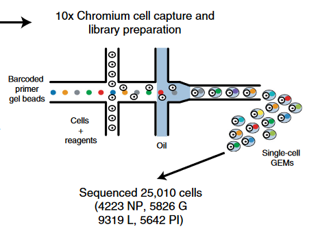

```{r configuracion_inicial, include=FALSE}
knitr::opts_chunk$set(echo = TRUE,
                      message = TRUE,
                      warning = FALSE,
                      tidy = F)
##################################################
#######        Encoded in UTF-8        ###########
##################################################
```

***

# Introducción y pre-requisitos

En este documento se muestran las prácticas y ejercicios de Pedro Madrigal, traducidas de Seurat V2 a Seurat V3, ya que Pedro usaba la versión 2 pese a estar obsoleta y tener dependencias obsoletas y difíciles de instalar en equipos actuales.

__Las prácticas 1 y 2__ se basan (incluyen modificaciones) en el código aportado por el Dr. Martin Hemberg del Instituto Wellcome Sanger en el curso de dos días de análisis de scRNA-seq impartido por la unidad de enseñanza de bioinformática de la Universidad de Cambridge.

__En la práctica 3__ aprenderemos a integrar en Seurat datos de scRNA-seq de páncreas humano y de ratón siguiendo la metodología de Butler _et al._, 2018.

__En la práctica 4__ aprenderemos a inferir trayectorias celulares a partir de datos de expresión single cell usando Monocle3.

__Los archivos necesarios para realizar las prácticas se pueden encontrar en [Dropbox](https://www.dropbox.com/sh/3gbbrz8go3fki29/AACJnK2StRDtXPBrMK110QEGa?dl=0) o en mi repositorio de [GitHub](https://github.com/gloknar/R-Utilities/tree/master/Traduccion%20Seurat%20V2%20V3/Archivos%20accesorios).__

```{r instalacion_paquetes, eval = F}
# Instalación monocle3 en R 3.6.1
if (!requireNamespace("BiocManager", quietly = TRUE))
  install.packages("BiocManager")
BiocManager::install(version = "3.10")

BiocManager::install(c('BiocGenerics', 'DelayedArray', 'DelayedMatrixStats',
                       'limma', 'S4Vectors', 'SingleCellExperiment',
                       'SummarizedExperiment', 'batchelor', 'Matrix.utils'))

install.packages("devtools")
devtools::install_github('cole-trapnell-lab/leidenbase')
devtools::install_github('cole-trapnell-lab/monocle3')


# Instalación Seurat V3 en R 3.6.1
remotes::install_version("Seurat", version = "3.2")
```


<br>

Comenzamos cargando Seurat y Monocle3.

```{r, message = F}
# Cargamos librerías
library("Seurat")
library("monocle3")
library("ggplot2")
```

<br>

Hemos cargado las siguientes versiones:

```{r}
packageVersion("Seurat")
packageVersion("monocle3")
```

<br>

## Matriz de conteos de UMIs

En la práctica 1 de Seurat usaremos datos de SC3-seq (un tipo de scRNA-seq con amplificación del extremo 3 prima del ARNm de la célula) de embriones del macaco cangrejero _Macaca fascicularis_ (Nakamura et al., 2016). Los datos se encuentran en el archivo "D3Ecounts.txt " (tiene valores separados por tabuladores) y vienen en forma de matriz de conteos de UMIs en las que las filas son los genes y las columnas son las células. El dataset consta de 399 células y les aplicaremos reducción de la dimensionalidad, clustering e identificación de genes marcadores.

La tabla 2.1 muestra detalles sobre los tipos celulares encontrados en el dataset.


<br>

## Preprocesado del dataset (ya realizado)

El dataset empleado se descargó del GEO en formato FastQ y contenía originalmente 474 células. Las células de tipo cyESC, ePGC e IPGC fueron filtradas y eliminadas del dataset, lo que generó el tamaño actual de 399 células. Tal como se hizo en Nakamura et al., 2016,  las lecturas de ARNm fueron preprocesadas con cutadapt 1.16 para eliminar el adaptador, la cola poli-A y los nucleótidos mal secuenciados (baja calidad) con 'cutadapt -colorspace -e 0.1 -q 20 -n 2 -O 1 -m 30 -a CTCGAGGGCGCGCCGGATCCATATACGCCTTGGCCGTACAGCAG -a “A{100}” -g CTCGAGGGCGCGCCGGATCCATATACGCCTTGGCCGTACAGCAG'.

Posteriormente las lecturas se mapearon al genoma de Macaca_fascicularis_5.0 descargado de ftp://ftp.ncbi.nih.gov/genomes/Macaca_fascicularis/Assembled_chromosomes/seq/ (chr1-20, chrX y chrMT) y a las secuencias ERCC spike-in RNA obtenidas de https://tools.thermofisher.com/content/sfs/manuals/cms_095047.txt. Para el mapeado, se empleó el programa Bowtie V1.2.2 con los parámetros 'bowtie -q -C -S -k 1 -p 1'.

Tras el mapeado, analizamos aquellas lecturas alineadas que tenían una Mapping Quality >= 10. Para la cuantificación de genes se usó el programa featureCounts v1.6.0 con los parámetros '-T 2 -t exon -g gene' y el archivo de anotación génica "macFas5_Annot_wo_pseudo_v1e_add10k.gtf" (disponible gracias a Tomonori Nakamura y Mitinori Saitou).

***

<br>


# Comenzamos el workflow

Antes de nada, establecemos la semilla de aleatoriedad para poder replicar los resultados.

```{r}
# Establecemos semilla de aleatoriedad
set.seed(1234567)
```


A continuación leemos la matriz de conteos de UMIs, almacenada en el archivo "D3Ecounts.txt", y observamos los 10 primeros genes y células.

```{r}
# Leemos matriz de conteos UMIs (contiene valores separados por tabuladores)
sc3 <- read.table("./Archivos accesorios/Codigo y datos de las Practicas 1-4/data/D3Ecounts.txt", sep = "\t", header = T)

head(sc3[1:10, 1:10])
```


Ahora formateamos la matriz para que quede más bonita y ordenada. Dado que cada fila corresponde a un gen, vamos a renombrar las filas con los nombres de los susodichos genes:
```{r}
rownames(sc3) <- sc3$Geneid
sc3 <- sc3[,2:ncol(sc3)]
head(sc3[1:10, 1:10])
```

***

<br>

# El objeto Seurat

El paquete `Seurat` no contiene una de las clases más usadas en Bioconductor, `SingleCellExperiment`. En su lugar usa su propio tipo de objeto, `seurat`. Todos los cálculos realizados en esta práctica se ejecutan sobre este objeto. Para comenzar el análisis primero tenemos que crear el objeto de tipo `seurat` a partir de los datos sc3 crudos ( _i.e._ no normalizados). Conservaremos todos los genes expresados en >= 3 células (parámetro `min.cells`) y todas las células que expresen como mínimo 200 genes (parámetro `min.features`). Esto se hace para evitar analizar células mal secuenciadas.

```{r, message = F}
library(dplyr)
cm <- CreateSeuratObject(counts = sc3, 
                         project = "Nakamura", 
                         min.cells = 3, 
                         min.features = 200)
```

***

<br>

# Control de calidad

Seurat te permite visualizar con simpleza métricas QC y filtrar células en base a cualquier criterio que imponga el usuario. Podemos visualizar conteos de moléculas de ARNm y genes y graficar su relación.


```{r}
# Nota: en Seurat V2 se llama "nGene"; en Seurat V3 se llama "nFeature_RNA"
# Nota2: en Seurat V2 se llama "nUMI"; en Seurat V3 se llama "nCount_RNA"
VlnPlot(object = cm, 
        features = c("nFeature_RNA", "nCount_RNA"),
        ncol = 2)
```

De los gráficos de violín se observa que la mayoría de células expresan entre 11000 y 14000 genes, y la mayoría de células presentan una expresión génica de entre 1 y 3 millones de moléculas de ARNm.


Los UMIs (Unique Molecular Identifiers) son los identificadores de los primers empleados en las tecnologías de scRNA-seq basadas en gotículas. Se usan para identificar lecturas originadas de una misma molécula de ARNm, de manera que evitamos contar dos veces la misma molécula de ARNm (ver imagen inferior, sacada de Bach et al., [2017](https://www.nature.com/articles/s41467-017-02001-5)).



<br>

```{r}
# Nota: En Seurat V2 usa "GenePlot", en Seurat V3 usa "FeatureScatter"
FeatureScatter(object = cm,
               feature1 = "nFeature_RNA",
               feature2 = "nCount_RNA")
```

En el gráfico anterior se observa que hay una relación (aunque no muy buena, dado que R = 0.44) entre el nº de genes que expresa una célula y el nº de transcritos de ARN que contiene la susodicha, lo cual es lógico.


<br>


Podemos excluir del análisis aquellas células que presenten un valor anormalmente elevado de transcritos con el comando `subset`:

```{r}
# Nota: Seurat V2 usa "FilterCells", Seurat V3 usa "subset" 
cm <- subset(x = cm, subset = nCount_RNA < 1e+07)

max(cm@meta.data$nCount_RNA)
```

***

<br>

# Normalización

Tras eliminar células indeseadas del dataset, el siguiente paso es normalizar los datos. Por defecto usamos `LogNormalize`, método ya explicado en el [tutorial](https://github.com/gloknar/R-Utilities/blob/master/Tutorial%20Seurat%202700%20PBMCs/Tutorial-Seurat-2700-PBMCs.html) de 2700 PBMCs.

Nótese que siempre podemos utilizar el método `sctransform` en lugar de `LogNormalize` para obtener una mejor resolución de los datos biológicos en cuestión (véase el [tutorial](https://satijalab.org/seurat/articles/sctransform_vignette.html) pertinente del laboratorio Satija) 

```{r}
cm <- NormalizeData(cm, normalization.method = "LogNormalize", scale.factor = 10000)
```
***

<br>

# Genes altamente variables

Seurat calcula los genes altamente variables y centra los posteriores análisis en ellos. Pedro usa el método `mvp` (mean.var.plot) del comando `FindVariableGenes`, el cual calcula la expresión media y la dispersión (desviación estándar) de cada gen, luego coloca los genes en grupos (bins) y finalmente calcula el z-score para la dispersión dentro de cada grupo. Esto permite controlar la fuerte relación entre la varianza y la expresión media de cada gen. No obstante, el método por defecto en Seurat V3 es `vst`.


```{r, message = F}
# Nota: Seurat V2 usa "FindVariableGenes", Seurat V3 usa "FindVariableFeatures"
cm <- FindVariableFeatures(cm, selection.method = "mvp")

VariableFeaturePlot(cm)

# Identificamos los 10 genes más variables
top10 <- head(VariableFeatures(cm), 10)

# Graficamos dichos genes
grafico_genes_variable <- VariableFeaturePlot(cm)
LabelPoints(grafico_genes_variable, points = top10, repel = TRUE)
```

***

<br>

# Escalado de datos

Después de la normalización de los datos, los escalamos. Este es un paso estándar y previo a la aplicación de técnicas de reducción de dimensionalidad (también llamadas en su conjunto como "extracción de características" en el ámbito de Machine Learning). En este paso podemos controlar algunos _confounders_ mediante el parámetro `vars.to.regress` (no se hace en la práctica 1).

```{r, message = F}
cm <- ScaleData(cm)
```

***

<br>

# Reducción lineal de la dimensionalidad (PCA)

A continuación realizamos el PCA en los datos escalados. Por defecto el comando `RunPCA` actúa sobre los genes variables detectados previamente (almacenados en `cm[["RNA"]]@meta.features`), aunque podemos configurar los genes sobre los que realizar el PCA mediante el parámetro `features` (los genes seleccionados necesitan estar escalados y tener varianza distinta de 0). 

La razón por la que las técnicas de reducción de la dimensionalidad en Seurat usan como input sólo los genes variables es que con algunos tipos de datos (como las matrices de conteos de UMIs), y sobre todo si se controlan variables técnicas, dichas técnicas devuelven resultados similares tanto si se ejecutan sólo sobre los genes variables como si se ejecutan en muchos más genes o incluso en el transcriptoma completo (lo cual es más lento de computar).

```{r}
# Nota: Seurat V2 usa parámetros "pcs.print", "genes.print" y "pcs.compute",
# mientras que Seurat v3 usa "ndims.print", "nfeatures.print" y "npcs",
# respectivamente.
cm <- RunPCA(object = cm,
             ndims.print = 1:5,
             nfeatures.print = 5,
             npcs = 20)
```
<br>

Seurat ofrece varias maneras de visualizar las células y los genes que definen las componentes principales encontradas:

```{r}
# Células
head(cm@reductions$pca@cell.embeddings[,1:10])

# Genes
head(cm@reductions$pca@feature.loadings[,1:10])
```

```{r}
# Nota: Seurat V2 usa "VizPCA"
VizDimLoadings(cm, dims = 1:2, nfeatures = 30, reduction = "pca")
```


```{r}
# Nota: También puedes usar "PCAPlot"
#
# PCAPlot(cm)
DimPlot(cm, reduction = "pca", dims = c(1,2))
```


Concretamente, los comandos `PCHeatmap` y `DimHeatmap` (realizan exactamente la misma función) permiten explorar fácilmente las fuentes de varianza en un dataset, y pueden ser útiles a la hora de decidir la verdadera dimensionalidad del dataset, o sea, decidir qué componentes principales conservar para los próximos análisis. Tanto las células como los genes están ordenados en función de sus _loadings_ del PCA. El parámetro `cells` permite visualizar un número reducido de células (útil para graficar datasets grandes), e incluye las células con los loadings de ambos extremos ( _i.e._ incluye en el heatmap tanto las células que más infraexpresan un gen concreto como aquellas que más lo sobreexpresan). Colores violáceos indican infraexpresión, mientras que colores amarillos indican sobreexpresión.

```{r}
# PCHeatmap(object = cm,
#           dims = 1:6,
#           cells = 500,
#           balanced = T,
#           fast = F)

DimHeatmap(object = cm, 
           dims = 1:6, 
           cells = 500,
           balanced = T,
           fast = F)
```

Nótese que el parámetro `fast` (`TRUE` por defecto) permite graficar rápidamente los heatmaps, pero elimina la leyenda y previene que podamos modificar los gráficos resultantes (por ejemplo, no podremos cambiar el título de los heatmaps).

***

<br>

# Componentes principales significativas (determinar la verdadera dimensionalidad del dataset)


Para superar el ruido técnico presente en cualquier dataset de scRNA-seq, Seurat agrupa las células en función de sus _loadings_ del PCA, siendo cada componente principal un "metagén" que combina información sobre un set de genes correlacionados. Por tanto, determinar el nº correcto de componentes principales que conservar para futuros análisis es un paso muy importante, y se puede averiguar con varios métodos, entre ellos, el método del Jackstraw.

El comando `JackStraw` permuta aleatoriamente un subconjunto del dataset original (1% de células por defecto) y ejecuta de nuevo el PCA y repite este proceso para generar una distribución nula de puntuaciones de genes. Las componentes principales significativas serán aquellas que estén enriquecidas con genes que presenten un p-valor pequeño.


```{r}
# Nota: El Jackstraw puede ser lento en datasets medianos y grandes. En su lugar
# se puede usar el método del codo
cm <- JackStraw(cm, num.replicate = 100, dims = 9)
cm <- ScoreJackStraw(cm, dims = 1:9, do.plot = F)
```


Las funciones `ScoreJackStraw` (parámetro `do.plot`) y `JackStrawPlot` permiten visualizar qué componentes principales son estadísticamente significativas. Serán significativas aquellas componentes que se sitúen por encima de la línea discontinua (distribución uniforme). En el gráfico a continuación se observa que podríamos conservar las primeras 9 componentes principales.

```{r}
JackStrawPlot(cm, dims = 1:9)
```


El método del codo, ya explicado en bioestadística y en otros informes, se puede realizar con el siguiente comando:

```{r}
# Nota: Seurat V2 usa "PCElbowPlot"
ElbowPlot(cm)
```

***

<br>

# Clustering basado en grafos

El método de clustering que incorpora Seurat se basa en grafos y ya viene explicado en otro [informe](https://github.com/gloknar/R-Utilities/tree/master/Tutorial%20Seurat%202700%20PBMCs).


La función `FindClusters` contiene un parámetro de resolución que establece la granularidad del clustering. A mayor valor de resolución/granularidad, más clusters se generan. Tanto 10x Genomics como Pedro recomiendan establecer una resolución de entre 0,4 ~ 1,2 para datasets de 3000 células. Para datasets mayores, la resolución debe aumentar proporcionalmente. Los clusters con sus respectivas células se guardan en `cm@active.ident`, `cm$RNA_snn_res.0.6` y `cm$seurat_clusters` (`cm@ident` en Seurat V2), y se puede acceder a ellos con el comando `Idents(cm)`.

Nótese que una vez realizado el clustering, las visualizaciones en PCA, tSNE y UMAP pasarán a incluir información sobre a qué clúster pertenece cada célula representada en las mismas.


```{r}
# Nota: Seurat V2 prescinde del comando "FindNeighbors" y en su lugar agrupa
# todos sus parámetros en la función "FindCluster"
cm <- FindNeighbors(object = cm, reduction = "pca", dims = 1:9, k.param = 11)
cm <- FindClusters(object = cm, resolution = 0.6)

# 20 primeras células y sus clusters
head(Idents(cm), n = 20L)

# Nº de células por clúster
#
# table(cm$seurat_clusters)
# table(cm$RNA_snn_res.0.6)
table(cm@active.ident)
```

Una utilidad muy práctica de Seurat es la posibilidad de obtener los parámetros con los que configuramos los comandos previamente ejecutados sobre el objeto seurat `cm`. Con el comando `Command(cm)` podemos ver una lista de dichas funciones, y con la estructura `cm$comando_usado` podemos obtener los parámetros con los que ejecutamos previamente esa función:

```{r}
# Comandos ejecutados
Command(cm)

# Parámetros del comando "FindClusters"
cm$FindClusters
```


Seurat permite usar también gráficos tSNE y UMAP para visualizar el clustering. tSNE usa como input las dimensiones significativas del PCA (por ejemplo, las 9 que detallábamos en el paso del `JackStraw`), aunque también podemos pedirle que use como input un set de genes escalados concretos mediante el argumento `features` (`genes.use` en Seurat V2).


```{r}
cm <- RunTSNE(cm, reduction = "pca", dims = 1:9, tsne.method = "Rtsne", verbose = F)

# Nota: También puedes usar "TSNEPlot"
#
# TSNEPlot(cm)
DimPlot(cm, reduction = "tsne", dims = c(1,2))
```

Ídem para UMAP:

```{r}
cm <- RunUMAP(cm, reduction = "pca", dims = 1:9, umap.method = "uwot", metric = "cosine", min.dist = 0.3)

# Nota: También puedes usar "UMAPPlot"
#
# UMAPPlot(cm)
DimPlot(cm, reduction = "umap", dims = c(1,2), label = T)
```

***

<br>

# Genes marcadores (biomarcadores de clusters/genes diferencialmente expresados)


Seurat te permite encontrar marcadores que definen clusters mediante expresión diferencial. Por defecto, identifica marcadores positivos y negativos de un único clúster, comparado con el resto de células. Puedes testar clusters entre sí o un grupo de clusters vs el resto de células. Por ejemplo, para encontrar los biomarcadores del clúster 2 ejecutamos este código:


```{r}
cluster2.markers <- FindMarkers(cm, ident.1 = 2, min.pct = 0.25)
head(cluster2.markers, n = 5)
```

Para ver los genes diferencialmente expresados entre el clúster 2 y el 4 ( o sea, comparar los patrones de expresión génica del clúster 2 vs los patrones del clúster 4):

```{r}
cluster2_4.markers <- FindMarkers(cm, ident.1 = 2, ident.2 = 4, min.pct = 0.25)
head(cluster2_4.markers, n = 5)
```


Para ver los genes diferencialmente expresados del clúster 1 y 5 vs el resto del dataset:

```{r}
cluster1_5.markers <- FindMarkers(cm, ident.1 = c(1,5), min.pct = 0.25)
head(cluster1_5.markers, n = 5)
```


Podemos visualizar los biomarcadores de los clusters con:

```{r}
VlnPlot(cm, features = "BMP6")

FeaturePlot(cm, features = "IL6R", reduction = "umap", pt.size = 2)
```

El comando `FindAllMarkers` automatiza este proceso y encuentra los biomarcadores de todos los clusters (seleccionamos solo los genes sobreexpresados de cada cluster con el parámetro `only.pos = T`):

```{r}
# Nota: En Seurat V2 el parámetro "logfc.threshold" se llama "thresh.use"
markers <- FindAllMarkers(cm, min.pct = 0.25, logfc.threshold = 0.25, only.pos = T)
head(markers)
```


El comando `DoHeatmap` genera un heatmap de expresión génica para las células y genes seleccionados. En este caso graficamos los top 5 biomarcadores de cada clúster:


```{r}
top5 <- markers %>% group_by(cluster) %>% slice_max(order_by = avg_logFC, n = 5)
DoHeatmap(cm, features = top5$gene)
```


Ahora podemos asignar las etiquetas dadas a las células (disponibles en el archivo accesorio `colnames.txt`):

```{r}
archivo_etiquetas_celulas <- t(read.table("./Archivos accesorios/Codigo y datos de las Practicas 1-4/data/colnames.txt"))

# Descartamos el primer elemento del archivo dado que no es un nombre de célula
NewIdent <- as.factor(archivo_etiquetas_celulas[2:length(archivo_etiquetas_celulas)])


names(NewIdent) <- names(cm@active.ident)
cm@active.ident <- NewIdent
cm <- AddMetaData(cm, metadata = NewIdent, col.name = "Cell.Identity")

head(cm@meta.data)
```


```{r}
# UMAP con etiquetas
DimPlot(cm , group.by='Cell.Identity', reduction = "umap", pt.size=2, label = T) + 
  ggtitle("UMAP") + theme(plot.title = element_text(hjust = 0.5))

# t-SNE con etiquetas
DimPlot(cm , group.by='Cell.Identity', reduction = "tsne", pt.size=2, label = T) + 
  ggtitle("t-SNE") + theme(plot.title = element_text(hjust = 0.5))
```

***

<br>


# Inferencia del ciclo celular


Para la inferencia del ciclo celular, asiganmos a cada célula una puntuación basada en sus niveles de expresión de genes marcadores de las fases S y G2/M. Los niveles de expresión de los biomarcadores de una fase celular deberían estar inversamente correlacionados con los de la otra fase (están en extremos opuestos del ciclo celular), y las células que no expresen ninguno de estos biomarcadores se encontrarán probablemente en la fase G1 (no se están duplicando).

En Seurat, asiganmos esta puntuación a las células con la función `CellCycleScoring`, la cual almacena las puntuación de las fases S y G2/M en `cm@meta.data`, junto con la fase celular predicha de cada célula. Si estableces el parámetro `set.ident = TRUE`, la identidad de las células pasará a ser su fase celular y la identidad previa se guardará en la columna `old.ident`.

Los biomarcadores de estos puntos de control en _Macaca fascicularis_ se encuentran en el archivo de texto `regev_lab_cell_cycle_genes.txt`. Los primeros 43 genes corresponden a los biomarcadores de la fase S, y los 54 genes restantes corresponden a los de las fases G2/M.


```{r}
# Leemos el archivo de texto con los biomarcadores y separamos los genes de cada
# fase
cellcycle.genes <- readLines(con = "./Archivos accesorios/Codigo y datos de las Practicas 1-4/data/regev_lab_cell_cycle_genes.txt")
s.genes <- cellcycle.genes[1:43]
g2.m.genes <- cellcycle.genes[44:97]

# Predecimos la fase celular de nuestras células
cm <- CellCycleScoring(cm, s.features = s.genes, g2m.features = g2.m.genes, set.ident = F)

DimPlot(cm, reduction = "umap", group.by = "Phase", pt.size = 2) + 
  ggtitle("UMAP") + theme(plot.title = element_text(hjust= 0.5))
```


Mediante un ridgeplot podemos comprobar visualmente la expresión diferencial de los marcadores PCNA, MCM6, TOP2A y MKI67 en función de la fase en la que se haye la célula:

```{r}
# PCNA y MCM6 son marcadores de la fase S;
# TOP2A y MKI67 son marcadores de la fase G2/M
RidgePlot(cm, features = c("PCNA", "MCM6", "TOP2A", "MKI67"), group.by = "Phase", ncol = 2)
```


Por último procedemos a guardar el trabajo realizado hasta ahora, pues lo necesitaremos en la práctica 4

```{r, eval = F}
saveRDS(object = cm, file = "./Archivos accesorios/Codigo y datos de las Practicas 1-4/data/nakamura_P4.rds")
```

***

<br>

# sessionInfo()

<details>

<summary> Click para mostrar </summary>

```{r, echo = F}
sessionInfo()
```

</details>