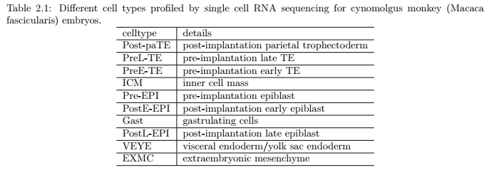

```{r configuracion_inicial, include=FALSE}
knitr::opts_chunk$set(echo = TRUE,
                      message = TRUE,
                      warning = FALSE,
                      tidy = F)
##################################################
#######        Encoded in UTF-8        ###########
##################################################
```

***

# Introducción y pre-requisitos

En este documento se muestran las prácticas y ejercicios de Pedro Madrigal, traducidas de Seurat V2 a Seurat V3, ya que Pedro usaba la versión 2 pese a estar obsoleta y tener dependencias obsoletas y difíciles de instalar en equipos actuales.

__Las prácticas 1 y 2__ se basan (incluyen modificaciones) en el código aportado por el Dr. Martin Hemberg del Instituto Wellcome Sanger en el curso de dos días de análisis de scRNA-seq impartido por la unidad de enseñanza de bioinformática de la Universidad de Cambridge.

__En la práctica 3__ aprenderemos a integrar en Seurat datos de scRNA-seq de páncreas humano y de ratón siguiendo la metodología de Butler _et al._, 2018.

__En la práctica 4__ aprenderemos a inferir trayectorias celulares a partir de datos de expresión single cell usando Monocle3.

__Los archivos necesarios para realizar las prácticas se pueden encontrar en [Dropbox](https://www.dropbox.com/sh/3gbbrz8go3fki29/AACJnK2StRDtXPBrMK110QEGa?dl=0) o en mi repositorio de [GitHub](https://github.com/gloknar/R-Utilities/tree/master/Traduccion%20Seurat%20V2%20V3/Archivos%20accesorios).__

```{r instalacion_paquetes, eval = F}
# Instalación monocle3 en R 3.6.1
if (!requireNamespace("BiocManager", quietly = TRUE))
  install.packages("BiocManager")
BiocManager::install(version = "3.10")

BiocManager::install(c('BiocGenerics', 'DelayedArray', 'DelayedMatrixStats',
                       'limma', 'S4Vectors', 'SingleCellExperiment',
                       'SummarizedExperiment', 'batchelor', 'Matrix.utils'))

install.packages("devtools")
devtools::install_github('cole-trapnell-lab/leidenbase')
devtools::install_github('cole-trapnell-lab/monocle3')


# Instalación Seurat V3 en R 3.6.1
remotes::install_version("Seurat", version = "3.2")
```


<br>

Comenzamos cargando Seurat y Monocle3.

```{r, message = F}
# Cargamos librerías
library("Seurat")
library("monocle3")
```

<br>

Hemos cargado las siguientes versiones:

```{r}
packageVersion("Seurat")
packageVersion("monocle3")
```

<br>

## Matriz de conteos de UMIs

En la práctica 1 de Seurat usaremos datos de SC3-seq (un tipo de scRNA-seq con amplificación del extremo 3 prima del ARNm de la célula) de embriones del macaco cangrejero Macaca fascicularis (Nakamura et al., 2016). Los datos se encuentran en el archivo "D3Ecounts.txt " (tiene valores separados por tabuladores) y vienen en forma de matriz de conteos de UMIs en las que las filas son los genes y las columnas son las células. El dataset consta de 399 células y les aplicaremos reducción de la dimensionalidad, clustering e identificación de genes marcadores.

La tabla 2.1 muestra detalles sobre los tipos celulares encontrados en el dataset.



<br>

## Preprocesado del dataset (ya realizado)

El dataset empleado se descargó del GEO en formato FastQ y contenía originalmente 474 células. Las células de tipo cyESC, ePGC e IPGC fueron filtradas y eliminadas del dataset, lo que generó el tamaño actual de 399 células. Tal como se hizo en Nakamura et al., 2016,  las lecturas de ARNm fueron preprocesadas con cutadapt 1.16 para eliminar el adaptador, la cola poli-A y los nucleótidos mal secuenciados (baja calidad) con 'cutadapt -colorspace -e 0.1 -q 20 -n 2 -O 1 -m 30 -a CTCGAGGGCGCGCCGGATCCATATACGCCTTGGCCGTACAGCAG -a “A{100}” -g CTCGAGGGCGCGCCGGATCCATATACGCCTTGGCCGTACAGCAG'.

Posteriormente las lecturas se mapearon al genoma de Macaca_fascicularis_5.0 descargado de ftp://ftp.ncbi.nih.gov/genomes/Macaca_fascicularis/Assembled_chromosomes/seq/ (chr1-20, chrX y chrMT) y a las secuencias ERCC spike-in RNA obtenidas de https://tools.thermofisher.com/content/sfs/manuals/cms_095047.txt. Para el mapeado, se empleó el programa Bowtie V1.2.2 con los parámetros 'bowtie -q -C -S -k 1 -p 1'.

Tras el mapeado, analizamos aquellas lecturas alineadas que tenían una Mapping Quality >= 10. Para la cuantificación de genes se usó el programa featureCounts v1.6.0 con los parámetros '-T 2 -t exon -g gene' y el archivo de anotación génica "macFas5_Annot_wo_pseudo_v1e_add10k.gtf" (disponible gracias a Tomonori Nakamura y Mitinori Saitou).

***

<br>


# Comenzamos el workflow

Antes de nada, establecemos la semilla de aleatoriedad para poder replicar los resultados.

```{r}
# Establecemos semilla de aleatoriedad
set.seed(1234567)
```


A continuación leemos la matriz de conteos de UMIs, almacenada en el archivo "D3Ecounts.txt", y observamos los 10 primeros genes y células.

```{r}
# Leemos matriz de conteos UMIs (contiene valores separados por tabuladores)
sc3 <- read.table("./Archivos accesorios/Codigo y datos de las Practicas 1-4/data/D3Ecounts.txt", sep = "\t", header = T)

head(sc3[1:10, 1:10])
```


Ahora formateamos la matriz para que quede más bonita y ordenada. Dado que cada fila corresponde a un gen, vamos a renombrar las filas con los nombres de los susodichos genes:
```{r}
rownames(sc3) <- sc3$Geneid
sc3 <- sc3[,2:ncol(sc3)]
head(sc3[1:10, 1:10])
```

***

<br>

# El objeto Seurat

El paquete `Seurat` no contiene una de las clases más usadas en Bioconductor, `SingleCellExperiment`. En su lugar usa su propio tipo de objeto, `seurat`. Todos los cálculos realizados en esta práctica se ejecutan sobre este objeto. Para comenzar el análisis primero tenemos que crear el objeto de tipo `seurat` a partir de los datos sc3 crudos ( _i.e._ no normalizados). Conservaremos todos los genes expresados en >= 3 células (parámetro `min.cells`) y todas las células que expresen como mínimo 200 genes (parámetro `min.features`). Esto se hace para evitar analizar células mal secuenciadas.

```{r, message = F}
library(dplyr)
cm <- CreateSeuratObject(counts = sc3, 
                         project = "Nakamura", 
                         min.cells = 3, 
                         min.features = 200)
```

***

<br>

# Control de calidad

Seurat te permite visualizar con simpleza métricas QC y filtrar células en base a cualquier criterio que imponga el usuario. Podemos visualizar conteos de moléculas de ARNm y genes y graficar su relación.


```{r}
# Nota: en Seurat V2 se llama "nGene"; en Seurat V3 se llama "nFeature_RNA"
# Nota2: en Seurat V2 se llama "nUMI"; en Seurat V3 se llama "nCount_RNA"
VlnPlot(object = cm, 
        features = c("nFeature_RNA", "nCount_RNA"),
        ncol = 2)
```

De los gráficos de violín se observa que la mayoría de células expresan entre 11000 y 14000 genes, y la mayoría de células presentan una expresión génica de entre 1 y 3 millones de moléculas de ARNm.


Los UMIs (Unique Molecular Identifiers) son los identificadores de los primers empleados en las tecnologías de scRNA-seq basadas en gotículas. Se usan para identificar lecturas originadas de una misma molécula de ARNm, de manera que evitamos contar dos veces la misma molécula de ARNm (ver imagen inferior, sacada de Bach et al., [2017](https://www.nature.com/articles/s41467-017-02001-5)).


<br>

```{r}
# Nota: En Seurat V2 usa "GenePlot", en Seurat V3 usa "FeatureScatter"
FeatureScatter(object = cm,
               feature1 = "nFeature_RNA",
               feature2 = "nCount_RNA")
```

En el gráfico anterior se observa que hay una relación (aunque no muy buena, dado que R = 0.44) entre el nº de genes que expresa una célula y el nº de transcritos de ARN que contiene la susodicha, lo cual es lógico.


