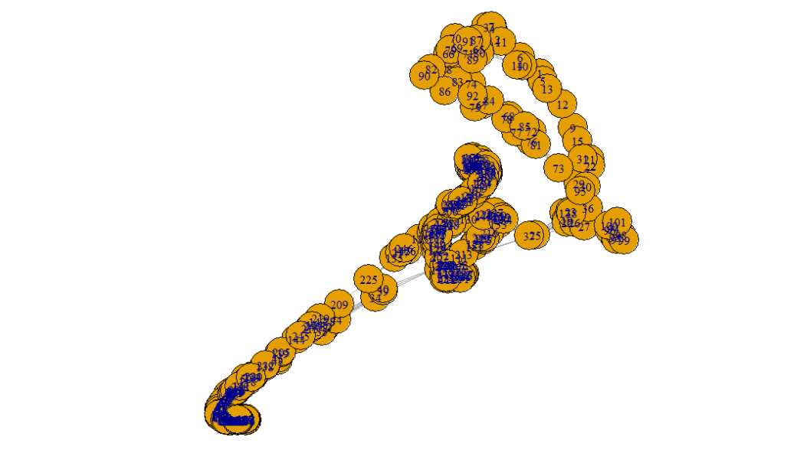
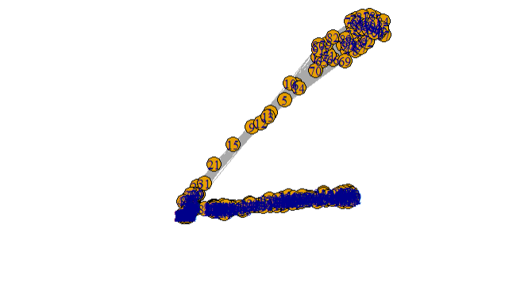
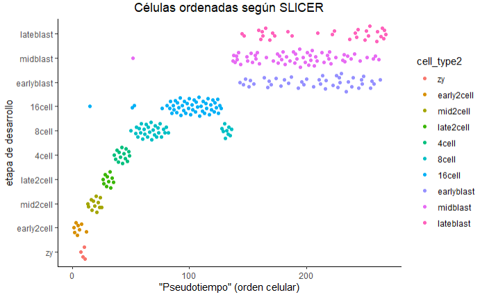
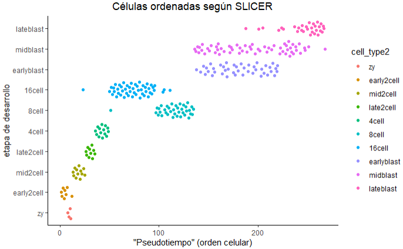
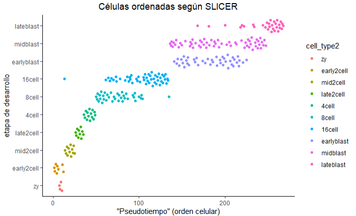
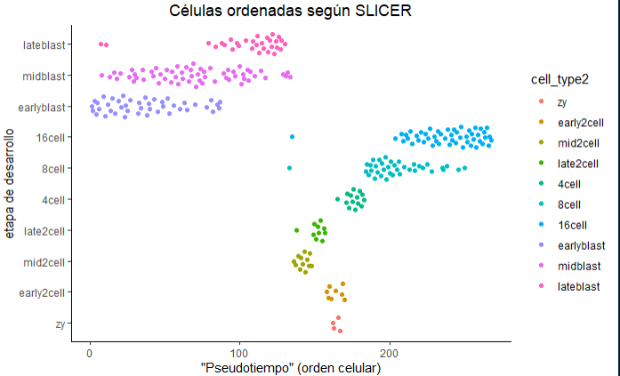

```{r configuracion_inicial, include=FALSE}
knitr::opts_chunk$set(echo = TRUE,
                      message = F,
                      warning = F,
                      tidy = F)
##################################################
#######        Encoded in UTF-8        ###########
##################################################
```

***

# Introducción al pseudotiempo

__El pseudotiempo es el ordenamiento basado en la similaridad de las células a lo largo de la trayectoria de un proceso de desarrollo contínuo.__


El pseudotiempo es una medida de cuánto progreso ha hecho una célula en un proceso biológico como por ejemplo la diferenciación celular. En muchos procesos biológicos, las células no progresan en perfecta sincronía. En estudios de expresión de single-cell sobre procesos tales como la diferenciación celular, las células estudiadas pueden mostrar diversos grados de desarrollo. Es decir, en una población de células capturadas exactamente a la vez, algunas células pueden estar más desarrolladas, mientras que otras pueden ni haber empezado el proceso en cuestión. Esta asincronía dificulta seriamente el estudio de la secuencia de cambios regulatorios que ocurren cuando las células transicionan de un estado a otro. Seguirle la pista a la expresión en todas las células capturadas a la vez produce un sentido muy comprimido de la cinética de un gen, y la variabilidad aparente de la expresión de ese gen será muy elevada. Al ordenar cada célula de acuerdo a su progreso a lo largo de una trayectoria aprendida, el análisis del pseudotiempo alivia los problemas derivados de la susodicha asincronía. En lugar de rastrear los cambios de la expresión génica en función del tiempo, diversas herramientas rastrean dichos cambios en función del progreso a lo largo de la trayectoria, la cual denominamos "pseudotiempo". El pseudotiempo es una unidad abstracta de progreso: en realidad es la distancia entre una célula dada y el comienzo de la trayectoria, medida a lo largo del camino más corto. La longitud total de la trayectoria se define en términos de la cantidad total de cambios transcripcionales que sufre una célula mientras se mueve del estado inicial al final.

```{r, message = F}
library("SingleCellExperiment")
library("TSCAN")
library("destiny")
library("SLICER")
library("ouija")
library("scater")
library("ggplot2")
library("ggthemes")
library("ggbeeswarm")
library("corrplot")
# library("M3Drop")
# library("monocle)
set.seed(1)
```


En muchas situaciones, uno estudia un proceso en el cual las células cambian continuamente. Esto incluye, por ejemplo, muchos procesos de diferenciación que tienen lugar durante el desarrollo del organismo: tras un estímulo, las células cambian de un tipo a otro. Idealmente, nos interesaría monitorizar los niveles de expresión de una célula dada a lo largo del tiempo. Desafortunadamente, tal monitorización no es posible en scRNA-seq dado que la célula se lisa cuando el ARN se extrae.


En su lugar, debemos muestrear en múltiples puntos del tiempo y así obtener "fotografías" de los perfiles de expresión génicos. Puesto que algunas células se diferenciarán más rápido que otras, cada fotografía puede contener células en diversas etapas del desarrollo. __Usamos métodos estadísticos para ordenar las células a lo largo de una o más trayectorias las cuales representan las trayectorias del desarrollo subyacentes, este ordenamiento se conoce como "pseudotiempo".__


En esta práctica nos centraremos en 4 herramientas para ordenar las células según su grado de desarrollo en el pseudotiempo: `TSCAN`, `SLICER`, `destiny` y `Ouija.` Para ilustrar su uso, emplearemos el dataset del desarrollo embrionario en ratón de [Deng _et al._, 2014](https://science.sciencemag.org/content/343/6167/193). Dicho dataset cuenta con 268 células provenientes de la fase temprana del desarrollo embrional y extraídas en 10 puntos de tiempo. En este caso no hace falta alinear las células a la trayectoria del pseudotiempo dado que están ya etiquetadas con información sobre la trayectoria embrionaria. Por tanto, las etiquetas son la _ground truth_ o verdad experimental sobre la cual podemos comparar el rendimiento obtenido por los susodichos métodos.

Una revisión más o menos reciente de [Cannoodt _et al._](https://onlinelibrary.wiley.com/doi/full/10.1002/eji.201646347) publicada en 2016 nos aporta un resumen detallado de los distintos algoritmos empleados para la inferencia de trayectoria en scRNA-seq. Dicha revisión cubre:


* **Monocle** - Paquete de Bioconductor

* **TSCAN** - Paquete de Bioconductor

* **SLICER** - Paquete de R, disponible sólo a través de GitHub

* Waterfall - Paquete de R (se incluye un script en el suplemento del artículo original de [Shin _et al,_ 2015](https://www.cell.com/cell-stem-cell/fulltext/S1934-5909(15)00312-4) y en los [archivos asociados](https://github.com/gloknar/R-Utilities/tree/master/Traduccion%20Seurat%20V2%20V3/Cosas%20accesorias%20Informe%202) a este informe)

* Mpath - Paquete de R disponible en GitHub (comprimido con formato `tar.gz`). La función está documentada, pero el workflow no, ni tiene una _vignette_.

* Wishbone - Paquete de Python

* SCUBA - Paquete de Matlab

* Wanderlust - Paquete de Matlab

* SCOUP - Programa en C++ por línea de comandos 

<br>

Las figuras 1 y 2 del paper de Cannoodt _et al._ resumen algunas de las características de estos métodos.


<br>


***

<br>

# Visualización del dataset en PCA


Al igual que el dataset de Nakamura _et al._ usado en la práctica 1, el dataset de Deng _et al._ contiene células embrionarias en los primeros estadios de Carnegie, solo que en este caso las células son de ratón, y no de macaco cangrejero. El dataset de esta práctica se encuentra en el archivo `deng-reads.rds`.


```{r}
# Leemos los datos
deng_SCE <- readRDS(file = "./Archivos accesorios/Codigo y datos de las Practicas 1-4/data/deng-reads.rds")

# Reordenamos los niveles, ya que zigoto < 2 células < 4 células, etc...
deng_SCE$cell_type2 <- factor(deng_SCE$cell_type2, 
                              levels = c("zy", "early2cell", "mid2cell", "late2cell",
                              "4cell", "8cell", "16cell", "earlyblast", "midblast", 
                              "lateblast")) 


# Generamos y formateamos una matriz de conteos crudos (i.e. nº de transcritos
# por gen y célula)
raw_deng <- counts(deng_SCE)

# Establecemos el nombre de las células en el objeto `cellLabels`
cellLabels <- deng_SCE$cell_type2
colnames(raw_deng) <- cellLabels
```


Tal como muestra el siguiente gráfico, el PCA muestra bastante bien la estructura de los datos y los separa correctamente en su mayoría, exceptuando aquellas células que corresponden al estadio de blastocisto (early/mid/lateblast), que están mezcladas entre sí. Se aprecia cómo las células están ordenadas en el espacio del PCA en sentido horario, desde la etapa de zigoto (zy) hasta la de blastocisto tardío (lateblast).

```{r}
# Corremos PCA en un objeto de tipo SingleCellExperiment
deng_SCE <- runPCA(deng_SCE)

# Graficamos el PCA
BiocGenerics::plotPCA(deng_SCE, colour_by = "cell_type2") + 
  ggtitle("PCA de células embrionarias de ratón") + 
  theme(plot.title = element_text(hjust = 0.5))
```

Aquí el PCA nos proporciona un útil punto de referencia para comprobar diversos métodos de inferencia de trayectoria. A diferencia del t-SNE y el UMAP, el PCA podría revelarnos mejor el tiempo de desarrollo, a expensas de producir un clustering peor. Un algoritmo muy sencillo de inferencia podría ser simplemente utilizar las coordenadas en el espacio del PCA de la primera componente principal. 


```{r}
# Guardamos en el bolsillo `PC1` del objeto `SCE` el pseudotiempo calculado para
# las células con el PCA
deng_SCE$PC1 <- reducedDim(x = deng_SCE, type = "PCA")[,1]

# Graficamos el pseudotiempo según las coordenadas de la primera componente
# principal
ggplot(as.data.frame(colData(deng_SCE)), 
       aes(x = PC1, y = cell_type2, colour = cell_type2)) + 
       geom_quasirandom(groupOnX = F) + theme_classic() + 
       theme(plot.title = element_text(hjust = 0.5)) +
       ggtitle("Células ordenadas por la 1ªCP") + 
       xlab("Primera componente principal") + ylab("Etapa de desarrollo") + 
       scale_colour_calc()
```

Aplicando dicho algoritmo básico, y tal y como muestra el gráfico anterior, vemos que a la primera dimensión le cuesta un poco diferenciar algunos tipos celulares, pero en general ordena bien las células según su estapa de desarrollo. Nótese que aunque los resultados estén al revés, esto se puede solucionar fácilmente invirtiendo el eje X.

```{r}
# Invertimos el pseudotiempo (1ª componente principal)
deng_SCE$PC1 <- deng_SCE$PC1 * (-1)

# Graficamos la trayectoria final inferida (corregida)
ggplot(as.data.frame(colData(deng_SCE)), 
       aes(x = PC1, y = cell_type2, colour = cell_type2)) + 
       geom_quasirandom(groupOnX = F) + theme_classic() + 
       theme(plot.title = element_text(hjust = 0.5)) +
       ggtitle("Células ordenadas por la 1ªCP (orden correcto)") + 
       xlab("Primera componente principal") + ylab("Etapa de desarrollo") + 
       scale_colour_calc()
```


```{r, echo = F, eval = F}
# Para invertir el eje X hay 3 opciones, que yo sepa: Una es multiplicar la
# columna de interés por -1, tal que así:
deng_SCE$PC1 <- -deng_SCE$PC1

# otra opción es usar el comando `scale_x_reverse()` de ggplot2:
ggplot()... + scale_x_reverse()

# La tercera opción es establecer manualmente al revés los límites del eje X con el comando de gglplot2 `xlim()`:
ggplot()... + xlim(-80,120)
```


En las siguientes secciones veremos qué rendimiento desempeñan los algoritmos previamente citados ( _i.e._ `TSCAN` y sucedáneos).


***

<br>

# `TSCAN`

`TSCAN` combina el clustering con el análisis de pseudotiempo. El clustering de las células que ejerce el comando `exprmclust` se basa en `mclust` ([Scrucca _et al._, 2016](https://journal.r-project.org/archive/2016/RJ-2016-021/RJ-2016-021.pdf)), el cual modela varias distribuciones normales. Tras el agrupamiento, se construye un árbol del menor tamaño posible ( _minimum-spanning-tree_ o MST) que conecta los clusters entre sí. La rama principal del árbol será la que conecte el mayor nº de clusters, y es la rama que se usa para determinar el pseudotiempo.

Mostramos a continuación el workflow:

```{r}
# El comando `preprocess` usa como input la matriz de conteos cruda y devuelve
# la matriz de conteos logarítmica a la vez que filtra genes con poca varianza
# y/o expresados en pocas células. Uso la forma `TSCAN::preprocess` para evitar
# confusión con el comando homónimo del paquete `caret`.
procdeng <- TSCAN::preprocess(raw_deng)

# Cambiamos el nombre de las columnas de tipo celular a índice numérico.
colnames(procdeng) <- 1:ncol(raw_deng)

# Agrupamos las células con `exprmclust`.
dengclust <- exprmclust(procdeng, clusternum = 10)

# Graficamos el clustering en el espacio del PCA generado por `exprmclust`.
plotmclust(dengclust, show_tree = T, show_cell_names = F)

# Computamos el pseudotiempo calculado por TSCAN mediante el comando
# `TSCANorder`. Con el parámetro `orderonly = F`, nos devuelve un dataframe con
# el nombre de la célula, el estadio celular en el que se encuentra y su
# posición en el pseudotiempo, respectivamente.
dengorderTSCAN <- TSCANorder(dengclust, orderonly = F)

# Inicializamos el bolsillo vacío "pseudotime_order_tscan" en el objeto `deng_SCE` y
# lo rellenamos con el pseudotiempo que asigna TSCAN a cada célula.
deng_SCE$pseudotime_order_tscan <- NA
deng_SCE$pseudotime_order_tscan[as.numeric(dengorderTSCAN$sample_name)] <- dengorderTSCAN$Pseudotime
```


Nota: Con el siguiente código podemos comprobar qué cluster asigna TSCAN a cada estadio celular. En este caso, el clúster nº 10 corresponde a células en fase "late2cell".

```{r}
cellLabels[dengclust$clusterid == 10]
```


Ahora visualizamos la trayectoria inferida por `TSCAN` y el pseudotiempo asignado a cada estadio celular:

```{r}
# Graficamos el pseudotiempo final de TSCAN
ggplot(as.data.frame(colData(deng_SCE)), 
       aes(x = pseudotime_order_tscan, y = cell_type2, colour = cell_type2)) +
       geom_quasirandom(groupOnX = F) + theme_classic() +
       theme(plot.title = element_text(hjust = 0.5)) +
       ggtitle("Células ordenadas según TSCAN") +
       xlab("Pseudotiempo") + ylab("Etapa de desarrollo") +
       scale_colour_calc()
```

Al igual que el PCA, `TSCAN` nos devuelve la trayectoria al revés. Vamos a invertirla.


```{r}
# Invertimos la trayectoria para ponerla en el sentido correcto
deng_SCE$pseudotime_order_tscan <- -deng_SCE$pseudotime_order_tscan

# Graficamos la trayectoria final inferida (corregida)
ggplot(as.data.frame(colData(deng_SCE)), 
       aes(x = pseudotime_order_tscan, y = cell_type2, colour = cell_type2)) +
       geom_quasirandom(groupOnX = F) + theme_classic() +
       theme(plot.title = element_text(hjust = 0.5)) +
       xlab("Pseudotiempo") + ylab("Etapa de desarrollo") +
       scale_colour_calc() + labs(title = "Células ordenadas según TSCAN (orden correcto)")
```

Observamos que la trayectoria inferida por `TSCAN` es similar a la obtenida en el PCA, y por tanto no podemos asegurar que `TSCAN` funcione mejor que el ordenamiento que hicimos mediante las coordenadas de la 1ª componente principal. Ello se debe a que `TSCAN` es un método de inferencia de trayectoria basado en el PCA.


<details>
<summary> __Ejercicio 2.1: Compara los resultados obtenidos al variar el parámetro `clusternum` (nº de clusters) del comando `exprmclust`__ </summary>

<br>

__Solución__: en este dataset, `TSCAN` infiere bien en su mayoría la trayectoria del desarrollo embrionario del ratón si configuramos el parámetro `clusternum` entre 3 y 8.


```{r}
for (i in c(2:9)) {
  # clustering buscando 2-9 clusters
  dengclust <- exprmclust(procdeng, clusternum = i)
  
  # Computamos el pseudotiempo
  dengorderTSCAN <- TSCANorder(dengclust, orderonly = F)
  
  # Añadimos al objeto `SCE` el pseudotiempo calculado por `TSCAN`
  deng_SCE$exercise_tscan[as.numeric(dengorderTSCAN$sample_name)] <- dengorderTSCAN$Pseudotime
  
  # Graficamos la trayectoria final
  print(ggplot(as.data.frame(colData(deng_SCE)), 
       aes(x = exercise_tscan, y = cell_type2, colour = cell_type2)) +
       geom_quasirandom(groupOnX = F) + theme_classic() +
       theme(plot.title = element_text(hjust = 0.5)) +
       ggtitle(paste("Trayectoria inferida con", i, "clusters"))) +
       xlab(paste("Pseudotiempo")) + ylab("Etapa de desarrollo") +
       scale_colour_calc()
  # Tienes que usar explícitamente print(ggplot()) si usas gráficos de ggplot2
  # dentro de un bucle for
}
```

</details>


***

<br>


# Mapas de difusión: `destiny`

Los mapas de difusión fueron inventados por [Ronald Coifman y Stephane Lagon en 2006](https://ieeexplore.ieee.org/document/1704834), y la idea principal tras dichos mapas es asumir que los datos son muestras de un proceso de difusión. Este método infiere la estructura de los datos en un espacio de baja dimensionalidad al estimar los _eigenvalues_ y los _eigenvectors_ (valores y vectores propios) del operador de difusión relacionado con los datos.

10 años después, [Angerer _et al._](https://academic.oup.com/bioinformatics/article/32/8/1241/1744143) aplicaron exitosamente el concepto de los mapas de difusión al análisis de datos scRNA-seq para crear así un paquete de R llamado `destiny`.

Si en la sección del PCA comentábamos que el pseudotiempo era las coordenadas de la 1ª componente principal, en `destiny` el pseudotiempo pasa a ser las coordenadas de la 1ª componente de difusión. Los mapas de difusión son no lineales.

```{r}
# Primero creamos la matriz de conteos en forma logarítmica con  el comando
# `logcounts`. Recuerda que usa la pseudocuenta de 1, o sea, log2(x+1), para
# definir el logaritmo cuando x = 0.
log_deng <- logcounts(deng_SCE)

# Formateamos bien los nombres de las células (columnas) en la matriz de conteos
# logarítmica.
colnames(log_deng) <- cellLabels

# Calculamos las componentes de difusión. Hay que transponer la matriz de
# conteos logarítmica.
dm <- DiffusionMap(t(log_deng))

# Creamos un dataframe _ad interim_ con las 2 primeras componentes de difusión y
# el tipo ce célula.
tmp <- data.frame(DC1 = eigenvectors(dm)[,1],
                  DC2 = eigenvectors(dm)[,2],
                  etapa_desarrollo = cellLabels) # = deng_SCE$cell_type2
```


```{r}
# Graficamos las dos primeras componentes del mapa de difusión
ggplot(tmp, aes(x = DC1, y = DC2, color = etapa_desarrollo)) + geom_point() + 
       theme_classic() + theme(plot.title = element_text(hjust = 0.5)) + 
       xlab("Componente de difusión 1") + ylab("Componente de difusión 2") + 
       scale_color_calc() + ggtitle("Mapa de difusión de destiny")
```


```{r}
# Ordenamos las células según sus coordenadas en la primera componente de
# difusión y guardamos el resultado en el objeto `SCE`
deng_SCE$pseudotime_diffusionmap <- rank(eigenvectors(dm)[,1]) # = rank(dm@eigenvectors[,1])

# Graficamos la trayectoria final inferida
ggplot(as.data.frame(colData(deng_SCE)), aes(x = pseudotime_diffusionmap, y = cell_type2, colour = cell_type2)) +
       geom_quasirandom(groupOnX = FALSE) + scale_color_calc() + theme_classic() + 
       theme(plot.title = element_text(hjust = 0.5)) + xlab("Pseudotiempo del mapa de difusión (1ª componente)") + 
       ylab("Etapa de desarrollo") + ggtitle("Células ordenadas según destiny")
```

```{r}
# Invertimos el pseudotiempo
deng_SCE$pseudotime_diffusionmap <- -deng_SCE$pseudotime_diffusionmap

# Graficamos la trayectoria final inferida (corregida)
ggplot(as.data.frame(colData(deng_SCE)), aes(x = pseudotime_diffusionmap, y = cell_type2, colour = cell_type2)) +
       geom_quasirandom(groupOnX = FALSE) + scale_color_calc() + theme_classic() + 
       theme(plot.title = element_text(hjust = 0.5)) + xlab("Pseudotiempo del mapa de difusión (1ª componente)") + 
       ylab("Etapa de desarrollo") + ggtitle("Células ordenadas según destiny (orden correcto)")
```

Al igual que `TSCAN` y el PCA, usar la 1ª componente de difusión a modo de pseudotiempo nos ayuda a ordenar las células tempranas, pero no puede distinguir las células en etapas más avanzadas del desarrollo (embrión con 8 o más células).


***

<br>


# `SLICER`

`SLICER` es un algoritmo para construir trayectorias que describen cambios en la expresión génica durante un proceso biológico secuencial (al igual que `Monocle` y `TSCAN`). `SLICER` está diseñado para capturar cambios de expresión génica no lineales, seleccionar automáticamente aquellos genes que participen en el proceso biológico y detectar _branches_/caminos alternativos y _loops_ en la trayectoria ([Welch _et al._, 2016](https://genomebiology.biomedcentral.com/articles/10.1186/s13059-016-0975-3)). El paquete de `SLICER` está disponible en [GitHub](https://github.com/jw156605/SLICER) y se puede instalar mediante las utilidades del paquete `devtools`.

Emplearemos la función `select_genes` de `SLICER` para seleccionar automáticamente los genes que se usarán para construir la trayectoria celular. Dicha función usa la "neighbourhood variance" para identificar los genes que varían suavemente (en lugar de aquellos que fluctúan aleatoriamente) en las células estudiadas. A continuación, determinaremos mediante el comando `select_k` el nº de vecinos cercanos o _nearest neighbours_ que devuelva un _embedding_ o embebimiento (construcción en un espacio de dimensionalidad reducida) lo más parecido a una trayectoria. Finalmente estimaremos el embebimiento localmente lineal (LLE) de las células mediante el comando `lle` del paquete homónimo. 


```{r, warning = F}
# Para seleccionar los genes en SLICER, usamos la matriz de conteos logarítmica
# traspuesta. Ídem para seleccionar k
slicer_genes <- select_genes(t(log_deng))
k <- select_k(t(log_deng[slicer_genes,]), kmin = 30, kmax = 60)

# La librería `lle` permite usar el comando homónimo para calcular el LLE o
# Locally Linear Embedding.
library("lle")
slicer_traj_lle <- lle(t(log_deng[slicer_genes,]), m = 2, k)$Y # Importante usar esta notación, si no, no funciona el comando `conn_knn_graph()`

# Añadimos los resultados de la técnica de reducción de la dimensionalidad al
# objeto `SCE`
reducedDim(x = deng_SCE, type = "LLE") <- slicer_traj_lle

# Con el siguiente comando comprobamos que el LLE esté disponible para la
# función `reducedDim()`
reducedDimNames(deng_SCE)

# Graficamos el espacio de dimensionalidad reducida LLE
plotReducedDim(deng_SCE, dimred = "LLE", colour_by = "cell_type2", ncomponents = 2) +
                xlab("Componente de LLE 1") + ylab("Componente de LLE 2") +
                ggtitle("Embebimiento localmente lineal (LLE) de las células - SLICER") + 
                theme(plot.title =  element_text(hjust = 0.5))
```

> SLICER was initially developed with single cell RNA-seq in mind, but we have also found that it can give good results when applied to other types of data, including bulk RNA-seq, single cell qPCR data, and single cell epigenomic data.

> A key assumption of SLICER is that a possibly branching, intrinsically one-dimensional process is the dominant source of variation among samples. It is important to think carefully about whether this assumption is reasonable for any given dataset.

Ahora que hemos calculado el LLE, podemos construir un grafo basado en _k-nearest neighbours_ (k-NN) que sea completamente conectado ( _fully connected_, como se suele decir en el ámbito de los MLPs) mediante el comando `conn_knn_graph`. En el grafo a continuación se representan las células como círculos naranjas con sus IDs en azul. Mostramos a continuación el grafo obtenido con 10 vecinos.

```{r, warning = F}
set.seed(43765)
# El input del grafo es el LLE (de k = 60 vecinos)
slicer_traj_graph <- conn_knn_graph(slicer_traj_lle, k = 5)

# Graficamos
plot(slicer_traj_graph, main = "Grafo k-NN completamente conectado de SLICER")
```

A partir del grafo podemos identificar las células distales (de los extremos), las cuales serán candidatas para el comienzo y el fin de la trayectoria. Esto se lleva a cabo a través de la función `find_extreme_cells`.

```{r}
# Encontramos las células distales del grafo
ends <- find_extreme_cells(traj_graph = slicer_traj_graph, embedding = slicer_traj_lle)
start <- ends[1]
```

Tras definir la célula inicial y la final, ambas contenidas en el objeto `ends`, procedemos a ordenar las células a lo largo de la trayectoria. Para ello, primero ordenamos las células con el comando `cell_order` y acto seguido detectamos las ramas de la trayectoria con `assign_branches` (este comando es muy sensible a la elección de los parámetros `k` del LLE y del grafo, en el sentido de que puede devolver un error fácilmente. Para más información, véase la solución del ejercicio 2.2).

```{r}
# Ordenamos las células en el pseudotiempo con la función `cell_order()` del
# paquete `SLICER`
pseudotime_order_slicer <- cell_order(slicer_traj_graph, start)

# Detectamos ramas/caminos alternativos
branches <- assign_branches(slicer_traj_graph, start)

# creamos dataframe con las ramas, los estadios celulares y el pseudotiempo
pseudotime_slicer <- data.frame(TimePoint = cellLabels,
                                pseudotime = NA,
                                State = branches)

# Añadimos a la columna pseudotime del dataframe anterior el orden de las
# células en el pseudotiempo
pseudotime_slicer$pseudotime[pseudotime_order_slicer] <-  1:length(pseudotime_order_slicer)
```


Hecho esto, ahora podemos comparar la trayectoria inferida por `SLICER` con las etapas del desarrollo ya conocidas. `SLICER` no devuelve un pseudotiempo _per se_, sino simplemente el orden final de las células.


```{r}
# Añadimos al objeto `SCE` el pseudotiempo del dataframe anterior para comparar
# los resultados con los métodos anteriores y la verdad experimental
deng_SCE$pseudotime_slicer <- pseudotime_slicer$pseudotime

# Graficamos el resultado
ggplot(as.data.frame(colData(deng_SCE)), aes(x = pseudotime_slicer, y = cell_type2, colour = cell_type2)) + 
  geom_quasirandom(groupOnX = F) + xlab(" \"Pseudotiempo\" (orden celular) ") + ylab("etapa de desarrollo") +
  theme_classic() + ggtitle("Células ordenadas según SLICER") + theme(plot.title = element_text(hjust = 0.5))
```

Al igual que los métodos ya probados hasta ahora, `SLICER` ordena relativamente bien las primeras etapas del desarrollo, aunque ha invertido el orden de las etapas `16cell` y `8cell` (e ídem para las etapas `zy` y `early2cell`). Pese a ello, logra separar un poco mejor las blastómeras tardías del resto de blastómeras.


<details>
<summary> __Ejercicio 2.2: ¿Cómo cambian los resultados del LLE en función del valor de `k`? ¿Y qué pasa al cambiar el nº de vecinos cercanos en la función `conn_knn_graph()`?__ </summary>

<br>

__Solución__: 

* Manteniendo el parámetro `k = 60` del LLE  y variando el parámetro `k` del comando `conn_knn_graph()`, vemos que __a mayor nº de vecinos cercanos, la trayectoria se perfila cada vez más en el grafo, si bien el ordenamiento final de las células se mantiene igual__. Nótese que para valores muy bajos de vecinos (k = 1~3), el comando `assign_branches` devuelve el error `Error in 1:num_branches : Argumento NA/NaN`

* Manteniendo el parámetro `k = 10` del grafo y variando el parámetro `k` del LLE, vemos que para valores extremos de `k`, a SLICER le cuesta ordenar las células. __SLICER ordena exitosamente las células tempranas con un `k = 30`__, mientras que con `k = 55` intenta separar las blastómeras (aunque sin mucho éxito). Nótese que para valores muy bajos de vecinos (k < 10), el comando `assign_branches` devuelve el error `Error in if (mean_dist < min_dist) { : valor ausente donde TRUE/FALSE es necesario` (Si se observa la función con F2, se aprecia que se omitieron algunos casos en la sección de condicionales).


<br>


<br>



<br>



<br>


<br>



<br>


<br>



<br>



<br>



</details>


***

<br>


# `ouija`

`ouija` (viñeta online: http://kieranrcampbell.github.io/ouija/) infiere la trayectoria de manera distinta a como lo han hecho los paquetes previamente presentados. Mientras que el PCA, `TSCAN`, `destiny` y `SLICER` eran métodos no supervisados y no tenían en cuenta las etiquetas asignadas por el investigador, `ouija` es un algoritmo probabilístico capaz de inferir el pseudotiempo a partir de un pequeño panel de genes marcadores. En concreto, este algoritmo:

* Infiere el pseudotiempo a partir de un nº reducido de biomarcadores, llevando la atención del investigador a dichos genes.

* Proporciona estimaciones de los parámetros (incluye incertidumbre), lo que permite interpretar patrones de regulación génica. 

* Incluye un test para hipótesis Bayesiana para encontrar a lo largo de la trayectoria genes regulados antes que otros.     

* Identifica estados metaestables a lo largo de la trayectoria, _i.e._ tipos celulares discretos.


<br>

En `ouija` podemos modelar los genes de varias maneras:

* Que se sobre o infraexpresen de manera monotónica ( _i.e._ su expresión a lo largo del tiempo sea exclusivamente al alza o a la baja, respectivamente). Esto se conoce como comportamiento _switch-like_.

* Que se sobre o infraexpresen de manera aguda ( _i.e._ la expresión del gen alcanza brevemente y de manera rápida un máximo/mínimo). Esto se conoce como comportamiento transitorio.

Por defecto, `ouija` asume que todos los genes usan el modelo monotónico, aunque el autor asegura que no pasa nada, pues modelar un gen transitorio como uno monotónico tiene un efecto mínimo en los resultados finales.


<br>

Proporcionaremos a `ouija` los siguientes biomarcadores, junto con la etapa del desarrollo en la que se sobreexpresan:

* Etapa inicial: Dazl, Rnf17, Sycp3, Nanog, Pou5f1, Fgf8, Egfr, Bmp5, Bmp15

* Etapa intermedia: Zscan4b, Foxa1, Prdm14, Sox21

* Etapa tardía: Creb3, Gpx4, Krt8, Elf5, Eomes, Cdx2, Tdgf1, Gdf3

En nuestro caso particular con el dataset de Deng podemos hacer un poco de trampas y comprobar que nuestros genes marcadores seleccionados son realmente biomarcadores de las distintas etapas del desarrollo aquí estudiadas.


```{r, fig.height = 9.5}
# Genes de la etapa inicial(excepto Nanog). Comienzan activos y se desactivan a
# medida que progresa el pseudotiempo (de ahí lo de "down").
ouija_markers_down <- c("Dazl", "Rnf17", "Sycp3", "Pou5f1", "Fgf8", "Egfr", "Bmp5", "Bmp15")

# Genes de la etapa intermedia. Comienzan inactivos, se activan un rato y
# vuelven a desactivarse hacia el final de la trayectoria. Presentan una
# activación transitoria
ouija_markers_transient <- c("Zscan4b", "Foxa1", "Prdm14", "Sox21") 

# Genes de la etapa tardía. Comienzan inactivos y se activan a medida que
# progresa el pseudotiempo (de ahí lo de "up").
ouija_markers_up <- c("Creb3", "Gpx4", "Krt8", "Elf5", "Eomes", "Cdx2", "Tdgf1", "Gdf3") # Mirar gen Sox2

# Mirar differential activity of the CARM1 histone methyltransferase has been
# shown to determine cell fate decision in 4-cell mouse embryos


ouija_markers <- c(ouija_markers_up, ouija_markers_down, ouija_markers_transient)

plotExpression(deng_SCE, features = ouija_markers, x = "cell_type2", colour_by = "cell_type2") + 
  theme(axis.text.x = element_text(angle = 60, hjust = 1))
```


Para computar el pseudotiempo, basta con llamar a `ouija` y pasarle los modelos de genes esperados. Como ya se dijo en el párrafo anterior, el paquete modela por defecto los genes de manera monotónica (cosa que haremos a continuación). El input que espera `ouija` es cualquiera de las 3 opciones siguientes:

* Una matriz de célula(fila) x gen(columna) con valores de expresión génica no negativos.

* Una matriz de conteos logarítmica, producto de aplicar el comando `logcounts()` a un objeto de tipo `SingleCellExperiment`.

* Un objeto de tipo `ExpressionSet`.


Podemos añadir información conocida _a priori_ respecto a la sobre o infraexpresión de los genes implicados en el proceso biológico estudiado, además de incluir conocimiento previo sobre el tipo de modelo que sigue cada gen (monotónico/transitorio).

Podemos contruir el modelo de `ouija` con:

* El método de Monte Carlo Hamiltoniano o Monte Carlo Híbrido ( _Hamiltonian Monte Carlo_ o HMC). Consiste en inferencia completa con el método de Monte Carlo basado en Cadenas de Markov ( _Monte Carlo Markov Chain_ o MCMC) en la cual se usa la información del gradiente de la _log-posterior_ (logaritmo de la probabilidad _a posteriori_) para guiar el paseo aleatorio en el espacio del parámetro.

* El método de _Automatic Differentiation Variational Bayes_, ADVI o simplemente VI. Consiste en inferencia aproximada en la cual se minimiza la divergencia Kullback-Leibler o KL (una medida de distancia asimétrica y distinta de la euclídea; no es lo mismo medir la distancia _forwards KL_ que la distancia _backwards KL_) a una distribución aproximada.


En general, el método de HMC infere de manera más precisa la trayectoria y devuelve una varianza posterior aproximadamente correcta para todos los parámetros. No obstante, el ADVI es _significativamente_ más rápido que HMC y aunque pueda infraestimar la varianza _a posteriori_, el autor de `ouija` comenta que en ocasiones ADVI puede devolver resultados igual de buenos que los obtenidos con HMC, en cuanto a descubrimiento de pseudotiempos posteriores se refiere.


Para ayudar al modelo de `ouija`, vamos a proporcionarle información _a priori_ sobre el comportamiento de nuestros genes sobre e infraexpresados. Al seleccionar la switch strength en +-10 (-10 para genes infraexpresados y +10 para genes sobreexpresados) y la prior strength standard deviation en 0.5, le estamos indicando al modelo que estamos muy seguros sobre el comportamiento esperado de estos genes a lo largo del proceso biológico estudiado (desarrollo embrionario en este caso).


```{r}
# Tipo de respuesta de cada gen
response_type <- c(rep("switch", length(ouija_markers_down) + length(ouija_markers_up)),
                   rep("transient", length(ouija_markers_transient)))

# c(rep("switch", length(ouija_markers_down) + length(ouija_markers_up))) equivale a 
# c(rep("switch", length(ouija_markers_down)), rep("switch, length(ouija_markers_up)))


# Certeza del comportamiento de nuestros biomarcadores
switch_strengths <- c(rep(-10, length(ouija_markers_down)), 
                      rep(10, length(ouija_markers_up)))

# Desviación estándar de dicha certeza
switch_strength_sd <- c(rep(0.5, length(ouija_markers_down)), 
                         rep(0.5, length(ouija_markers_up)))


# El comando `ouija()` recomienda usar la siguiente línea de código para
# paralelizar en local su computación:
options(mc.cores = parallel::detectCores())

oui_vb <- ouija(x = deng_SCE[ouija_markers,],
                response_type = response_type,
                switch_strengths = switch_strengths,
                switch_strength_sd = switch_strength_sd,
                inference_type = "vb", # "vb" = ADVI
                single_cell_experiment_assay = "logcounts")

print(oui_vb)
```


```{r, echo = F, eval = F}
# Con `capture.output` evitamos que imprima por consola toda la verbose. Es
# equivalente a `verbose = F` en comandos que carecen de dicho parámetro, como
# es el caso de `ouija()`

garbage <- capture.output(
  oui_monsieur <- ouija(x = deng_SCE[ouija_markers,],
                  response_type = response_type,
                  switch_strengths = switch_strengths,
                  switch_strength_sd = switch_strength_sd,
                  inference_type = "vb",
                  single_cell_experiment_assay = "logcounts")
)
print(oui_monsieur)
```


Podemos graficar la expresión génica a lo largo del pseudotiempo junto con las estimaciones de la función media-MAP ( _maximum a posteriori_) usando el comando `plot_expression()` del paquete `ouija`. 

```{r, fig.height= 7}
plot_expression(oui_vb) + theme_classic()
```


Nótese que genes tempranos como Zscan4b (expresado en los estadios de 2 y 4 células) aparecen sobreexpresados al final del pseudotiempo, lo que nos indica que el gráfico tiene el eje X invertido. Vamos a solucionarlo:

```{r, fig.height= 7}
plot_expression(oui_vb) + theme_classic() + 
  scale_x_reverse() + xlab("Ouija pseudotime (corrected)")
```


Ahora podemos observar en el gráfico la expresión de cada gen a lo largo del proceso de desarrollo embrionario. Por ejemplo, el gen Elf5 comienza a expresarse en las estapas finales (blastocisto).

<br>

También podemos visualizar cuándo suceden en la trayectoria los comportamientos de regulación génica, ya sea en forma de switch time o el peak time (para genes monotónicos o transitorios) usando los comandos `plot_switch_times` y `plot_transient_times`.


```{r, warning=F}
# Graficamos los switch times de los genes monotónicos (switch-like)
plot_switch_times(oui_vb)

# Graficamos los peak times de los genes transitorios
plot_peak_times(oui_vb)
```

Se aprecia que igual que en el gráfico anterior, la trayectoria está invertida. Además, el gráfico que devuelve `plot_switch_times()` indica la regulación al revés (El gen Fgf8 se desactiva al comienzo de la trayectoria aunque en el gráfico indique que se activa, ídem para el gen Egfr). Procedemos a corregir ambos gráficos inviertiendo el eje X de ambos gráficos y la leyenda del gráfico `plot_switch_times`, teniendo en cuenta que:

* Los comandos `plot_switch_times` y `plot_peak_times` usan internamente el comando `coord_flip()`, por lo que para invertir el eje x, tenemos que usar el comando `scale_y_reverse()` en lugar de `scale_x_reverse()`.

* Para invertir los valores de la regulación del gráfico de `plot_switch_times`, multiplicaremos por $-1$ los valores contenidos en el objeto `oui_vb$fit@sim$samples`, pues la función `plot_switch_times` obtiene dichos valores de regulación de ahí.


<details>
<summary> __Compendio de soluciones para corregir los valores de regulación génica de `plot_switch_times`__</summary>

<br>

Mientras que para invertir el eje x de nuestros gráficos, basta con llamar a la función `scale_y_reverse` (y no `scale_x_reverse` dado que las funciones de graficado `plot_switch_times` y `plot_peak_times` usan internamente `coord_flip`), para invertir los valores de la regulación génica no es tan fácil.

La función de graficado `plot_switch_times` obtiene los valores de regulación génica de los objetos k.1-k.16 de la lista `oui_vb$fit@sim$samples[[1]]` (i.e. `oui_vb$fit@sim$samples[[1]]$k.1`, `oui_vb$fit@sim$samples[[1]]$k.2`...), ubicada dentro del objeto `oui_vb`. A continuación ofrecemos 3 soluciones:

```{r, eval = F}
################################################################
###############        Solución 1      #########################
################################################################

# A partir de la función original `plot_switch_times()`, definimos una función
# de graficado con las modificaciones necesarias ya incluidas (requiere
# librerías `viridis` para el color, `coda` para el comando `mcmc` y `tibble`
# para el comando ´data_frame´)


plot_switch_times2 <- function (oui) {
  Gene <- t0_mean <- lower <- upper <- NULL
  vpal <- viridis_pal()(8)
  k_trace <- extract(oui$fit, "k")$k
  kmean <- colMeans(k_trace)
  t0 <- extract(oui$fit, "t0")$t0
  t0_means <- colMeans(t0)
  t0_interval <- coda::HPDinterval(mcmc(t0))
  t0_df <- data_frame(t0_mean = t0_means, lower = t0_interval[, 
    1], upper = t0_interval[, 2], kmean = -kmean) # Multiplicamos kmean por -1
  t0_df$Gene <- colnames(oui$Y[, oui$response_type == "switch"])
  t0_df$Gene <- factor(t0_df$Gene, t0_df$Gene[order(t0_means)])
  ggplot(t0_df, aes(x = Gene, y = t0_mean, fill = kmean)) + 
    geom_errorbar(aes(ymin = lower, ymax = upper), color = "grey60", 
      width = 0.5, alpha = 0.5) + coord_flip() + geom_point(color = "grey50", 
    shape = 21, size = 3) + ylab("Switch point") + scale_fill_gradient2(name = "Regulation", 
    low = vpal[1], high = vpal[5]) + scale_color_gradient2(name = "Regulation", 
    low = vpal[1], high = vpal[5]) + theme(legend.position = "top") + scale_y_reverse() +
    theme_classic()  # Añadimos `scale_y_reverse()` y `theme_classic()`
}

library(viridis)
library(coda)
library(tibble)

# Graficamos los switch times de los genes monotónicos (switch-like)
plot_switch_times2(oui_vb)


################################################################
###############        Solución 2      #########################
################################################################

# Solucion manual. Modificamos manualmente cada uno de los 16 objetos de interés
# de la lista `oui_vb$fit@sim$samples[[1]]`


oui_vb$fit@sim$samples[[1]]$k.1 <- -oui_vb$fit@sim$samples[[1]]$k.1
oui_vb$fit@sim$samples[[1]]$k.2 <- -oui_vb$fit@sim$samples[[1]]$k.2
oui_vb$fit@sim$samples[[1]]$k.3 <- -oui_vb$fit@sim$samples[[1]]$k.3
oui_vb$fit@sim$samples[[1]]$k.4 <- -oui_vb$fit@sim$samples[[1]]$k.4
oui_vb$fit@sim$samples[[1]]$k.5 <- -oui_vb$fit@sim$samples[[1]]$k.5
oui_vb$fit@sim$samples[[1]]$k.6 <- -oui_vb$fit@sim$samples[[1]]$k.6
oui_vb$fit@sim$samples[[1]]$k.7 <- -oui_vb$fit@sim$samples[[1]]$k.7
oui_vb$fit@sim$samples[[1]]$k.8 <- -oui_vb$fit@sim$samples[[1]]$k.8
oui_vb$fit@sim$samples[[1]]$k.9 <- -oui_vb$fit@sim$samples[[1]]$k.9
oui_vb$fit@sim$samples[[1]]$k.10 <- -oui_vb$fit@sim$samples[[1]]$k.10
oui_vb$fit@sim$samples[[1]]$k.11 <- -oui_vb$fit@sim$samples[[1]]$k.11
oui_vb$fit@sim$samples[[1]]$k.12 <- -oui_vb$fit@sim$samples[[1]]$k.12
oui_vb$fit@sim$samples[[1]]$k.13 <- -oui_vb$fit@sim$samples[[1]]$k.13
oui_vb$fit@sim$samples[[1]]$k.14 <- -oui_vb$fit@sim$samples[[1]]$k.14
oui_vb$fit@sim$samples[[1]]$k.15 <- -oui_vb$fit@sim$samples[[1]]$k.15
oui_vb$fit@sim$samples[[1]]$k.16 <- -oui_vb$fit@sim$samples[[1]]$k.16

# Graficamos los switch times de los genes monotónicos (switch-like)
plot_switch_times(oui = oui_vb) + theme_classic() + scale_y_reverse() + 
  scale_x_discrete(limits = rev) 
# Opcionalmente, podemos usar `scale_x_discrete(limits = rev)` para invertir el
# orden del eje x, que muestra factores (ergo no podemos usar `scale_x_reverse`)


################################################################
###############        Solución 3      #########################
################################################################


# Solución con bucle `for`. Automatizamos con un bucle `for` los pasos realizados en
# la solución 2


# Con `grep` obtenemos los índices de los k.1-k.16 y los visualizamos con
# `print()`.
indices <- grep("k.", names(oui_vb$fit@sim$samples[[1]]))

# Ahora los multiplicamos por -1 para obtener la regulación génica en el sentido
# correcto
for (i in indices) {
  oui_vb$fit@sim$samples[[1]][[i]] <- -oui_vb$fit@sim$samples[[1]][[i]]
}

# Graficamos los switch times de los genes monotónicos (switch-like)
plot_switch_times(oui = oui_vb) + theme_classic() + scale_y_reverse()
```


Finalmente, optamos por una 4ª solución: usar `lapply`, pues es mucho más eficiente que usar bucles `for` en R (ver siguiente chunk)

<br>

</details>

```{r, warning = F}
# Con `grep` (RegEx) obtenemos los índices de los k.1-k.16 y los visualizamos con
# `print()`
indices <- grep("k.", names(oui_vb$fit@sim$samples[[1]])); print(c(min(indices), max(indices)))

# Multiplicamos sus valores por -1 para obtener la regulación génica en el
# sentido correcto
oui_vb$fit@sim$samples[[1]][c(22:37)] <- lapply(oui_vb$fit@sim$samples[[1]][c(22:37)], function(x) x*-1)


# Graficamos los switch times de los genes monotónicos (switch-like)
plot_switch_times(oui = oui_vb) + theme_classic() + 
  theme(legend.position ="top") + scale_y_reverse() + 
  ylab("Switch point (corrected)")

# Graficamos los peak times de los genes transitorios
plot_peak_times(oui_vb) + theme_classic() + 
  scale_y_reverse(limits = c(1,0)) + ylab("Peak time (corrected)")
```


Ahora tanto la trayectoria como los valores de regulación se muestran correctamente, _i.e._ Zscan4b muestra un pico de expresión al comienzo de la trayectoria; Egfr comienza a infraexpresarse desde el comienzo de la trayectoria; Elf5 comienza a sobreexpresarse en etapas tardías, etc...


<br>

Adicionalmente, con `ouija` podemos detectar estados celulares metaestables usando matrices de consistencia. Para ello, primero tenemos que computar la matriz de consistencia con el comando `consistency_matrix`, y acto seguido agrupar las células con `cluster_consistency`. Tras ello, podemos computar el pseudotiempo con el comando `map_pseudotime` y visualizar cómo se suceden dichos estados celulares a lo largo del pseudotiempo. Nótese que comprobé posteriormente que `ouija` también nos devuelve el pseudotiempo al revés, así que lo corregiremos aquí para ahorrarnos futuros quebraderos de cabeza.

```{r, warning = F}
# Visualizamos la matriz de consistencia (opcional)
plot_consistency(oui_vb)

# Guardamos la matriz de consistencia en el objeto `cmo` y agrupamos las células
cmo <- consistency_matrix(oui_vb)
cell_classifications <- cluster_consistency(cmat = cmo, n_clusters = 2:9)

# Hemos detectado 5 estados celulares metaestables
levels(as.factor(cell_classifications))


# Computamos el pseudotiempo en el orden correcto, lo añadimos a un dataframe
# con los estados celulares metaestables y graficamos dicho dataframe
map_pst <- map_pseudotime(oui_vb) * (-1)

ouija_pseudotime <- data.frame(map_pst, cell_classifications)

ggplot(ouija_pseudotime, aes(x = map_pst, y = cell_classifications)) + 
       geom_point() + xlab("Pseudotiempo MAP") + ylab("Estado celular metaestable") + 
       theme_classic() + theme(plot.title = element_text(hjust = 0.5)) +
       ggtitle("Estados celulares metaestables a lo largo del pseudotiempo (orden correcto)")
```


Ahora que hemos identificado 5 estados celulares metaestables, procedemos a identificarlos mediante su comparación con la verdad experimental (curiosamente, Pedro detectó sólo 4):

```{r}
# Añadimos el pseudotiempo y los estados celulares metaestables computados en el
# chunk anterior al objeto `SCE` para poder graficarlos
deng_SCE$pseudotime_ouija <- ouija_pseudotime$map_pst
deng_SCE$ouija_cell_class <- ouija_pseudotime$cell_classifications

# Graficamos. Nótese que invertimos el pseudotiempo (`pseudotime_ouija`) en el
# chunk anterior
ggplot(as.data.frame(colData(deng_SCE)), 
       aes(x = as.factor(ouija_cell_class), y = pseudotime_ouija, colour = cell_type2)) +
       geom_boxplot() + coord_flip() + scale_color_tableau() +
       theme_classic() + theme(plot.title = element_text(size = 10, hjust = 0.35)) +
       ggtitle("Estados celulares metaestables y su correspondencia con la verdad experimental (orden correcto)") + 
       xlab("Estado celular metaestable") + ylab("Pseudotiempo MAP")
```

<br>

`ouija` identifica en este caso 5 estados celulares metaestables, los cuales anotaremos como “zygote/2cell”, “4cell”, "8/16cell/early blast", “mid blast” and “late blast”.

<br>


Finalmente procedemos a visualizar la trayectoria inferida por `ouija`:

```{r, warning = F}
# Graficamos la trayectoria final inferida
ggplot(as.data.frame(colData(deng_SCE)), 
       aes(x = pseudotime_ouija, y = cell_type2, colour = cell_type2)) +
       geom_quasirandom(groupOnX = F) + theme_classic() +
       scale_color_calc() + xlab("Pseudotiempo MAP") +
       ylab("estado de desarrollo") + ggtitle("Ordenamiento celular según ouija (orden correcto)") + 
       theme(plot.title = element_text(hjust = 0.5))
```

<br>

`ouija` ha ordenado bien en general los tipos celulares, aunque cabe destacar que el algoritmo puede ser sensible a la elección de biomarcadores y la información _a priori_ proporcionada al mismo.


<details>
<summary> __Ejercicio 2.3: ¿Cómo cambian los resultados al elegir otros biomarcadores o cambiar las probabilidades _a priori_?__</summary>

<br>

__Solución__: 

* Efectivamente, el algoritmo es sensible a las probabilidades _a priori_ de los genes. Resulta muy beneficial para el algoritmo tener muy claro el funcionamiento de los biomarcadores que le proporciones y elegir en consecuencia unos valores de probabilidades _a prioris_ elevados (estás muy seguro de su funcionamiento) y de signo correcto (si un gen tiende a activarse, ponle una probabilidad _a priori_ > 0, y viceversa para genes que se desactivan). De no elegir correctamente los biomarcadores y sus probabilidades _a priori_, `ouija` no podrá inferir correctamente la trayectoria, ni podrá afirmar con precisión el orden en el que se activan/desactivan algunos genes.  

* Respecto a la selección de otros biomarcadores, parece ser que `ouija` puede seguir infiriendo correctamente la trayectoria al seleccionar otros biomarcadores como los de la familia Hox (genes arquitecto, orquestran el desarrollo embrionario).


</details>

<br>


Un análisis típico en inferencia de trayectorias es averiguar el orden de regulación de los genes. Por ejemplo, ¿se activa el gen A antes que el gen B? ¿Alcanza el gen C su máximo de expresión antes de que el gen D se desactive?

`ouija` responde a estas preguntas en términos de un test a pares de hipótesis Bayesiana de si la diferencia en los tiempos de regulación, ya sea _switch time_ o _peak time_, es significativamente distinta de 0. Esto se comprueba con el comando `gene_regulation`.

```{r}
gene_regs <- gene_regulation(oui_vb)
head(gene_regs)
```

<details>
<summary> __Ejercicio 2.4: ¿Qué conclusiones puedes derivar de la tabla de regulación génica?__ </summary>

<br>

__Solución:__
La tabla anterior nos confirma mediante el susodicho test a pares la información previamente obtenida en los gráficos de expresión génica a lo largo del pseudotiempo (comandos `plot_expression`,`plot_switch_times` y `plot_peak_times`).

```{r, fig.height= 7, echo = F}
# Tenemos que deshacer el cambio hecho en el chunk 29 (invertir sentido de
# regulación génica del gráfico `plot_switch_times`) para que las líneas rojas
# (= estimación del MAP) del `plot_expression` sigan las nubes de puntos (=
# células)
oui_vb$fit@sim$samples[[1]][c(22:37)] <- lapply(oui_vb$fit@sim$samples[[1]][c(22:37)], function(x) x*-1)

# Graficamos correctamente la expresión génica a lo largo del pseudotiempo
plot_expression(oui_vb) + theme_classic() + 
  scale_x_reverse() + xlab("Ouija pseudotime (corrected)")

# Deshacemos el cambio del chunk anterior para poder visualizar bien el gráfico de
# `plot_switch_times` del chunk 36
oui_vb$fit@sim$samples[[1]][c(22:37)] <- lapply(oui_vb$fit@sim$samples[[1]][c(22:37)], function(x) x*-1)
```


<br>

Tanto en el gráfico superior como en el inferior, observamos que Zscan4b alcanza su máximo de expresión antes que Sox21, pero, ¿es esa diferencia significativa o se debe al azar)? Según la tabla, esa diferencia es efectivamente significativa. Podemos afirmar con un 95% de confianza que Zscan4b alcanza su máximo de expresión antes que lo hace Sox21. Un resultado así podría indicarnos que la activación de Sox21 podría depender del producto génico de Zscan4b, y el retardo observado entre ambos picos de expresión se correspondería con el tiempo que tarda en transcribirse Zscan4b, traducirse en el citoplasma, desplazarse al núcleo e inducir una activación detectable de Sox21.

```{r, echo = F, message = F}
plot_peak_times(oui_vb) + scale_y_reverse(limits = c(1,0)) + 
  ylab("Pseudotiempo (corregido)")

gene_regs[190,]
```


<br>

Si comparamos dos genes monotónicos de la etapa temprana, Egfr y Dazl, el primero se desactiva/infraexpresa antes que el segundo. Un resultado de este tipo podría indicar que el silenciamiento de Dazl depende de que Egfr se desactive primero ( _i.e._ ¿inhibición por producto génico?).

```{r, echo = F, message = F}
plot_switch_times(oui_vb) + xlim(c("Dazl", "Egfr")) + 
  scale_y_reverse() + ylab("Pseudotiempo (corregido)")

gene_regs[45,]
```


<br>

Por otro lado, en el gráfico parece que Egfr y Bmp5 se activan a la vez. Tras consultar la tabla, lo confirmamos con respaldo estadístico. Un resultado de este tipo podría indicarnos que dichos genes se coexpresan y que participan en la misma etapa de desarrollo.

```{r, echo = F}
plot_switch_times(oui_vb) + xlim(c("Bmp5", "Egfr")) + 
  scale_y_reverse() + ylab("Pseudotiempo (corregido)")

gene_regs[55,]
```


</details>

***

<br>


# Comparación de métodos

¿Cómo se comparan las trayectorias inferidas por el PCA, `TSCAN`, `destiny`, `SLICER` y `ouija`? Para responder a esta pregunta, analizaremos su matriz de correlación. Dado que en los apartados previos hemos ido ajustando el pseudotiempo de los diversos métodos para que todos tuviesen el mismo sentido (i.e. el pseudotiempo progresa de izquierda a derecha, estando el zigoto en el comienzo y el blastocisto al final del mismo), no es necesario realizar más modificaciones.


```{r}
# Obtenemos con `grep` (RegEx) los pseudotiempos inferidos por `TSCAN`,
# `destiny`, `SLICER` y `ouija` y los agrupamos en un dataframe
df_pseudotime <- as.data.frame(
  colData(deng_SCE)[,grep("pseudotime", colnames(colData(deng_SCE)))]
)

# Añadimos también la trayectoria inferida con el PCA
df_pseudotime$PC1 <- deng_SCE$PC1

# Renombramos las columnas con RegEx
colnames(df_pseudotime) <- gsub("pseudotime_", "", colnames(df_pseudotime))

# Graficamos la matriz de correlación
corrplot.mixed(cor(df_pseudotime, use = "na.or.complete"), 
               order = "hclust", tl.col = "black", 
               main = "Matriz de correlación para los resultados del pseudotiempo",
               mar = c(0,0,2,0))
```

Aquí vemos que `ouija`, `TSCAN` y `SLICER` dan trayectorias fuertemente correlacionadas con la 1ª CP (R > 0.9). La trayectoria computada por `destiny` está menos correlacionada con el resto de métodos (0.65 < R < 0.8).


<details> 
<summary> __Ejercicio 2.5: Compara los métodos en mayor profundidad. ¿Dónde y cómo difieren?__</summary>

<br>

Ver las figuras 1 y 2 del apartado 1- Introducción al pseudotiempo (revisión de Canoodt et al.)


* `TSCAN` es un método basado en MST o Minimum Spanning Tree, y es conceptualmente muy parecido a `Monocle`. Además, hace uso de PCA para reducir la dimensionalidad de los datos y Mclust para agrupar las células en un nº óptimo de clusters (determinado automáticamente usando el criterio de información bayesiano [sinónimos= BIC o criterio de Schwarz]).


It calculates an MST through the cluster centers from which a trajectory is
inferred by determining the longest connected path through the tree. Finally,
all the cells are projected to the nearest point on the trajectory, creating the
final ordering. TSCAN is also one of the few completely unsupervised methods, as
it automatically determines both start and end cell clusters like Monocle does,
while avoiding any prior filtering in the gene dimension. It has a high ease of
use, as all of its parameters are automatically determined (Fig. 3). Like
Monocle, it also finds the longest path in an MST, but does so more reliably
since the cells were first grouped into clusters. However, similar to Waterfall,
slight changes in center locations might have a large impact on the trajectory
found


* `SLICER` es un método de inferencia de trayectoria basado en grafos k-NN y capaz de inferir trayectorias ramificadas a la vez que requiere de un escaso input por parte del usuario. Usa una envolutra alfa o _alpha-hull_ (serie de rectas que forman en su conjunto curvas en el espacio euclídeo y están asociadas a un grupo de instancias/puntos) para estimar el parámetro `k` del LLE. Dicho LLE se usa para computar el grafo k-NN y encontrar las células distales, candidatas a ser el punto de partida o fin de la trayectoria. El usuario debe especificar cuál de estas células será el punto de partida, y a partir de ahí `SLICER` calcula la ruta más corta al resto de las células. Los puntos de ramificación de la trayectoria se detectan por vía de la entropía geodésica (zonas con una elevada entropía indican puntos de ramificación). `SLICER` calcula automáticamente sus propios parámetros y muestra visualmente las células distales, para permitir al usuario seleccionar la célula de partida óptima. A día de hoy es la única técnica que ofrece una trayectoria ramificada con un sesgo mínimo en los resultados, y escala bien con miles de células y genes.


Monocle [30] is an alternative method to detect branched trajectories. Monocle
uses ICA as its initial dimensionality reduction step (Fig. 2), but first
performs a differential expression test between the different cell populations,
as ICA does not scale well with an increasing number of genes. After the
dimensionality has been reduced, a minimal spanning tree (MST) is calculated,
after which the longest connected path(s) is determined within the graph. Each
cell is then assigned to the nearest point in the inferred trajectory.
Calculating an MST between individual cells is typically very sensitive to noise
(Fig. 3). By reducing the number of genes using a differential expression test,
the execution time of ICA is decreased and potentially improves the robustness
of the MST. However, this introduces a heavy bias toward existing population
groupings and away from possible heterogeneities within subpopulations. In a
recent paper, Monocle was used to successfully recover the continuous
development from endothelial cells to hematopoietic stem cells from scRNA-seq
data [46]


At the methodological level, currently available TI methods frequently make
assumptions about the structure of the trajectory and the parameterization of
the method, or require external information such as known cellular states. While
these assumptions are usually based on established biological knowledge, they
still introduce a bias that could in some cases prevent the method from finding
the correct but unexpected trajectory in the data. One can imagine for example
that cells have the capacity to follow several alternative routes to a
particular end state [49], but such branching and subsequent convergence is
rarely covered by current methods. Moreover, a crucial assumption shared by
every current TI method is that there is a trajectory present in the data, and
as such these methods will always return a trajectory, even if it is not well
supported by the data. In such cases alternative methods to cluster and/or
visualize the data such as SPADE [20], viSNE [21], or FlowSOM [22] could be
better suited. It is therefore crucial that the models generated by TI methods
are seen as hypotheses, which require further experimental validation to
establish the correct developmental relationships between cells


</details>


***

<br>

# Expresión génica temporal: `scater`


Los paquetes estudiados cuentan con herramientas para visualizar la expresión génica a lo largo del pseudotiempo. Seguir el rastro de genes individuales resulta útil para identificar aquellos genes que tengan un rol importante en el proceso de diferenciación celular estudiado. Ilustraremos el procedimiento usando el gen Rhoa, el cual participa en procesos de transducción de señales intracelulares ([fuente](https://www.genecards.org/cgi-bin/carddisp.pl?gene=RHOA)).


Hemos añadido el pseudotiempo computado por cada algoritmo estudiado al bolsillo `colData` del objeto `deng_SCE`. Por tanto, podemos usar el paquete `scater` para investigar de manera visual la relación entre expresión génica, poblaciones celulares y pseudotiempo. El paquete `scater` es especialmente útil en el caso de paquetes como `SLICER`, los cuales carecen de herramientas para graficar.


PCA:
```{r}
plotExpression(deng_SCE, features = "Rhoa", x = "PC1", colour_by = "cell_type2")
plotExpression(deng_SCE, features = "Rhoa", x = "PC1", colour_by = "pseudotime_order_tscan") # avance de la PC1 en la madurez de la célula?  según tscan
retrieveCellInfo(x = deng_SCE, by = "Rhoa")

# Aqui guardo todo lo del objeto_SCE, inaginatelo como una carpeta del ordenador
names(colData(deng_SCE))

colnames(colData(deng_SCE))

```


TSCAN:
```{r}
plotExpression(deng_SCE, "Rhoa", x = "pseudotime_order_tscan", colour_by = "cell_type2", show_smooth = T, show_violin = F)
```

Mapa de difusión:
```{r}
plotExpression(deng_SCE, "Rhoa", x = "pseudotime_diffusionmap", colour_by = "cell_type2", show_smooth = T, show_violin = F)
```


SLICER:
```{r}
plotExpression(deng_SCE, "Rhoa", x = "pseudotime_slicer", colour_by = "cell_type2", show_smooth = T, show_violin = F)
```


Ouija:
```{r}
plotExpression(deng_SCE, "Rhoa", x = "pseudotime_ouija", colour_by = "cell_type2", show_smooth = T, show_violin = F)
```

<br>

<details> 
<summary> __Ejercicio 2.6?: ¿Qué algoritmos de los aquí estudiados riden mejor que el PCA a la hora de inferir el pseudotiempo, para nuestro dataset?__</summary>

WIP

</details>


***

<br>

# sessionInfo()

<details>

<summary> Click para mostrar </summary>

```{r, echo = F}
sessionInfo()
```

</details>