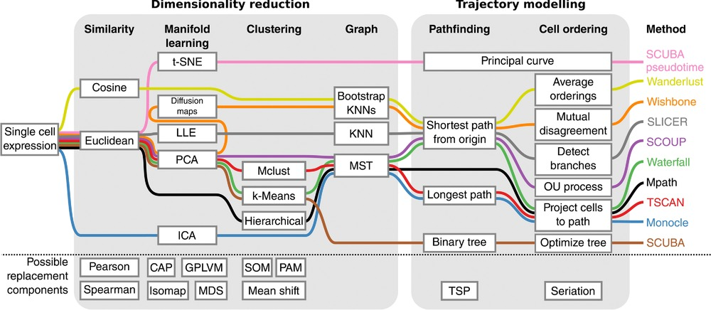

```{r configuracion_inicial, include=FALSE}
knitr::opts_chunk$set(echo = TRUE,
                      message = TRUE,
                      warning = FALSE,
                      tidy = F)
##################################################
#######        Encoded in UTF-8        ###########
##################################################
```

***

# Introducción al pseudotiempo

__El pseudotiempo es el ordenamiento basado en la similaridad de las células a lo largo de la trayectoria de un proceso de desarrollo contínuo.__


El pseudotiempo es una medida de cuánto progreso ha hecho una célula en un proceso biológico como por ejemplo la diferenciación celular. En muchos procesos biológicos, las células no progresan en perfecta sincronía. En estudios de expresión de single-cell sobre procesos tales como la diferenciación celular, las células estudiadas pueden mostrar diversos grados de desarrollo. Es decir, en una población de células capturadas exactamente a la vez, algunas células pueden estar más desarrolladas, mientras que otras pueden ni haber empezado el proceso en cuestión. Esta asincronía dificulta seriamente el estudio de la secuencia de cambios regulatorios que ocurren cuando las células transicionan de un estado a otro. Seguirle la pista a la expresión en todas las células capturadas a la vez produce un sentido muy comprimido de la cinética de un gen, y la variabilidad aparente de la expresión de ese gen será muy elevada. Al ordenar cada célula de acuerdo a su progreso a lo largo de una trayectoria aprendida, el análisis del pseudotiempo alivia los problemas derivados de la susodicha asincronía. En lugar de rastrear los cambios de la expresión génica en función del tiempo, diversas herramientas rastrean dichos cambios en función del progreso a lo largo de la trayectoria, la cual denominamos "pseudotiempo". El pseudotiempo es una unidad abstracta de progreso: en realidad es la distancia entre una célula dada y el comienzo de la trayectoria, medida a lo largo del camino más corto. La longitud total de la trayectoria se define en términos de la cantidad total de cambios transcripcionales que sufre una célula mientras se mueve del estado inicial al final.

```{r, message = F}
library("SingleCellExperiment")
library("TSCAN")
library("destiny")
library("SLICER")
library("ouija")
library("scater")
library("ggplot2")
library("ggthemes")
library("ggbeeswarm")
library("corrplot")
# library("M3Drop")
# library("monocle)
set.seed(1)
```


En muchas situaciones, uno estudia un proceso en el cual las células cambian continuamente. Esto incluye, por ejemplo, muchos procesos de diferenciación que tienen lugar durante el desarrollo del organismo: tras un estímulo, las células cambian de un tipo a otro. Idealmente, nos interesaría monitorizar los niveles de expresión de una célula dada a lo largo del tiempo. Desafortunadamente, tal monitorización no es posible en scRNA-seq dado que la célula se lisa cuando el ARN se extrae.




En su lugar, debemos muestrear en múltiples puntos del tiempo y así obtener "fotografías" de los perfiles de expresión génicos. Puesto que algunas células se diferenciarán más rápido que otras, cada fotografía puede contener células en diversas etapas del desarrollo. __Usamos métodos estadísticos para ordenar las células a lo largo de una o más trayectorias las cuales representan las trayectorias del desarrollo subyacentes, este ordenamiento se conoce como "pseudotiempo".__


***

<br>

# sessionInfo()

```{r, echo = F}
sessionInfo()
```