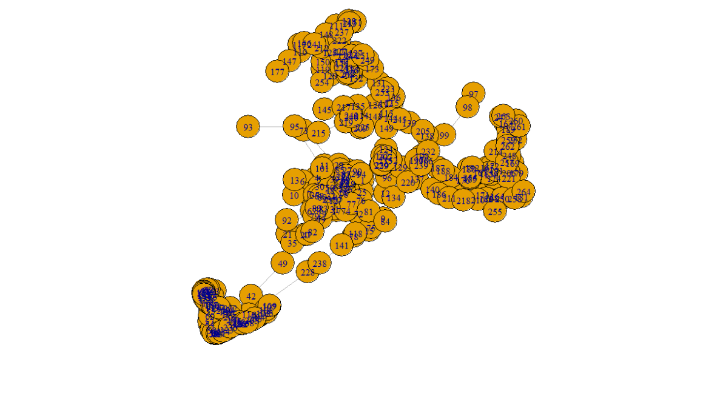
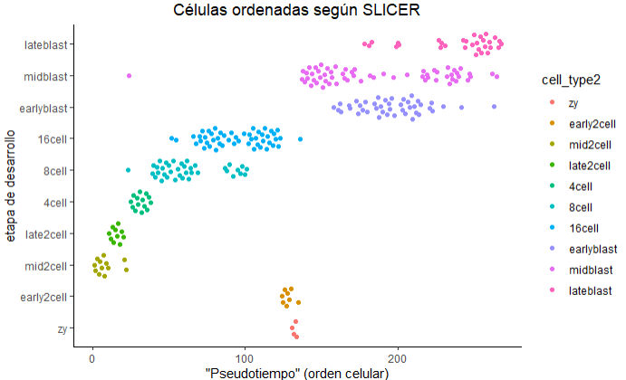

```{r configuracion_inicial, include=FALSE}
knitr::opts_chunk$set(echo = TRUE,
                      message = F,
                      warning = F,
                      tidy = F)
##################################################
#######        Encoded in UTF-8        ###########
##################################################
```

***

# Introducción al pseudotiempo

__El pseudotiempo es el ordenamiento basado en la similaridad de las células a lo largo de la trayectoria de un proceso de desarrollo contínuo.__


El pseudotiempo es una medida de cuánto progreso ha hecho una célula en un proceso biológico como por ejemplo la diferenciación celular. En muchos procesos biológicos, las células no progresan en perfecta sincronía. En estudios de expresión de single-cell sobre procesos tales como la diferenciación celular, las células estudiadas pueden mostrar diversos grados de desarrollo. Es decir, en una población de células capturadas exactamente a la vez, algunas células pueden estar más desarrolladas, mientras que otras pueden ni haber empezado el proceso en cuestión. Esta asincronía dificulta seriamente el estudio de la secuencia de cambios regulatorios que ocurren cuando las células transicionan de un estado a otro. Seguirle la pista a la expresión en todas las células capturadas a la vez produce un sentido muy comprimido de la cinética de un gen, y la variabilidad aparente de la expresión de ese gen será muy elevada. Al ordenar cada célula de acuerdo a su progreso a lo largo de una trayectoria aprendida, el análisis del pseudotiempo alivia los problemas derivados de la susodicha asincronía. En lugar de rastrear los cambios de la expresión génica en función del tiempo, diversas herramientas rastrean dichos cambios en función del progreso a lo largo de la trayectoria, la cual denominamos "pseudotiempo". El pseudotiempo es una unidad abstracta de progreso: en realidad es la distancia entre una célula dada y el comienzo de la trayectoria, medida a lo largo del camino más corto. La longitud total de la trayectoria se define en términos de la cantidad total de cambios transcripcionales que sufre una célula mientras se mueve del estado inicial al final.

```{r, message = F}
library("SingleCellExperiment")
library("TSCAN")
library("destiny")
library("SLICER")
library("ouija")
library("scater")
library("ggplot2")
library("ggthemes")
library("ggbeeswarm")
library("corrplot")
# library("M3Drop")
# library("monocle)
```


En muchas situaciones, uno estudia un proceso en el cual las células cambian continuamente. Esto incluye, por ejemplo, muchos procesos de diferenciación que tienen lugar durante el desarrollo del organismo: tras un estímulo, las células cambian de un tipo a otro. Idealmente, nos interesaría monitorizar los niveles de expresión de una célula dada a lo largo del tiempo. Desafortunadamente, tal monitorización no es posible en scRNA-seq dado que la célula se lisa cuando el ARN se extrae.


En su lugar, debemos muestrear en múltiples puntos del tiempo y así obtener "fotografías" de los perfiles de expresión génicos. Puesto que algunas células se diferenciarán más rápido que otras, cada fotografía puede contener células en diversas etapas del desarrollo. __Usamos métodos estadísticos para ordenar las células a lo largo de una o más trayectorias las cuales representan las trayectorias del desarrollo subyacentes, este ordenamiento se conoce como "pseudotiempo".__


En esta práctica nos centraremos en 4 herramientas para ordenar las células según su grado de desarrollo en el pseudotiempo: `TSCAN`, `SLICER`, `destiny` y `Ouija.` Para ilustrar su uso, emplearemos el dataset del desarrollo embrionario en ratón de [Deng _et al._, 2014](https://science.sciencemag.org/content/343/6167/193). Dicho dataset cuenta con 268 células provenientes de la fase temprana del desarrollo embrional y extraídas en 10 puntos de tiempo. En este caso no hace falta alinear las células a la trayectoria del pseudotiempo dado que están ya etiquetadas con información sobre la trayectoria embrionaria. Por tanto, las etiquetas son la _ground truth_ o verdad experimental sobre la cual podemos comparar el rendimiento obtenido por los susodichos métodos.

Una revisión más o menos reciente de [Cannoodt _et al._](https://onlinelibrary.wiley.com/doi/full/10.1002/eji.201646347) publicada en 2016 nos aporta un resumen detallado de los distintos algoritmos empleados para la inferencia de trayectoria en scRNA-seq. Dicha revisión cubre:


* **Monocle** - Paquete de Bioconductor

* **TSCAN** - Paquete de Bioconductor

* **SLICER** - Paquete de R, disponible sólo a través de GitHub

* Waterfall - Paquete de R (se incluye un script en el suplemento del artículo original de [Shin _et al,_ 2015](https://www.cell.com/cell-stem-cell/fulltext/S1934-5909(15)00312-4) y en los [archivos asociados](https://github.com/gloknar/R-Utilities/tree/master/Traduccion%20Seurat%20V2%20V3/Cosas%20accesorias%20Informe%202) a este informe)

* Mpath - Paquete de R disponible en GitHub (comprimido con formato `tar.gz`). La función está documentada, pero el workflow no, ni tiene una _vignette_.

* Wishbone - Paquete de Python

* SCUBA - Paquete de Matlab

* Wanderlust - Paquete de Matlab

* SCOUP - Programa en C++ por línea de comandos 

<br>

Las figuras 1 y 2 del paper de Cannoodt _et al._ resumen algunas de las características de estos métodos.


<br>


***

<br>

# Visualización del dataset


Al igual que el dataset de Nakamura _et al._ usado en la práctica 1, el dataset de Deng _et al._ contiene células embrionarias en los primeros estadios de Carnegie, solo que en este caso las células son de ratón, y no de macaco cangrejero. El dataset de esta práctica se encuentra en el archivo `deng-reads.rds`.


```{r}
# Leemos los datos
deng_SCE <- readRDS(file = "./Archivos accesorios/Codigo y datos de las Practicas 1-4/data/deng-reads.rds")

# Reordenamos los niveles, ya que zigoto < 2 células < 4 células, etc...
deng_SCE$cell_type2 <- factor(deng_SCE$cell_type2, 
                              levels = c("zy", "early2cell", "mid2cell", "late2cell",
                              "4cell", "8cell", "16cell", "earlyblast", "midblast", 
                              "lateblast")) 


# Generamos y formateamos una matriz de conteos crudos (i.e. nº de transcritos
# por gen y célula)
raw_deng <- counts(deng_SCE)

# Establecemos el nombre de las células en el objeto `cellLabels`
cellLabels <- deng_SCE$cell_type2
colnames(raw_deng) <- cellLabels
```


Tal como muestra el siguiente gráfico, el PCA muestra bastante bien la estructura de los datos y los separa correctamente en su mayoría, exceptuando aquellas células que corresponden al estadio de blastocisto (early/mid/lateblast), que están mezcladas entre sí. Se aprecia cómo las células están ordenadas en el espacio del PCA en sentido horario, desde la etapa de zigoto (zy) hasta la de blastocisto tardío (lateblast).

```{r}
set.seed(1)
# Corremos PCA en un objeto de tipo SingleCellExperiment
deng_SCE <- runPCA(deng_SCE)

# Graficamos el PCA
BiocGenerics::plotPCA(deng_SCE, colour_by = "cell_type2") + 
  ggtitle("PCA de células embrionarias de ratón") + 
  theme(plot.title = element_text(hjust = 0.5))
```

Aquí el PCA nos proporciona un útil punto de referencia para comprobar diversos métodos de inferencia de trayectoria. A diferencia del t-SNE y el UMAP, el PCA podría revelarnos mejor el tiempo de desarrollo, a expensas de producir un clustering peor. Un algoritmo muy sencillo de inferencia podría ser simplemente utilizar las coordenadas en el espacio del PCA de la primera componente principal. 


```{r}
deng_SCE$PC1 <- reducedDim(x = deng_SCE, type = "PCA")[,1]

# Graficamos el pseudotiempo según las coordenadas de la primera componente
# principal
ggplot(as.data.frame(colData(deng_SCE)), 
       aes(x = PC1, y = cell_type2, colour = cell_type2)) + 
       geom_quasirandom(groupOnX = F) + theme_classic() + 
       theme(plot.title = element_text(hjust = 0.5)) +
       ggtitle("Células ordenadas por la 1ªCP") + 
       xlab("Primera componente principal") + ylab("Etapa de desarrollo") + 
       scale_colour_calc()
```

Aplicando dicho algoritmo básico, y tal y como muestra el gráfico anterior, vemos que a la primera dimensión le cuesta un poco diferenciar algunos tipos celulares, pero en general ordena bien las células según su estapa de desarrollo. Nótese que aunque los resultados estén al revés, esto se puede solucionar fácilmente invirtiendo el eje X

```{r, echo = F, eval = F}
# Para invertir el eje X hay dos opciones, que yo sepa:
# Una es multiplicar la columna de interés por -1, tal que así:
deng_SCE$PC1 <- -deng_SCE$PC1

# Y la otra opción es añadir el comando scale_x_reverse() de ggplot:
ggplot()... + scale_x_reverse()
```

```{r}
ggplot(as.data.frame(colData(deng_SCE)), 
       aes(x = PC1, y = cell_type2, colour = cell_type2)) + 
       geom_quasirandom(groupOnX = F) + theme_classic() + 
       theme(plot.title = element_text(hjust = 0.5)) +
       ggtitle("Células ordenadas por la 1ªCP") + 
       xlab("Primera componente principal") + ylab("Etapa de desarrollo") + 
       scale_colour_calc() + scale_x_reverse()
```


En las siguientes secciones veremos qué rendimiento desempeñan los algoritmos previamente citados ( _i.e._ `TSCAN` y sucedáneos).


***

<br>

# TSCAN

`TSCAN` combina el clustering con el análisis de pseudotiempo. Primero agrupa las células usando `mclust`, el cual se basa en una mezcla de distribuciones normales. Seguidamente construye un árbol del menor tamaño posible que conecte los clusters. La rama principal del árbol será la que conecte el mayor nº de clusters, y es la rama que se usa para determinar el pseudotiempo.

Primero intentaremos usar todos los genes para ordenar las células:

```{r}
set.seed(1)
# Preprocesamos la matriz de conteos crudos
procdeng <- TSCAN::preprocess(raw_deng)

# Cambiamos el nombre de las columnas de tipo celular a índice numérico
colnames(procdeng) <- 1:ncol(raw_deng)

# Hacemos el clustering con `mclust`
dengclust <- TSCAN::exprmclust(procdeng, clusternum = 10)

# Graficamos el resultado
TSCAN::plotmclust(dengclust)


# Ordenamos las células. Con `orderonly = F`, nos devuelve también el
# pseudotiempo.
dengorderTSCAN <- TSCAN::TSCANorder(dengclust, orderonly = F)
pseudotime_order_tscan <- as.character(dengorderTSCAN$sample_name)

# Creamos el bolsillo vacío "pseudotime_order_tscan" en el objeto deng_SCE
deng_SCE$pseudotime_order_tscan <- NA
deng_SCE$pseudotime_order_tscan[as.numeric(dengorderTSCAN$sample_name)] <- dengorderTSCAN$Pseudotime
```


Ahora vemos los _timepoints_ que se han asignado a cada estado celular:

```{r}
# El último cúster (nº10), o sea el último paso del pseudotiempo según TSCAN,
# corresponde a células en fase "late2cell"
cellLabels[dengclust$clusterid == 10]

# Graficamos el pseudotiempo final de TSCAN
ggplot(as.data.frame(colData(deng_SCE)), 
       aes(x = pseudotime_order_tscan, y = cell_type2, colour = cell_type2)) +
       geom_quasirandom(groupOnX = F) + theme_classic() +
       theme(plot.title = element_text(hjust = 0.5)) +
       ggtitle("Células ordenadas según TSCAN") +
       xlab("Pseudotiempo") + ylab("Etapa de desarrollo") +
       scale_colour_calc() + scale_x_reverse()
```


En la gráfica se aprecia que en nuestro dataset, TSCAN infiere al revés la trayectoria del desarrollo embrionario. Esto no es un problema _per se_ ya que podemos darle la vuelta al ordenamiento para entenderlo, pero no podemos asegurar que funcione mejor que el ordenamiento que hicimos mediante las coordenadas de la 1ª componente principal. El motivo de esto se debe al hecho de que TSCAN es un método de inferencia de trayectoria basado en PCA.


<details>
<summary> __Ejercicio 2.1: Compara los resultados obtenidos al variar el parámetro `clusternum` (nº de clusters) del comando `exprmclust`__ </summary>

<br>

__Solución__: en este dataset, TSCAN infiere bien en su mayoría la trayectoria del desarrollo embrionario si elegimos `clusternum` entre 3 y 8.


```{r, echo = F}
# clustering buscando 2 clusters
dengclust <- TSCAN::exprmclust(procdeng, clusternum = 2)

# Graficamos el resultado
# TSCAN::plotmclust(dengclust)


# Ordenamos las células
dengorderTSCAN <- TSCAN::TSCANorder(dengclust, orderonly = F)
pseudotime_order_tscan <- as.character(dengorderTSCAN$sample_name)

# Creamos el bolsillo vacío "pseudotime_order_tscan" en el objeto deng_SCE
deng_SCE$pseudotime_order_tscan <- NA
deng_SCE$pseudotime_order_tscan[as.numeric(dengorderTSCAN$sample_name)] <- dengorderTSCAN$Pseudotime

# Graficamos el pseudotiempo final de TSCAN
ggplot(as.data.frame(colData(deng_SCE)), 
       aes(x = pseudotime_order_tscan, y = cell_type2, colour = cell_type2)) +
       geom_quasirandom(groupOnX = F) + theme_classic() +
       theme(plot.title = element_text(hjust = 0.5)) +
       ggtitle("TSCAN, 2 clusters") +
       xlab("Pseudotiempo") + ylab("Etapa de desarrollo") +
       scale_colour_calc() + scale_x_reverse()
```

<br>

```{r, echo = F}
# clustering buscando 3 clusters
dengclust <- TSCAN::exprmclust(procdeng, clusternum = 3)

# Graficamos el resultado
# TSCAN::plotmclust(dengclust)


# Ordenamos las células
dengorderTSCAN <- TSCAN::TSCANorder(dengclust, orderonly = F)
pseudotime_order_tscan <- as.character(dengorderTSCAN$sample_name)

# Creamos el bolsillo vacío "pseudotime_order_tscan" en el objeto deng_SCE
deng_SCE$pseudotime_order_tscan <- NA
deng_SCE$pseudotime_order_tscan[as.numeric(dengorderTSCAN$sample_name)] <- dengorderTSCAN$Pseudotime

# Graficamos el pseudotiempo final de TSCAN
ggplot(as.data.frame(colData(deng_SCE)), 
       aes(x = pseudotime_order_tscan, y = cell_type2, colour = cell_type2)) +
       geom_quasirandom(groupOnX = F) + theme_classic() +
       theme(plot.title = element_text(hjust = 0.5)) +
       ggtitle("TSCAN, 3 clusters") +
       xlab("Pseudotiempo") + ylab("Etapa de desarrollo") +
       scale_colour_calc() + scale_x_reverse()
```

<br>

```{r, echo = F}
# clustering buscando 8 clusters
dengclust <- TSCAN::exprmclust(procdeng, clusternum = 8)

# Graficamos el resultado
# TSCAN::plotmclust(dengclust)


# Ordenamos las células
dengorderTSCAN <- TSCAN::TSCANorder(dengclust, orderonly = F)
pseudotime_order_tscan <- as.character(dengorderTSCAN$sample_name)

# Creamos el bolsillo vacío "pseudotime_order_tscan" en el objeto deng_SCE
deng_SCE$pseudotime_order_tscan <- NA
deng_SCE$pseudotime_order_tscan[as.numeric(dengorderTSCAN$sample_name)] <- dengorderTSCAN$Pseudotime

# Graficamos el pseudotiempo final de TSCAN
ggplot(as.data.frame(colData(deng_SCE)), 
       aes(x = pseudotime_order_tscan, y = cell_type2, colour = cell_type2)) +
       geom_quasirandom(groupOnX = F) + theme_classic() +
       theme(plot.title = element_text(hjust = 0.5)) +
       ggtitle("TSCAN, 8 clusters") +
       xlab("Pseudotiempo") + ylab("Etapa de desarrollo") +
       scale_colour_calc() + scale_x_reverse()
```

<br>

```{r, echo = F}
# clustering buscando 9 clusters
dengclust <- TSCAN::exprmclust(procdeng, clusternum = 9)

# Graficamos el resultado
# TSCAN::plotmclust(dengclust)


# Ordenamos las células
dengorderTSCAN <- TSCAN::TSCANorder(dengclust, orderonly = F)
pseudotime_order_tscan <- as.character(dengorderTSCAN$sample_name)

# Creamos el bolsillo vacío "pseudotime_order_tscan" en el objeto deng_SCE
deng_SCE$pseudotime_order_tscan <- NA
deng_SCE$pseudotime_order_tscan[as.numeric(dengorderTSCAN$sample_name)] <- dengorderTSCAN$Pseudotime

# Graficamos el pseudotiempo final de TSCAN
ggplot(as.data.frame(colData(deng_SCE)), 
       aes(x = pseudotime_order_tscan, y = cell_type2, colour = cell_type2)) +
       geom_quasirandom(groupOnX = F) + theme_classic() +
       theme(plot.title = element_text(hjust = 0.5)) +
       ggtitle("TSCAN, 9 clusters") +
       xlab("Pseudotiempo") + ylab("Etapa de desarrollo") +
       scale_colour_calc() + scale_x_reverse()
```

<br>

```{r, echo = F}
# clustering buscando 10 clusters
dengclust <- TSCAN::exprmclust(procdeng, clusternum = 10)

# Graficamos el resultado
# TSCAN::plotmclust(dengclust)


# Ordenamos las células
dengorderTSCAN <- TSCAN::TSCANorder(dengclust, orderonly = F)
pseudotime_order_tscan <- as.character(dengorderTSCAN$sample_name)

# Creamos el bolsillo vacío "pseudotime_order_tscan" en el objeto deng_SCE
deng_SCE$pseudotime_order_tscan <- NA
deng_SCE$pseudotime_order_tscan[as.numeric(dengorderTSCAN$sample_name)] <- dengorderTSCAN$Pseudotime

# Graficamos el pseudotiempo final de `TSCAN`
ggplot(as.data.frame(colData(deng_SCE)), 
       aes(x = pseudotime_order_tscan, y = cell_type2, colour = cell_type2)) +
       geom_quasirandom(groupOnX = F) + theme_classic() +
       theme(plot.title = element_text(hjust = 0.5)) +
       ggtitle("TSCAN, 10 clusters") +
       xlab("Pseudotiempo") + ylab("Etapa de desarrollo") +
       scale_colour_calc() + scale_x_reverse()
```

</details>


***

<br>


# Mapas de difusión: `destiny`

Los mapas de difusión fueron inventados por Ronald Coifman y Stephane Lagon, y la idea principal es asumir que los datos son muestras de un proceso de difusión. Este método infiere la estructura de los datos en un espacio de baja dimensionalidad al estimar los _eigenvalues_ y los _eigenvectors_ (valores y vectores propios) del operador de la difusión relacionado con los datos.

Angerer _et al._ han aplicado el concepto de los mapas de difusión al análisis de datos scRNA-seq para crear así un paquete de R llamado `destiny`.

Si en la sección del PCA comentábamos que el pseudotiempo era las coordenadas de la 1ª componente principal, en `destiny` el pseudotiempo pasa a ser las coordenadas de la 1ª componente de difusión.


```{r}
set.seed(1)
# Primero creamos la matriz de conteos en forma logarítmica con `logcounts`.
# Recuerda que usa el "pseucocount of 1", o sea, log2(x+1), para definir el 0.
log_deng <- logcounts(deng_SCE)

# Ponemos bien los nombres de las células en la matriz de conteos en formato
# logarítmico
colnames(log_deng) <- cellLabels

# Calculamos las componentes de difusión. Hay que transponer la matriz de
# conteos logarítmicos. Por defecto, `DiffusionMap` usa como input el PCA, creo
dm <- DiffusionMap(t(log_deng))

# Creamos un dataframe _ad interim_ con 3 columnas: DC1, DC2 y etapa_desarrollo
tmp <- data.frame(DC1 = eigenvectors(dm)[,1],
                  DC2 = eigenvectors(dm)[,2],
                  etapa_desarrollo = cellLabels) # = deng_SCE$cell_type2
```


```{r}
# Graficamos las dos primeras componentes del mapa de difusión
ggplot(tmp, aes(x = DC1, y = DC2, color = etapa_desarrollo)) + geom_point() + 
       theme_classic() + theme(plot.title = element_text(hjust = 0.5)) + 
       xlab("Componente de difusión 1") + ylab("Componente de difusión 2") + 
       scale_color_calc() + ggtitle("Mapa de difusión de destiny")
```


```{r}
# Ordenamos las células según sus coordenadas en la primera componente de
# difusión
deng_SCE$pseudotime_diffusionmap <- rank(eigenvectors(dm)[,1])

# Graficamos la trayectoria final inferida
ggplot(as.data.frame(colData(deng_SCE)), aes(x = pseudotime_diffusionmap, y = cell_type2, colour = cell_type2)) +
       geom_quasirandom(groupOnX = FALSE) + scale_color_calc() + theme_classic() + 
       theme(plot.title = element_text(hjust = 0.5)) + xlab("Pseudotiempo del mapa de difusión (1ª componente)") + 
       ylab("Etapa de desarrollo") + ggtitle("Células ordenadas según destiny") + scale_x_reverse()
```

Al igual que otros métodos, usar la 1ª componente de difusión a modo de pseudotiempo nos ayuda a ordenar las células tempranas, pero no puede distinguir las células en etapas más avanzadas del desarrollo (embrión con 8 o más células).


***

<br>


# SLICER


SLICER es un algoritmo para construir trayectorias que describen cambios en la expresión génica durante un proceso biológico secuencial (al igual que `Monocle` y `TSCAN`). SLICER está diseñado para capturar cambios de expresión génica no lineales, seleccionar automáticamente aquellos genes que participen en el proceso biológico y detectar _branches_/caminos alternativos y _loops_ en la trayectoria ([Welch _et al._, 2016](https://genomebiology.biomedcentral.com/articles/10.1186/s13059-016-0975-3)). El paquete de SLICER está disponible en [GitHub](https://github.com/jw156605/SLICER) y se puede instalar mediante `devtools`.


Usamos la función `select_genes` de SLICER para seleccionar automáticamente los genes que se usarán para construir la trayectoria celular. La función usa la "neighbourhood variance" para identificar los genes que varían suavemente (en lugar de aquellos que fluctúan aleatoriamente) en las células estudiadas. A continuación, determinamos el nº de vecinos cercanos o _nearest neighbours_ (parámetro `k`) que provee un _embedding_ o embebimiento (construcción en un espacio de dimensiones reducidas) lo más parecido a una trayectoria. Finalmente estimamos el embebimiento localmente lineal (LLE) de las células. 


```{r, warning = F}
set.seed(1)
# Para seleccionar los genes en SLICER, usamos la matriz logarítmica traspuesta.
# Ídem para seleccionar k
slicer_genes <- select_genes(t(log_deng))
k <- select_k(t(log_deng[slicer_genes,]), kmin = 30, kmax = 60)


# La librería `lle` permite usar el comando homónimo para calcular el LLE o
# Locally Linear Embedding.
library("lle")
slicer_traj_lle <- lle(t(log_deng[slicer_genes,]), m = 2, k)$Y # Importante usar esta notación, si no, no funciona conn_knn_graph()


# Añadimos los resultados de la técnica de reducción de la dimensionalidad al
# objeto original deng_SCE
reducedDim(deng_SCE, type = "LLE") <- slicer_traj_lle
reducedDimNames(deng_SCE)


# Graficamos el espacio de dimensionalidad reducida LLE
plotReducedDim(deng_SCE, dimred = "LLE", colour_by = "cell_type2") +
                xlab("Componente de LLE 1") + ylab("Componente de LLE 2") +
                ggtitle("Embebimiento localmente lineal (LLE) de las células - SLICER") + 
                theme(plot.title =  element_text(hjust = 0.5))
```


Ahora que hemos calculado el LLE, podemos construir un grafo basado en k-nearest neighbours (k-NN) que sea completamente conectado ( _fully connected_, como se suele decir en MLPs). Este gráfico muestra un círculo naranja por cada célula, con la ID de la célula representada en azul encima del círculo. Mostramos a continuación el grafo obtenido con k = 10 vecinos.


```{r}
# Construimos el grafo con la función `conn_knn_graph()`
slicer_traj_graph <- conn_knn_graph(slicer_traj_lle, k = 10)

# Graficamos
plot(slicer_traj_graph, main = "Grafo k-NN completamente conectado de SLICER")
```

A partir del grafo podemos identificar las células distales (de los extremos), las cuales serán candidatas para el comienzo y el fin de la trayectoria.

```{r}
# Encontramos células distales con el comando `find_extreme_cells()`
ends <- find_extreme_cells(traj_graph = slicer_traj_graph, embedding = slicer_traj_lle)
start <- ends[1]
```

Tras definir la célula inicial, ordenamos las células a lo largo del pseudotiempo.

```{r}
# Ordenamos las células en el pseudotiempo con la función `cell_order()` del
# paquete SLICER
pseudotime_order_slicer <- cell_order(slicer_traj_graph, start)

# Detectamos ramas
branches <- assign_branches(slicer_traj_graph, start)

# creamos dataframe con las ramas, los estadios celulares y el pseudotiempo
pseudotime_slicer <- data.frame(TimePoint = cellLabels,
                                pseudotime = NA,
                                State = branches)

# Añadimos a la columna pseudotime del dataframe anterior el orden de las
# células en el pseudotiempo
pseudotime_slicer$pseudotime[pseudotime_order_slicer] <-  1:length(pseudotime_order_slicer)
```


Hecho esto, ahora podemos comparar el pseudotiempo inferido por SLICER con las etapas del desarrollo ya conocidas. SLICER no devuelve un pseudotiempo _per se_, sino simplemente el orden final de las células.


```{r}
# Añadimos al objeto `deng_SCE` el pseudotiempo del dataframe anterior para
# comparar los resultados con los métodos anteriores y la verdad experimental
deng_SCE$pseudotime_slicer <- pseudotime_slicer$pseudotime

# Graficamos el resultado
ggplot(as.data.frame(colData(deng_SCE)), aes(x = pseudotime_slicer, y = cell_type2, colour = cell_type2)) + 
  geom_quasirandom(groupOnX = F) + xlab(" \"Pseudotiempo\" (orden celular) ") + ylab("etapa de desarrollo") +
  theme_classic() + ggtitle("Células ordenadas según SLICER") + theme(plot.title = element_text(hjust = 0.5))
```


Al igual que los métodos ya probados hasta ahora, SLICER ordena bien las primeras etapas de desarrollo, aunque ha invertido el orden de las etapas "16cell" y "8cell". Pese a ello, logra separar un poco mejor las blastómeras tardías del resto de blastómeras.


<details>
<summary> __Ejercicio 2.2: ¿Cómo cambian los resultados del LLE en función del valor de `k`? ¿Y qué pasa al cambiar el nº de vecinos cercanos en la función `conn_knn_graph()`?__ </summary>

__Solución__: 

* Manteniendo el parámetro `k = 60` del LLE  y variando el parámetro `k` del comando `conn_knn_graph()`, vemos que a mayor nº de vecinos cercanos, la trayectoria se perfila cada vez más, si bien el ordenamiento final de las células se mantiene igual. Nótese que para valores muy bajos de vecinos (k = 1~3), el comando `assign_branches` devuelve el error `Error in 1:num_branches : Argumento NA/NaN`

* Manteniendo el parámetro `k = 10` del grafo y variando el parámetro `k` del LLE, vemos que para valores extremos de `k`, a SLICER le cuesta ordenar las células. SLICER ordena exitosamente las células tempranas con un `k = 30`, mientras que con `k = 55` intenta separar las blastómeras (aunque sin mucho éxito). Nótese que para valores muy bajos de vecinos (k < 10), el comando `assign_branches` devuelve el error `Error in if (mean_dist < min_dist) { : valor ausente donde TRUE/FALSE es necesario` (Si se observa la función con F2, se aprecia que se omitieron algunos casos en la sección de condicionales).


<br>



<br>


<br>


***

<br>



<br>


<br>


<br>


<br>


<br>


</details>


***

<br>


# ouija


`ouija` (viñeta online: http://kieranrcampbell.github.io/ouija/) infiere la trayectoria de manera distinta a como lo han hecho los paquetes previamente presentados. Mientras que `TSCAN`, `destiny` y `SLICER` eran métodos no supervisados y no tenían en cuenta las etiquetas asignadas por el investigador, `ouija` es un algoritmo probabilístico capaz de inferir el pseudotiempo a partir de un pequeño panel de genes marcadores. En concreto, este algoritmo:

* Infiere el pseudotiempo a partir de un nº reducido de biomarcadores, llevando la atención del investigador a dichos genes.

* Proporciona estimaciones de los parámetros (incluye incertidumbre), lo que permite interpretar patrones de regulación génica. 

* Posee un test para hipótesis Bayesiana para encontrar a lo largo de la trayectoria genes regulados antes que otros.     

* Identifica estados metaestables a lo largo de la trayectoria, _i.e._ tipos celulares discretos.


<br>

En `ouija` podemos modelar los genes de varias maneras:

* Que se sobre o infraexpresen de manera monotónica ( _i.e._ su expresión a lo largo del tiempo es exclusivamente al alza o a la baja, respectivamente). Esto se conoce como comportamiento _switch-like_.

* Que se sobre o infraexpresen de manera aguda ( _i.e._ la expresión del gen alcanza brevemente y de manera rápida un máximo/mínimo). Esto se conoce como comportamiento transitorio.

Por defecto, `ouija` asume que todos los genes usan el modelo monotónico, aunque el autor asegura que no pasa nada, pues modelar un gen transitorio como uno monotónico tiene un efecto mínimo en los resultados finales.


<br>

Proporcionaremos a `ouija` los siguientes biomarcadores (junto con la etapa del desarrollo en la que se sobreexpresan):

* Etapa inicial: Dazl, Rnf17, Sycp3, Nanog, Pou5f1, Fgf8, Egfr, Bmp5, Bmp15

* Etapa intermedia: Zscan4b, Foxa1, Prdm14, Sox21

* Etapa tardía: Creb3, Gpx4, Krt8, Elf5, Eomes, Cdx2, Tdgf1, Gdf3

En nuestro caso particular con el dataset de Deng podemos hacer un poco de trampas y comprobar que nuestros genes marcadores seleccionados son realmente biomarcadores de las distintas etapas del desarrollo aquí estudiadas.


```{r, fig.height = 9.5}
ouija_markers_up <- c("Creb3", "Gpx4", "Krt8", "Elf5", "Eomes", "Cdx2", "Tdgf1", "Gdf3") # Son los genes de la etapa tardía 

ouija_markers_down <- c("Dazl", "Rnf17", "Sycp3", "Pou5f1", "Fgf8", "Egfr", "Bmp5", "Bmp15") # Son los genes de la etapa inicial, excepto Nanog

ouija_markers_transient <- c("Zscan4b", "Foxa1", "Prdm14", "Sox21") # Son los genes de la etapa intermedia

ouija_markers <- c(ouija_markers_up, ouija_markers_down, ouija_markers_transient)

plotExpression(deng_SCE, features = ouija_markers, x = "cell_type2", colour_by = "cell_type2") + 
  theme(axis.text.x = element_text(angle = 60, hjust = 1))
```


Para computar el pseudotiempo, basta con llamar a `ouija` y pasarle los modelos de genes esperados. Como ya se dijo en el párrafo anterior, el paquete modela por defecto los genes de manera monotónica (cosa que haremos a continuación). El input que espera `ouija` es cualquiera de las 3 opciones siguientes:

* Una matriz de célula(fila) x gen(columna) con valores de expresión génica no negativos.

* Una matriz de conteos logarítmica, producto de aplicar el comando `logcounts()` a un objeto de tipo `SingleCellExperiment`.

* Un objeto de tipo `ExpressionSet`.


Podemos añadir información conocida _a priori_ respecto a la sobre o infraexpresión de los genes implicados en el proceso biológico estudiado, además de incluir conocimiento previo sobre el tipo de modelo que sigue cada gen (monotónico/transitorio).

Podemos contruir el modelo de `ouija` con:

* El método de Monte Carlo Hamiltoniano o Monte Carlo Híbrido ( _Hamiltonian Monte Carlo_ o HMC). Consiste en inferencia completa con el método de Monte Carlo basado en Cadenas de Markov ( _Monte Carlo Markov Chain_ o MCMC) en la cual se usa la información del gradiente de la _log-posterior_ (logaritmo de la probabilidad _a posteriori_) para guiar el paseo aleatorio en el espacio del parámetro.

* El método de _Automatic Differentiation Variational Bayes_, ADVI o simplemente VI. Consiste en inferencia aproximada en la cual se minimiza la divergencia Kullback-Leibler o KL (una medida de distancia asimétrica y distinta de la euclídea; no es lo mismo medir la distancia _forwards KL_ que la distancia _backwards KL_) a una distribución aproximada.


En general, el método de HMC infere de manera más precisa la trayectoria y devuelve una varianza posterior aproximadamente correcta para todos los parámetros. No obstante, el ADVI es _significativamente_ más rápido que HMC y aunque pueda infraestimar la varianza _a posteriori_, el autor de `ouija` comenta que en ocasiones ADVI puede devolver resultados igual de buenos que los obtenidos con HMC, en cuanto a descubrimiento de pseudotiempos posteriores se refiere.


Para ayudar al modelo de `ouija`, vamos a proporcionarle información _a priori_ sobre el comportamiento de nuestros genes sobre e infraexpresados. Al seleccionar la switch strength en +-10 (-10 para genes infraexpresados y +10 para genes sobreexpresados) y la prior strength standard deviation en 0.5, le estamos indicando al modelo que estamos muy seguros sobre el comportamiento esperado de estos genes a lo largo del proceso biológico estudiado (desarrollo embrionario en este caso).


```{r}
# Tipo de respuesta de cada gen
response_type <- c(rep("switch", length(ouija_markers_down) + length(ouija_markers_up)),
                   rep("transient", length(ouija_markers_transient)))
# c(rep("switch", length(ouija_markers_down) + length(ouija_markers_up))) equivale a 
# c(rep("switch", length(ouija_markers_down)), rep("switch, length(ouija_markers_up)))

# Certeza del comportamiento de nuestros biomarcadores
switch_strengths <- c(rep(-10, length(ouija_markers_down)), 
                      rep(10, length(ouija_markers_up)))

# Desviación estándar de dicha certeza
switch_strength_sd <- c(rep(0.5, length(ouija_markers_down)), 
                         rep(0.5, length(ouija_markers_up)))


# El comando `ouija()` recomienda usar la siguiente línea de código para
# paralelizar en local su computación:
options(mc.cores = parallel::detectCores())

oui_vb <- ouija(x = deng_SCE[ouija_markers,],
                response_type = response_type,
                switch_strengths = switch_strengths,
                switch_strength_sd = switch_strength_sd,
                inference_type = "vb", # "vb" = ADVI
                single_cell_experiment_assay = "logcounts")

print(oui_vb)
```


```{r, echo = F, eval = F}
# Con `capture.output` evitamos que imprima por consola toda la verbose. Es
# equivalente a `verbose = F` en comandos que carecen de dicho parámetro, como
# es el caso de `ouija()`

garbage <- capture.output(
  oui_monsieur <- ouija(x = deng_SCE[ouija_markers,],
                  response_type = response_type,
                  switch_strengths = switch_strengths,
                  switch_strength_sd = switch_strength_sd,
                  inference_type = "vb",
                  single_cell_experiment_assay = "logcounts")
)
print(oui_monsieur)
```


Podemos graficar la expresión génica a lo largo del pseudotiempo junto con las estimaciones de la función media-MAP ( _maximum a posteriori_) usando el comando `plot_expression()` del paquete `ouija`. 

```{r, fig.height= 7}
plot_expression(oui_vb) + theme_classic()
```

También podemos visualizar cuándo suceden en la trayectoria los comportamientos de regulación génica, ya sea en forma de switch time o el peak time (para genes monotónicos o transitorios) usando los comandos `plot_switch_times` y `plot_transient_times`.


```{r, warning=F}
plot_switch_times(oui_vb) + theme_classic()

plot_peak_times(oui_vb) + theme_classic()
```


Para identificar estados celulares metaestables usando matrices de consistencia:

```{r, warning = F}
# Visualizamos la matriz de consistencia
plot_consistency(oui_vb)

# Guardamos la matriz de consistencia en el objeto `cmo` y agrupamos las células
cmo <- consistency_matrix(oui_vb)
cell_classifications <- cluster_consistency(cmat = cmo, n_clusters = 2:9)

# Generamos el pseudotiempo
map_pst <- map_pseudotime(oui_vb)

# Agrupamos la clasificación celular y el pseudotiempo MAP en un dataframe y lo
# graficamos
ouija_pseudotime <- data.frame(map_pst, cell_classifications)
ggplot(ouija_pseudotime, aes(x = map_pst, y = cell_classifications)) + 
  geom_point() + xlab("Pseudotiempo MAP") + ylab("Clasificación celular") + 
  theme_classic()


deng_SCE$pseudotime_ouija <- ouija_pseudotime$map_pst # Multiplícalo por -1 para invertir el orden
deng_SCE$ouija_cell_class <- ouija_pseudotime$cell_classifications

ggplot(as.data.frame(colData(deng_SCE)), 
       aes(x = pseudotime_ouija, y = cell_type2, colour = cell_type2)) +
       geom_quasirandom(groupOnX = F) + theme_classic() +
       scale_color_calc() + xlab("Pseudotiempo MAP") +
       ylab("estado de desarrollo") + ggtitle("Ordenamiento celular según ouija") + 
       theme(plot.title = element_text(hjust = 0.5))
```

Al igual que el primer gráfico que generamos con `TSCAN`, `ouija` nos ha devuelto el pseudotiempo ordenado al revés, pero esto se puede solucionar multiplicando la columna `deng_SCE$pseudotime_ouija` por $-1$. `ouija` ha ordenado bien en general los tipos celulares, aunque cabe destacar que el algoritmo puede ser sensible a la elección de biomarcadores y la información _a priori_ proporcionada al mismo. ¿Cómo cambian los resultados al elegir otros biomarcadores o cambiar las _a priori_?


<details>
<summary> __Ejercicio__</summary>
</details>

<br>

`ouija` identifica en este caso 4 estados celulares metaestables, los cuales anotaremos como “zygote/2cell”, “4/8/16 cell”,
“blast1” and “blast2”.

```{r}
ggplot(as.data.frame(colData(deng_SCE)), 
       aes(x = as.factor(ouija_cell_class), y = pseudotime_ouija, colour = cell_type2)) +
       geom_boxplot() + coord_flip() + scale_color_tableau() +
       theme_classic() + xlab("Pseudotiempo MAP") +
       ylab("Clasificación celular por ouija")
```

Un análisis típico es averiguar el orden de regulación de los genes. Por ejemplo, ¿se sobreexpresa el gen A antes que el gen B? ¿Alcanza el gen C su máximo/mínimo de expresión antes de que el gen D comience a infraexpresarse?

`ouija` responde a estas preguntas en términos de un test de hipótesis bayesiana de si la diferencia en los tiempos de regulación (either switch time or peak time) es significativamente distinto de 0. Esto se comprueba con el comando `gene_regulation`.

```{r}
gene_regs <- gene_regulation(oui_vb)
head(gene_regs)
```

¿Qué conclusiones puedes derivar de la tabla de regulación génica?

***

<br>


# Comparación de métodos

¿Cómo se comparan las trayectorias inferidas por TSCAN, destiny, SLICER y ouija?


TSCAN y destiny nos dan la trayectoria al revés, por lo tanto lo ajustaremos para hacer las comparaciones


```{r}
# Obtenemos con regex los pseudotiempos y los agrupamos en un dataframe
df_pseudotime <- as.data.frame(
  colData(deng_SCE)[,grep("pseudotime", colnames(colData(deng_SCE)))]
)

# Renombramos las columnas con regex
colnames(df_pseudotime) <- gsub("pseudotime_", "", colnames(df_pseudotime))

# Añadimos el orden mediante la 1ª CP del PCA (invertida)
df_pseudotime$PC1 <- -deng_SCE$PC1

# Invertimos el orden de TSCAN y destiny... (y ouija?)
df_pseudotime$order_tscan <- -df_pseudotime$order_tscan
df_pseudotime$diffusionmap <- -df_pseudotime$diffusionmap
df_pseudotime$ouija <- -df_pseudotime$ouija


cor(df_pseudotime)
corrplot.mixed(cor(df_pseudotime, use = "na.or.complete"), order = "hclust",
         tl.col = "black", mar = c(0,0,3.1,0), main = "Matriz de correlación para los resultados del pseudotiempo")
```

Aquí vemos que ouija, TSCAN y SLICER dan trayectorias muy correlacionadas con la 1ª CP. destiny está menos correlacionado con estos métodos.

<br>

<details> 
<summary> __Ejercicio 2.3: Compara los métodos en mayor profundidad. ¿Dónde y cómo difieren?__</summary>

WIP

</details>


***

<br>

# Expresión de los genes en el tiempo


Each package also enables the visualization of expression through pseudotime. Following individual genes
is very helpful for identifying genes that play an important role in the differentiation process. We illustrate
the procedure using the Rhoa gene.


***

<br>

# sessionInfo()

<details>

<summary> Click para mostrar </summary>

```{r, echo = F}
sessionInfo()
```

</details>