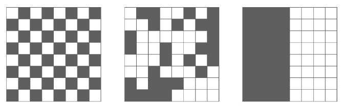

```{r configuracion_inicial, include=FALSE}
knitr::opts_chunk$set(echo = TRUE,
                      message = F,
                      warning = F,
                      tidy = F)
##################################################
#######        Encoded in UTF-8        ###########
##################################################
```

***

# Introducción


In this practical we will use the Nakamura dataset ( Practical 1 ) to infer a differentiation (developmental) trajectory from the data using Monocle3. This exercise is based on the Tutorial 1 found at:
http://cole-trapnell-lab.github.io/monocle-release/monocle3/. The web includes installation instructions.


During development, in response to stimuli, and throughout life, cells transition from one functional “state”
to another. Cells in different states express different sets of genes, producing a dynamic repetoire of proteins
and metabolites that carry out their work. As cells move between states, undergo a process of transcriptional
re-configuration, with some genes being silenced and others newly activated. These transient states are
often hard to characterize because purifying cells in between more stable endpoint states can be difficult
or impossible. Single-cell RNA-seq can enable you to see these states without the need for purification.
However, to do so, we must determine where each cell is the range of possible states.
  
  
  
```{r, message = F}
set.seed(1)
```


# The Monocle 3 workflow

The ordering workflow shown in Figure 5.1 has five main steps:

[ja]("./Cosas accesorias Informe 4/monocle.png")


## Step 1: Normalizing and pre-processing the data


To analyze a single-cell dataset, Monocle first normalizes expression values to account for technical variation
in RNA recovery and sequencing depth.


## Step 2: Reducing the dimensionality of the data

Next, to eliminate noise and make downstream computations more tractable, it projects each cell onto the
top 50 (by default) principal components. Then, you as the user choose whether to reduce the dimensionality
further using one of two non-linear methods for dimensionality reduction: t-SNE or UMAP. The former is
an extremely popular and widely accepted technique for visualizing single-cell RNA-seq data. The latter is
faster, and often better preserves the global structure of the data but is also newer and therefore less well tested by the single-cell community. Then, Monocle 3 will cluster your cells, organize them into trajectories,
or both.
ee


### Step 3: Clustering and partitioning the cells

Monocle 3 can learn multiple disconnected or "disjoint" trajectories. This is important because many experiments will capture a community of cells that are responding to a stimulus or undergoing differentiation, with each type of cell responding differently. Because Monocle version 2 assumes that all of your data is part of a single trajectory, in order to construct individual trajectories you would have to manually split up each group of related cell types and stages into different sets, and then run the trajectory analysis separately on each group of cells. In contrast, Monocle 3 can detect that some cells are part of a different process than others in the dataset, and can therefore build multiple trajectories in parallel from a single dataset. Monocle 3 achieves this by "partitioning" the cells into "supergroups" using a method derived from "approximate graph abstraction" (AGA) [@Wolf208819]. Cells from different supergroups cannot be part of the same trajectory.

### Step 4: Learning the principal graph

Monocle 3 provides three different ways to organize cells into trajectories, all of which are based on the concept of "reversed graph embedding". DDRTree is the method used in Monocle 2 to learn tree-like trajectories, and has received some important updates in Monocle 3. In particular, these updates have massively improved the throughout of DDRTree, which can now process millions of cells in minutes. SimplePPT works similarly to DDRTree in that it learns a tree-like trajectory, but it does not attempt to further reduce the dimensionality of the data. L1Graph is an advanced optimization method that can learn trajectories that have loops in them (that is, trajectories that aren't trees).

Once Monocle 3 has learned a principal graph that fits within the data, each cell is projected onto the graph. Then, the user selects one or more positions on the graph that define the starting points of the trajectory. Monocle measures the distance from these start points to each cell, traveling along the graph as it does so. A cell's pseudotime is simply the distance from each cell to the closest starting point on the graph.

### Step 5: Differential expression analysis and visualization

Once this is complete, you can run tests for genes that are specific to each cluster, find genes that vary over the course of a trajectory, and plot your data in many different ways. Monocle 3 provides a suite of regression tests to find genes that differ between clusters and over trajectories. Monocle 3 also introduces a new test that uses the principal graph directly and can help find genes that vary in complex ways over a trajectory with loops and more intricate structures.


## Load Monocle package and raw data from a Seurat object

```{r, fig.width=6, warning = F}
# Cargamos monocle 3 y otras librerías

library(monocle)
library(reticulate)
library(devtools)
library(Seurat)
BiocManager::install("spatstat", version = "1.64-1")
install.packages("http://cran.r-project.org/src/contrib/Archive/RNetLogo/RNetLogo_0.9-6.tar.gz", repo=NULL, type="source")
BiocManager::install()

#devtools::install_github(http://rcppcore.github.io/RcppParallel/)
?repositories
# BiocManager::install()
# remotes::install_version("Seurat", version = "3.2")
# devtools::install_github('cole-trapnell-lab/leidenbase')
# devtools::install_github('cole-trapnell-lab/monocle3')
# options(warn=-1)
# repositories
# ojo spatstat actualizado

# Import data from Seurat to Monocle  

data <- readRDS(file = 'Archivos accesorios/Codigo y datos de las Practicas 1-4/data/nakamura_P4.rds') # Mirar si funciona o ver versión original monocle

head(data@meta.data)


# Create a new CellDataSet (Monocle):
c3 <- importCDS(data, import_all = FALSE)
pData(c3)$res.0.6
colnames(pData(c3))
```

## Step 1: Normalize and pre-process the data

We then estimate size factors for each cell and dispersion function for the genes in _c3_ . Monocle 3 now performs these operations using the _DelayedArray_ packages so they work on datasets with millions of cells. The dispersion calculation and several other operations rely on the DelayedArray package in Bioconductor, which splits the operation into blocks in order to avoid exhausting the computer's memory. You can control the block size and the verbosity of these operations as shown below:

```{r, fig.width=6, fig.height=6.5}
############################
# Step 1: Normalize and pre-process the data
############################
# Pass TRUE if you want to see progress output on some of Monocle 3's operations
DelayedArray:::set_verbose_block_processing(TRUE)

# Passing a higher value will make some computations faster but use more memory. Adjust with caution!
options(DelayedArray.block.size=1000e6)

c3 <- estimateSizeFactors(c3)

c3 <- estimateDispersions(c3)
```

Next, run the preprocessCDS() function to project the data onto the top principal components:

```{r, fig.width=6, fig.height=6.5}
# function to project the data onto the top principal components:
c3 <- preprocessCDS(c3, num_dim = 20)
```

## Step 2: Reduce the dimensionality of the data

Then, apply a further round of (nonlinear) dimensionality reduction using t-SNE:

```{r, fig.width=6, fig.height=6.5}
c3 <- reduceDimension(c3, reduction_method = 'tSNE')
```

### Step 3: Partition the cells into supergroups

Rather than forcing all cells into a single developmental trajectory, Monocle 3 enables you to learn a set of trajectories that describe the biological process you're studying. For example, if you're looking at a community of immune cells responding to infection, each cell type will respond to antigen (and each other) in a different way, so they should be organized into distinct trajectories. This can also be helpful when you have small groups of outlier cells that for either technical or biological reasons are very dissimilar from the rest of the cells in your experiment. They can confuse a trajectory analysis. Monocle 3's partitioning strategy circumvents this issue because such groups often wind up in their own partition. In the Paul data, there is a small outgroup the authors classified as dendritic cells that Monocle automatically partitions away from the main trajectory.

In Monocle 3, we recognize "disjoint" trajectories by drawing on ideas from Alex Wolf and colleagues, who recently introduced the concept of abstract graph participation [@Wolf208819]. Monocle 3 implements the test for cell community connectedness from Wolf et al. via the partitionCells() function, which divides the cells into "supergroups".


```{r, fig.width=6, fig.height=6.5}
c3 <- partitionCells(c3, use_pca =TRUE )
```

## Step 4: Learn the principal graph
Now that the cells are partitioned, we can organize each supergroup into a separate trajectory. The default method for doing this in Monocle 3 is _SimplePPT_, which assumes that each trajectory is a tree (albeit one that may have multiple roots). Here we will use _DDRTree_ for the reasons mentioned above. Learn these trees with the learnGraph function:

```{r, fig.width=6, fig.height=6.5}
c3 <- learnGraph(c3,  RGE_method = 'DDRTree' ) 
```

## Step 5: Visualize the trajectory

Once the you've learned the trajectory, you can visualize the it:

```{r, fig.width=7, fig.height=8}
cell_type_color <- c("EXMC" = "blue",
                      "Gast"  = "#46C7EF",
                      "PostL-EPI" = "magenta",
                      "Hypoblast" = "red",
                      "ICM" = "darkgreen",
                      "PreE-TE" = "#4EB859",
                      "Post-paTE" = "#EFAD1E",
                      "PostE-EPI" = "gold",
                      "Pre-EPI" = "gray",
                      "PreL-TE" = "black",
                      "VEYE" = 'purple' )

p1 <- plot_cell_trajectory(c3, color_by = "res.0.6") +
  scale_color_manual(values = cell_type_color)

p1
```

**Exercise 4.1 What do you think about the trajectory? Is it in agreement with previous biological knowledge? **


**Adjusting the start of pseudotime with orderCells**

We know that ICM (inner cell mass) will give rise to the pre-implantation epiblast and the hypoblast. We need to tell Monocle that these cells are the "beginning" of the trajectory. In Monocle 2, this wouldn't be possible, because the software required that the root be one of the leaves of the tree. Monocle 3 allows you to specify an internal part of the tree as the root. 


```{r, fig.width=5, fig.height=5.5}
icm_node_ids = get_correct_root_state(c3,
                                      cell_phenotype =
                                        'res.0.6', "ICM")
c3 <- orderCells(c3, root_pr_nodes = icm_node_ids)
plot_cell_trajectory(c3)
```


## Identifying genes that vary in expression over a trajectory

We are often interested in finding genes that are differentially expressed across a single-cell trajectory. Monocle 3 introduces a new approach for finding such genes that draws on a powerful technique in spatial correlation analysis, the Moran’s I test. Moran’s I is a measure of multi-directional and multi-dimensional spatial autocorrelation. The statistic tells you whether cells at nearby positions on a trajectory will have similar (or dissimilar) expression levels for the gene being tested. Although both Pearson correlation and Moran’s I ranges from -1 to 1, the interpretation of Moran’s I is slightly different: +1 means that nearby cells will have perfectly similar expression (as in the right panel below); 0 represents no correlation (center), and -1 means that neighboring cells will be *anti-correlated* (left).

```{r monocle.figure2, out.width = '90%', fig.cap="Moran’s I test example.", echo=FALSE}

```


```{r, warning=FALSE, results='hide', echo=TRUE}
#Identifying genes that vary in expression over a trajectory  (Moran's I test)
pr_graph_test <- principalGraphTest(c3, k=25, cores=1, 
                                    interactive = FALSE, verbose = FALSE)
```

We can easily view the top differentially expressed genes as follows:

```{r, fig.width=5, fig.height=5.5}
# 'pr_graph_test' returns a data frame containing the p values and q-values 
# from the Moran's I test on the parallel arrays of models
head(pr_graph_test )
dim(pr_graph_test )
X <- dplyr::add_rownames(pr_graph_test) %>%
  dplyr::arrange(plyr::desc(morans_test_statistic), plyr::desc(-qval)) # %>% head(30)
```

Once you've identified differentially expressed genes, you'll often want to visualize their expression levels on the trajectory. The plots below show the top 2 most differentially expressed genes along the trajectory.

```{r, fig.width=5, fig.height=5.5}
Y <- as.data.frame(X)
# DE genes over the whole trajectory:
sig <- nrow(subset(pr_graph_test, qval < 0.01))

plot_cell_trajectory(c3, markers=Y$gene_short_name[1] , 
                     use_color_gradient = TRUE, alpha=0.7)
plot_cell_trajectory(c3, markers=Y$gene_short_name[2] , 
                     use_color_gradient = TRUE, alpha=0.7)
```


**Exercise 4.2 Repeat the analysis using UMAP instead of t-SNE dimensionality reduction. **


# sessionInfo()

<details>

<summary> __Click para mostrar__ </summary>

```{r, echo = F}
sessionInfo()
```

</details>