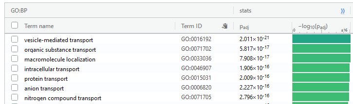

```{r configuracion_inicial, include=FALSE}
knitr::opts_chunk$set(echo = TRUE,
                      message = F,
                      warning = F,
                      tidy = F)
set.seed(1)
##################################################
#######        Encoded in UTF-8        ###########
##################################################
```

***

# Introducción

En esta práctica usaremos los mismos datos que los de la práctica 1, o sea el dataset de SC3-seq (un tipo de scRNA-seq) del desarrollo embrionario en _Macaca fascicularis_ ([Nakamura _et al._, 2016](https://www.nature.com/articles/nature19096)). En esta ocasión, en lugar de usar `TSCAN` u `ouija`, usaremos Monocle sobre estos datos para inferir la trayectoria del desarrollo embrionario.

Las células cambian de un estado funcional a otro en respuesta a estímulos, durante patologías o a lo largo del desarrollo vital del individuo. Cada estado funcional expresa un conjunto de genes concretos, lo que dota a la célula en cuestión un repertorio de proteínas y metabolitos específicos para llevar a cabo la tarea para la cual esté diseñado el estado en cuestión. 

No obstante, cuando una célula transiciona de un estado a otro, esta sufre una reconfiguración transcripcional gradual, con genes que se silencian y genes que se activan. Purificar células en transformación puede resultar difícil, lo que dificulta la caracterización de dichos estados transitorios. Por suerte, este problema no lo tenemos con scRNA-seq, dado que no es necesario purificar poblaciones celulares.


***

<br>

# Esquema del protocolo de Monocle 3

<br>

El protocolo de Monocle consta de 5 pasos principales, detallados a continuación:

](./Cosas accesorias Informe 4/monocle.png)


<br>

## Paso 1: Preprocesamiento y normalizado de los datos


Primero Monocle normaliza los valores de expresión génica para controlar la varianza técnica debida a la profundidad del secuenciado y la recuperación del ARN de la muestra.


<br>

## Paso 2: Reducir la dimensionalidad de los datos

Luego se proyectan las células al espacio del PCA (por defecto se calculan las 50 1<sup>as</sup> componentes) para eliminar ruido y facilitar la computación de los siguientes pasos. Tras esto, y de manera optativa, puedes reducir la dimensionalidad más aún con t-SNE o UMAP. Sea como sea, después de la reducción de la dimensionalidad Monocle puede aplicar un clustering a las células, inferir la trayectoria, o hacer ambas.


<br>

## Paso 3: Clustering y particionado de las células


Monocle 3 puede aprender múltiples trayectorias desconectadas, lo cual es importante dado que muchos experimentos capturan una comunidad de células que estén respondiendo a un estímulo o diferenciándose, y cada célula puede responder de una manera u otra.


Monocle 2 asume que todos tus datos son parte de una única trayectoria, por lo que para construir varias trayectorias individuales, se tendría que dividir manualmente cada grupo de células, generar datasets de manera acorde y ejecutar Monocle 2 sobre cada dataset. Por otro lado, Monocle 3 puede detectar que algunas células forman parte de un proceso biológico distinto y generar acordemente varias trayectorias en paralelo, sin tener que manipular y dividir el dataset como sería el caso con Monocle 2. Monocle 3 consigue esto particionando las células en supergrupos usando un método derivado del AGA o _Approximate Graph Abstraction_ ([Wolf _et al._, 2019](https://genomebiology.biomedcentral.com/articles/10.1186/s13059-019-1663-x)). Células de supergrupos distintos no pueden ser parte de la misma trayectoria.


<br>

## Paso 4: Generar el grafo principal


Versiones anteriores de Monocle 3 y Monocle 2 disponían de 3 maneras distintas de organizarlas las células en trayectorias, todas ellas basadas en el concepto de embebimiento en grafo reverso o "_reversed graph embedding_". __DDRTree__ era el método usado por Monocle 2 para generar trayectorias con forma de árbol, y este algoritmo fue mejorado en veriones anteriores de Monocle 3. En concreto, se optimizó su rendimiento, lo que le permitía procesar millones de células en minutos. __SimplePPT__ genera también trayectorias en forma de árbol, pero a diferencia de DDRTree, no aplica reducciones de la dimensionalidad adicionales. __L1Graph__ es un algoritmo de optimización avanzado capaz de generar trayectorias que incluyan bucles.

No obstante, el autor [ha expresado](https://github.com/cole-trapnell-lab/monocle3/issues/187) recientemente que Monocle 3 1.0.0 en adelante incorporará sólo SimplePPT, puesto que al combinarlo con UMAP, es más rápido, robusto y fácil de interpretar que DDRTree. 

> "DDRTree is not likely to be included in Monocle 3 going forward, because it doesn't scale well to the kind of datasets Monocle 3 is designed to process. Beyond a 100,000 cells DDRTree is impractically slow. However, SimplePPT and DDRTree are closely related techniques, and in our experience, UMAP + SimplePPT is faster, more robust, and gives easier to interpret trajectories than UMAP or PCA + DDRTree."
>
> -- <cite>Cole Trapnell, 2019</cite>

Una vez que Monocle ha aprendido un grafo principal que se ajusta a los datos, se proyecta cada célula al susodicho grafo. A continuación el usuario selecciona uno o más puntos en el grafo que definan los puntos de partida de la trayectoria. Monocle define entonces el pseudotiempo como la distancia de cada célula al punto de inicio más cercano.


<br>


## Paso 5: Análisis de expresión diferencial y visualización

Por último, detectamos biomarcadores específicos de cada clúster celular, genes con expresión cambiante a lo largo de la trayectoria y graficamos los resultados.

Monocle 3 provee una suite de tests estadísticos para detectar genes que difieren entre clusters y condiciones experimentales (covariables tales como tratamiento, tiempo, género...). Además, Monocle 3 incluye un novedoso test que usa el grafo principal directamente y permite detectar genes cuyas expresiones varían de manera compleja a lo largo de trayectorias con bucles y estructuras más complicadas.


***

<br>


# El protocolo de Monocle 3 en la práctica 


Antes de nada debemos asegurarnos de tener instalados tanto `Seurat 3` como `Monocle3 1.0.0`. A continuación se proporciona un chunk de código para instalar dichos paquetes. Este chunk no se ejecutará en la compilación de este informe, dado que sendos paquetes ya se encuentran instalados en mi máquina. 

```{r, eval = F}
# Instalación de Monocle 3 V1.0.0
BiocManager::install(c('BiocGenerics', 'DelayedArray', 'DelayedMatrixStats',
                       'limma', 'S4Vectors', 'SingleCellExperiment',
                       'SummarizedExperiment', 'batchelor', 'Matrix.utils'))
install.packages("devtools")
devtools::install_github('cole-trapnell-lab/leidenbase')
devtools::install_github('cole-trapnell-lab/monocle3')

# Si usas R 3.6, instala spatstat 1.64-1, ya que R 3.6 no es compatible con
# versiones posteriores de spatstat
install.packages("https://cran.r-project.org/src/contrib/Archive/spatstat/spatstat_1.64-1.tar.gz", 
                 repo=NULL, type="source")
```


```{r, echo = F}
print(paste("Seurat version", packageVersion("Seurat"), "is installed", sep = " "))
cat("\n")
print(paste0("Monocle 3 version ", packageVersion("monocle3"), " is installed as well", sep = ""))
```


<br>

Hecho eso, procedemos a cargar las librerías de interés y cargar los datos:

```{r, warning = F}
# Cargamos librerías
library(monocle3)
library(reticulate)
library(Seurat)
library(ggplot2)
library(dplyr)

# Cargamos en memoria el objeto seurat de la práctica 1  
data <- readRDS(file = "./Cosas accesorias Informe 1/nakamura_P4.rds")
head(data@meta.data)

# Creamos un nuevo objeto CellDataSet a partir del objeto seurat. Nótese que
# tenemos que añadir la columna "gene_short_name" dado que varios métodos de
# Monocle 3 lo usan, como por ejemplo plot_cells(c3, genes = "ZNF692")
gene.annotation <- data.frame(gene_short_name = rownames(data@assays$RNA@meta.features), 
           row.names = rownames(data@assays$RNA@meta.features))

head(gene.annotation)

# data[["RNA"]]@meta.features$gene_short_name <-  rownames(data@assays$RNA@meta.features)

c3 <- new_cell_data_set(expression_data = data@assays$RNA@counts,
                        cell_metadata = data@meta.data,
                        gene_metadata = gene.annotation) # gene_metadata = data@assays$RNA@meta.features
```


<br>

Para los objetos de tipo `CellDataSet`, podemos acceder a su información con los métodos `pData()`, `fData()` y `exprs()` de Monocle 3 (nótese que al crear un nuevo objeto `CellDataSet`, Monocle 3 ha calculado automáticamente el `Size_Factor` de las células, pues esa columna no la generamos en la práctica 1 y por tanto no ha aparecido al examinar el bolsillo `@meta.data` de nuestro objeto `seurat`):

```{r}
# Vemos los metadatos de las células
head(pData(c3))

# Accedemos a la columna Cell.Identity para ver a qué tejido pertenecen las
# células
head(pData(c3)$Cell.Identity)

# Alternativamente:
# c3$Cell.Identity

# Ídem para los metadatos de los genes con fData:
colnames(fData(c3))
head(fData(c3))

# Visualizamos una parte de la matriz de conteos
exprs(c3)[1:5,1:5]
```


<br>

## Paso 1: Preprocesamiento y normalizado de los datos


En el preprocesamiento y normalizado de datos se suele proceder a estimar el factor de tamaño de las muestras y la dispersión (=varianza) de la expresión de los genes. Monocle 3 realiza estas y otras operaciones con el paquete `DelayedArray`, lo que le permite escalar con millones de células. Dicho paquete divide las operaciones en bloques para prevenir el consumo excesivo de RAM del ordenador. Puedes controlar el tamaño de cada bloque y los mensajes que se devuelven por consola con los siguientes comandos:

> Nota: Puesto que la estimación del factor de tamaño de las muestras se realiza automáticamente al generar un nuevo objeto `CellDataSet`, podríamos incluir el siguiente chunk de código antes de la carga de datos, pero en aras de mantener un orden, lo incluiremos aquí. Si tienes experiencia trabajando con Monocle 3, puedes correr este chunk antes de generar el susodicho objeto.

```{r, echo = F, eval = F}
# http://hartleys.github.io/JunctionSeq/Rhtml/estimateJunctionSeqSizeFactors.html
# Explicación de size factors
```


```{r}
# Selecciona TRUE para ver en consola el progreso de algunas operaciones de
# Monocle 3
DelayedArray:::set_verbose_block_processing(TRUE)

# Tamaño de cada bloque, en bytes (es 1e8 bytes = 95.37MBs por defecto). A mayor
# tamaño del bloque, más rápidas serán algunos cálculos pero usará más memoria
# RAM, así que ajústalo con cautela.
DelayedArray::getAutoBlockSize()
DelayedArray::setAutoBlockSize(2e8)

# Alternativamente:
# getOption("DelayedArray.block.size")
# options(DelayedArray.block.size=1e9)
```


Establecido el tamaño de bloque y los mensajes por consola, procedemos al normalizado de los datos con el comando `preprocess_cds`. Nótese que se recomienda usar el método PCA para datos de RNA-seq y LSI para datos de ATAC-seq.

```{r}
# Si no se ha calculado previamente el size factor de cada muestra/célula, se
# puede calcular aquí con el comando:
# c3 <- estimate_size_factors(c3)
c3 <- preprocess_cds(c3, method = "PCA", num_dim = 20,
                     norm_method = "log")

plot_pc_variance_explained(c3)
```


<br>


## Paso 2: Reducir la dimensionalidad de los datos

Ahora procedemos a computar la proyección de los datos en un espacio de dimensionalidad reducida (la proyección por defecto en Monocle 3 1.0.0 es UMAP, pero también podemos calcular el t-SNE, PCA, LSI o Aligned) con el comando `reduce_dimension()`. Tras calcular la proyección, podemos visualizarla con el comando `plot_cells()`. 

Nótese que si calculamos el UMAP, podemos acelerar su computación modificando los parámetros `umap.fast_sgd` y `cores`, pero hacer esto incurre en que cada vez que calculemos el UMAP, generaremos proyecciones ligeramente distintas, aunque sólo hayamos modificado uno de los 2 parámetros mentados. Esto puede ser aceptable según la situación, pero por motivos de reproducibilidad de este informe, optaremos por no modificar ninguno de esos 2 parámetros Por fortuna, el dataset de Nakamura _et al._ es relativamente pequeño, por lo que no notaremos mucho la diferencia.


```{r, message = F}
c3 <- reduce_dimension(c3, preprocess_method = "PCA", 
                       reduction_method = "UMAP",
                       umap.fast_sgd = F,
                       cores = 1)

plot_cells(c3, color_cells_by = "Cell.Identity", 
           group_label_size = 3, norm_method = "log") + 
  ggtitle("Tejidos embrionarios (UMAP)") + 
  theme(plot.title = element_text(hjust = 0.5))


# Biomarcador de early epiblast, expresado en tejidos Pre-EPI y PostE-EPI 
plot_cells(c3, genes = "GBX2", color_cells_by = "Cell.Identity",  group_label_size = 3, 
           norm_method = "log", cell_size = 1) +
  ggtitle("Expresión de GBX2, biomarcador del epiblasto temprano (UMAP)") +
  theme(plot.title = element_text(hjust = .5))


# Biomarcador del hipoblasto 
plot_cells(c3, genes = "GATA6", color_cells_by = "Cell.Identity", group_label_size = 3, 
           norm_method = "log", cell_size = 1) +
  ggtitle("Expresión de GATA6, biomarcador del hipoblasto (UMAP)") +
  theme(plot.title = element_text(hjust = .5))
```

```{r, echo = F, eval = F}
# Mas biomarcadores: https://discovery.lifemapsc.com/in-vivo-development/inner-cell-mass/inner-cell-mass
```


<br>

## Paso 3: Partición de las células en supergrupos/particiones


En vez de forzar a todas las células en una única trayectoria, Monocle 3 permite inferir un conjunto de trayectorias, de manera que te permite estudiar varios procesos biológicos simultáneos con un mismo dataset. Por ejemplo, durante una infección (ya sea vírica, bacteriana, fúngica...), los diversos componentes del sistema inmune responden a un cóctel de estímulos (antígenos, citocinas, superantígenos...), por lo que cada célula inmune ejercerá un rol determinado. Por ende, dicho proceso se caracteriza mejor por un conjunto de trayectorias, en lugar de una única trayectoria.

Otra ventaja de inferir más de una trayectoria es que el algoritmo se vuelve resistente a la presencia de células extremas o _outliers_, las cuales normalmente confundirían a la trayectoria original. Al particionar las células en supergrupos o particiones, Monocle 3 agrupa entre sí dichas células extremas y las diferencia de otros supergrupos.

Monocle 3 incluye un test para la conectividad de comunidades celulares el cual divide las células en los ya mencionados supergrupos. Este test se deriva del concepto de participación en grafos abstractos (_abstract graph participation_), desarrollado por [Wolf _et al._ (2019)](https://doi.org/10.1186/s13059-019-1663-x) para su algoritmo [PAGA](https://github.com/theislab/paga). Para realizar dicho clustering, basta con llamar a la función `cluster_cells()`.

Maticemos que la función `cluster_cells()` genera clusters mediante el método de Leiden ([Traag _et al._, 2019](https://doi.org/10.1038/s41598-019-41695-z)), mientras que los supergrupos, particiones o superclusters son generados mediante el ya mencionado algoritmo de Wolf _et al._.


```{r, message = F}
c3 <- cluster_cells(c3, reduction_method = "UMAP", 
                    cluster_method = "leiden", 
                    verbose = T)

plot_cells(c3, color_cells_by = "cluster", group_label_size = 4) + 
  ggtitle("Clusters generados") +
  theme(plot.title = element_text(hjust = .5))

plot_cells(c3, color_cells_by = "partition", group_label_size = 4) + 
  ggtitle("Particiones generadas") +
  theme(plot.title = element_text(hjust = .5))
```


Una vez calculados los clusters y las particiones, podemos acceder a ellas mediante los siguientes comandos de Monocle 3:

```{r}
head(clusters(c3))
head(partitions(c3))
```


<br>

## Paso 4: Generar el grafo principal


Como ya se comentó en la sección 2.4, emplearemos UMAP + SimplePPT para generar el grafo a partir del cual inferiremos la trayectoria(s). Cada supergrupo genera su propia trayectoria, y puesto que nuestros datos forman parte de un único supergrupo, esta vez generaremos una única trayectoria. Esto se consigue con el comando `learn_graph()`:

```{r}
c3 <- learn_graph(c3, use_partition = T,
                  close_loop = T, verbose = T)
```


Ahora cada vez que llamemos a `plot_cells()`, veremos el grafo aprendido, y como ya comentamos en el párrafo anterior, en nuestro caso constará de una única trayectoria:

```{r, warning = F}
cell_type_color <- c("EXMC" = "blue",
                     "Gast"  = "#46C7EF",
                     "PostL-EPI" = "magenta",
                     "Hypoblast" = "red",
                     "ICM" = "darkgreen",
                     "PreE-TE" = "#4EB859",
                     "Post-paTE" = "#EFAD1E",
                     "PostE-EPI" = "gold",
                     "Pre-EPI" = "gray",
                     "PreL-TE" = "black",
                     "VEYE" = "purple")

plot_cells(c3, color_cells_by = "Cell.Identity", cell_size = 2, 
           label_cell_groups = F, graph_label_size = 3, 
           label_branch_points = T, label_leaves = T) +
  scale_color_manual(values = cell_type_color)
```

En el grafo superior, los números encapsulados en círculos negros son los puntos donde se ramifica el grafo/árbol/trayectoria (aquí son términos intercambiables), mientras que los círculos grises corresponden a las hojas del árbol, _i.e._ los posibles destinos que pueden tomar nuestras células al final de la trayectoria. A continuación desglosamos el grafo anterior para hacerlo más comprensible. Se observa que el árbol presenta 4 puntos de ramificación, y 6 destinos celulares (=hojas).

```{r, echo = F}
plot_cells(c3, color_cells_by = "Cell.Identity", cell_size = 2, 
           label_cell_groups = F, graph_label_size = 3, label_branch_points = T, label_leaves = F) +
  scale_color_manual(values = cell_type_color) + ggtitle("Puntos de ramificación") +
  theme(plot.title = element_text(hjust = .5))

plot_cells(c3, color_cells_by = "Cell.Identity", cell_size = 2, 
           label_cell_groups = F, graph_label_size = 3, label_branch_points = F, label_leaves = T) +
  scale_color_manual(values = cell_type_color) + ggtitle("Hojas del árbol (=destinos celulares)") +
  theme(plot.title = element_text(hjust = .5))
```


Se observa también que Monocle 3 no asigna automáticamente el nodo raíz del árbol. Para ello y con ayuda del comando `order_cells()` elegiremos en el gráfico el nodo raíz, a partir del cual Monocle 3 calculará el pseudotiempo y ordenará en él las células. Si no se proporcionan los nodos/células a esta función, se abrirá una ventana interactiva mediante la cual podremos elegir visualmente los nodos raíz. Este modo interactivo es incompatible con el compilado de informes, por lo que cuando ejecutes el código en tu máquina, podrás hacerlo en modo interactivo, pero en mi caso le pasaré a la función los nodos raíz en forma de argumento. Para ello, Visualizaremos el grafo, pero esta vez mostrando los nombres de los puntos principales.

Téngase en cuenta que a diferencia de Monocle 2, Monocle 3 1.0.0 permite elegir nodos internos como nodos raíz (en Monocle 2, sólo los nodos distales podían ser elegidos como nodos raíz, de manera similar a como pasaba con los mapas de difusión en la práctica 2). Además, como Monocle 3 puede generar más de una trayectoria, resulta coherente que se puedan elegir más de un nodo raíz.


```{r}
plot_cells(c3, label_principal_points = T, cell_size = 2)
```

A priori sabemos que la masa interna de células (ICM o _inner cell mass_) del embrión dará lugar al hipoblasto y al epiblasto. Por tanto para ajustar el comienzo del pseudotiempo, tenemos que especificarle a Monocle 3 que dichas células son los nodos raíz del grafo. En este caso, el punto principal `Y_67` se corresponde con la ICM, por lo que se lo pasaremos al comando `order_cells()` a través del argumento `root_pr_nodes`:

```{r}
c3 <- order_cells(c3, reduction_method = "UMAP", root_pr_nodes = "Y_67")

plot_cells(c3, color_cells_by = "pseudotime", cell_size = 2,
           label_leaves = F, label_branch_points = F,
           label_roots = T, graph_label_size = 3)
```


En la [página web](https://cole-trapnell-lab.github.io/monocle3/docs/trajectories/#order-cells) de Monocle 3 se facilita una función auxiliar para facilitar la extracción de nodos raíz en el grafo, cortesía del autor de Monocle 3, Cole Trapnell. Dicha función se ha modificado ligeramente para adaptarla a nuestro caso, en el cual elegimos como nodo raíz aquellas células etiquetadas como `ICM`:

```{r}
# Función auxiliar para identificar nodos raíz:
get_earliest_principal_node <- function(cds, cell_metadata, cell_identity){
  # El argumento cell_metadata recibe el nombre de la columna en pData(c3)
  # El argumento cell_identity recibe el valor a buscar en dicha columna
  
  cell_ids <- which(colData(cds)[, cell_metadata] == cell_identity) 
  closest_vertex <-
  cds@principal_graph_aux[["UMAP"]]$pr_graph_cell_proj_closest_vertex
  closest_vertex <- as.matrix(closest_vertex[colnames(cds), ])
  root_pr_nodes <-
  igraph::V(principal_graph(cds)[["UMAP"]])$name[as.numeric(names
  (which.max(table(closest_vertex[cell_ids,]))))]
  
  root_pr_nodes
}
pData(c3)

# Ordenamos las células con el uso de la función auxiliar
c3 <- order_cells(c3, 
                  root_pr_nodes = get_earliest_principal_node(c3, cell_metadata = "Cell.Identity", cell_identity = "ICM"))

# Graficamos
plot_cells(c3, color_cells_by = "pseudotime", cell_size = 2,
           label_leaves = F, label_branch_points = F,
           label_roots = T, graph_label_size = 3)
```

<br>

Por último, comentar que el pseudotiempo se almacena en el bolsillo `c3@principal_graph_aux$UMAP$pseudotime`:

```{r}
head(c3@principal_graph_aux$UMAP$pseudotime)
```


### Visualización de la trayectoria en 3D

Monocle 3 también permite la visualización de las trayectorias en gráficos 3D interactivos. Para ello, durante la reducción de la dimensionalidad tenemos que pedirle a la función `reduce_dimension()` que guarde como máximo 3 dimensiones mediante el parámetro `max_components`:

```{r, eval = F}
# Protocolo resumido de Monocle 3 para generar gráficos en 3D
cds_3d <- reduce_dimension(c3, max_components = 3, 
                           reduction_method = "UMAP", preprocess_method = "PCA")
cds_3d <- cluster_cells(cds_3d, reduction_method = "UMAP")
cds_3d <- learn_graph(cds_3d)
cds_3d <- order_cells(cds_3d, root_pr_nodes=get_earliest_principal_node(cds_3d, cell_metadata = "Cell.Identity", cell_identity = "ICM"))

# Generamos el gráfico 3D y lo visualizamos:
cds_3d_plot_obj <- plot_cells_3d(cds_3d, color_cells_by="pseudotime")
cds_3d_plot_obj

# También podemos usar el comando plot_cells_3d():
plot_cells_3d(cds_3d, color_cells_by = "Cell.Identity", 
              color_palette = cell_type_color)

# NOTA: Ejecuta este chunk en local, pues es muy pesado como para generarlo en
# un informe
```


```{r, fig.align = "center", fig.height = 2, fig.width = 2, echo = F}
knitr::include_graphics(path = "./Cosas accesorias Informe 4/3dplot.png")
```


<br>


## Paso 5: Análisis de expresión diferencial


Monocle 3 permite afrontar este problema mediante dos funciones distintas:

* Usando modelos de regresión mediante la función `fit_models()` para evaluar si la expresión de un gen varía en función de covariables tales como tratamiento, género, edad, etc...

* Mediante el análisis de autocorrelación espacial del grafo usando el comando `graph_test()` (función paralelizable en UNIX pero no en Windows) para encontrar genes que varían entre clusters o a lo largo de la trayectoria.

<br>

En esta práctica cubriremos el uso del comando `graph_test()`, pues permite detectar genes diferencialmente expresados tanto en clusters como a lo largo de la trayectoria (dependiendo de si le pasamos al argumento `neighbor_graph` el valor `knn` o `principal_graph`, respectivamente). Esta función se basa en un novedoso método denominado test I de Moran. La I de Moran es un estadístico que mide autocorrelaciones espaciales multidimensionales y multidireccionales. Esta medida indica si señales espaciales colindantes (en este caso, las células del grafo y sus vecinas) tienen valores similares (=niveles de expresión similares) u opuestos. 

Si bien la correlación de Pearson y la I de Moran devuelven medidas entre -1 y 1, la interpretación de la I de Moran es ligeramente distinta: +1 significa que células adyacentes tienen una expresión génica idéntica (imagen inferior, panel derecho); 0 indica que no hay correlación alguna (panel central) y -1 significa que las células vecinas están inversamente correlacionadas (panel izquierdo). [Cao _et al._](https://science.sciencemag.org/content/357/6352/661) demostraron exitosamente en 2017 la aplicabilidad del test de la I de Moran a datasets de scRNA-seq para el análisis de expresión diferencial.


En esta práctica nos centraremos en el análisis de autocorrelación espacial, puesto que según busquemos variaciones entre clusters o a lo largo de la trayectoria, tendremos que cambiar ligeramente el código empleado. Nosotros mostraremos cómo buscar genes que varían a lo largo de la trayectoria:


```{r, results = "hide"}
# Expresión génica diferencial a lo largo de la trayectoria (test I de Moran)
moran_test_principal_graph <- graph_test(c3,  neighbor_graph = "principal_graph", cores = 1, verbose = F)

# Visualizamos el dataframe
head(moran_test_principal_graph)
```


El comando `graph_test` nos devuelve un dataframe cuyas filas son los genes del dataset y las columnas son:

* El p-valor y el q-valor (p-valor ajustado para evitar falsos positivos durante tests múltiples) del gen

* El estadístico de la I de Moran (cualquier valor) y la I de Moran (valores entre [-1,1]). Recordemos que valores del test I de Moran cercanos a 1 significa que la expresión del gen en cuestión se focaliza en una región concreta de la trayectoria (_i.e._ es específico de un clúster o estado celular).

* Los metadatos de cada gen (recordemos que al generar el objeto `CellDataSet`, uno de los posibles inputs eran dichos metadatos, en nuestro caso incluíamos sólo los nombres de los genes en la columna `gene_short_name`)

* El estado (`status`).


Procedemos a quedarnos con los genes cuyo q-valor sea menor a 0.05 y los ordenamos en función de su significancia estadística:


```{r}
# Nos quedamos con los descubrimientos con un q-valor menor a 0.05
moran_test_principal_graph <- subset(moran_test_principal_graph, q_value < 0.05)

# Ordenamos los genes según su q-valor en orden ascendente (de más significativo
# a menos)
moran_test_principal_graph <- arrange(moran_test_principal_graph, q_value)

# Visualizamos los 6 genes diferencialmente expresados a lo largo de la
# trayectoria más significativos
head(moran_test_principal_graph, n = 6L)

# Nos quedamos con los nombres de dichos genes
dif_exp_genes <- rownames(moran_test_principal_graph)
```


Una vez identificados los genes diferencialmente expresados a lo largo de la trayectoria, podemos visualizarlos sobre el propio grafo. A continuación mostramos la expresión génica de los 2 genes más significativos: LOC102145562 y HMGA2.

```{r}
plot_cells(c3, genes = dif_exp_genes[c(1,2)], alpha = .7, 
           color_cells_by = "Cell.Identity", label_leaves = F, 
           label_branch_points = F, label_cell_groups = T, 
           cell_size = 2, label_roots = T, group_label_size = 3)
```


Además, Monocle 3 permite analizar módulos de genes co-expresados, de manera similar a como lo hace el paquete `WGCNA`:


```{r}
# Agrupamos los genes diferencialmente expresados (y estadísticamente
# significativos) en módulos de genes co-expresados
gene_module_df <- find_gene_modules(c3[dif_exp_genes,])


# Dataframe con nombres de las células y el tipo de tejido al que pertenecen
cell_group_df <- tibble::tibble(cell = rownames(pData(c3)), 
                                cell_group = pData(c3)$Cell.Identity)

# Agregamos expresión génica de los módulos en una matriz
agg_mat <- aggregate_gene_expression(c3, gene_group_df = gene_module_df, 
                                     cell_group_df = cell_group_df)

# Renombramos
rownames(agg_mat) <- stringr::str_c("Module ", row.names(agg_mat))

# Visualizamos el heatmap
library(pheatmap)
pheatmap(agg_mat, scale = "column", clustering_method = "ward.D2")

# Aislamos el módulo 1 y pasamos los nombres de los genes que lo componen a un
# archivo de texto para poder buscarlo en gProfiler
modulo_1 <- gene_module_df %>% filter(module == 1)
nombres_genes_modulo1 <- modulo_1$id
write(nombres_genes_modulo1, file = "./Cosas accesorias Informe 4/modulo1.txt")
```

Podemos visualizar la información obtenida en el heatmap directamente en la trayectoria. Dicho de otra manera, podemos ver en qué destinos celulares se sobreexpresan módulos de genes:

```{r}
plot_cells(c3, 
           genes = gene_module_df %>% filter(module %in% c(1)),
           color_cells_by = "Cell.Identity", group_label_size = 3,
           show_trajectory_graph = T, label_leaves = F,
           label_branch_points = F, cell_size = 2) + 
  theme(plot.title = element_text(hjust = .5)) + ggtitle("Expresión de genes del módulo 1")
```


La anotación génica aportada por gProfiler para el módulo 1 implica transporte celular de proteínas (aunque no nos centraremos en este tema en este informe, pues eso ya se practicó en otra asignatura).




Al igual que hicimos en la práctica 2 con `scatter` y `ouija`, Monocle 3 1.0.0 te permite visualizar cómo cambia la expresión génica a lo largo del pseudotiempo y observar el orden en el que se activan/desactivan genes. Para realizar esto, tenemos que pasarle a la función `plot_genes_in_pseudotime` un objeto `CellDataSet` que incluya sólo los genes que queremos visualizar. En este caso, vamos a crear otro objeto `CellDataSet` a partir del original `c3` que contenga los top 3 genes diferencialmente expresados del módulo 1:

```{r}
subconjunto.modulo1 <- subset(c3, gene_short_name %in% c("MPEG1", "HMGA2", "LOC102145562"))

plot_genes_in_pseudotime(subconjunto.modulo1, color_cells_by = "pseudotime", min_expr = .5, horizontal_jitter  = T)
```

En el gráfico se observa que MPEG1 y LOC102145562 muestran una tendencia a la baja (MPEG1 llega a silenciarse) tras la activación del gen HMGA2, lo cual podría darnos una pista sobre los patrones de regulación transcripcional en juego.


***

<br>

# Bibliografía

* Nakamura, T., Okamoto, I., Sasaki, K., Yabuta, Y., Iwatani, C., Tsuchiya, H., Seita, Y., Nakamura, S., Yamamoto, T., and Saitou, M. (2016). A developmental coordinate of pluripotency among mice, monkeys and humans. Nature, 537(7618):57–62.

* Wolf, F.A., Hamey, F.K., Plass, M. et al. PAGA: graph abstraction reconciles clustering with trajectory inference through a topology preserving map of single cells. Genome Biol 20, 59 (2019). https://doi.org/10.1186/s13059-019-1663-x

* Traag, V.A., Waltman, L. & van Eck, N.J. From Louvain to Leiden: guaranteeing well-connected communities. Sci Rep 9, 5233 (2019). https://doi.org/10.1038/s41598-019-41695-z

* Cao J, Packer JS, Ramani V, Cusanovich DA, Huynh C, Daza R, Qiu X, Lee C, Furlan SN, Steemers FJ, Adey A, Waterston RH, Trapnell C, Shendure J. Comprehensive single-cell transcriptional profiling of a multicellular organism. Science. 2017 Aug 18;357(6352):661-667. doi: 10.1126/science.aam8940. PMID: 28818938; PMCID: PMC5894354.

***

<br>

# sessionInfo()

<details>

<summary> __Click para mostrar__ </summary>

```{r, echo = F}
sessionInfo()
```

</details>